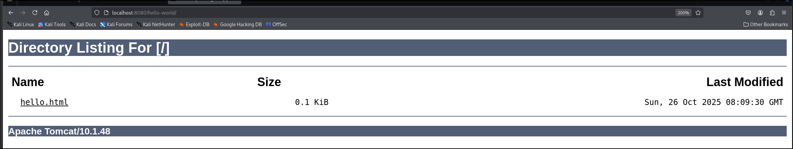
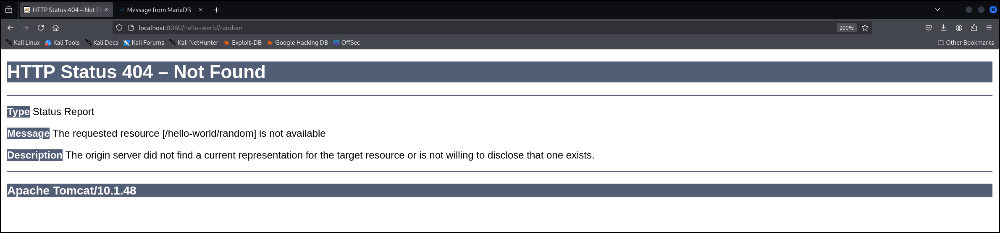

## Directory Listing
1. To enable directory listing, go to `<root>/conf/web.xml` or `<root>/webapps/<webapp>/WEB-INF/web.xml` 
```xml
<servlet>
	<servlet-name>default</servlet-name>
	<servlet-class>org.apache.catalina.servlets.DefaultServlet</servlet-class>
	<init-param>
		<param-name>debug</param-name>
		<param-value>0</param-value>
	</init-param>
	<init-param>
		<param-name>listings</param-name>
		<param-value>true</param-value> <!--Change this to true-->
	</init-param>
	<load-on-startup>1</load-on-startup>
</servlet>
```
2. To verify this vulnerability, navigate to any directory without index.html.
	
	Not Vulnerable
	
3. To remediate,
```xml
<servlet>
	<servlet-name>default</servlet-name>
	<servlet-class>org.apache.catalina.servlets.DefaultServlet</servlet-class>
	<init-param>
		<param-name>debug</param-name>
		<param-value>0</param-value>
	</init-param>
	<init-param>
		<param-name>listings</param-name>
		<param-value>false</param-value> <!--Ensure this is false-->
	</init-param>
	<load-on-startup>1</load-on-startup>
</servlet>
```
## Default Error Page
1. By default, Tomcat serves an error page
2. To verify, go to a non existent path
	
3. To remediate, use the `<error-page>` tag.
Given this directory structure
```
.
├── error
│   └── error.html
├── hello.html
└── WEB-INF
    ├── classes
    │   ├── CertServlet.class
    │   ├── CertServlet.java
    │   ├── HelloServlet.class
    │   ├── HelloServlet.java
    │   ├── SupermanServlet.class
    │   └── SupermanServlet.java
    └── web.xml
```
We can specify a custom error page like this
```xml
<?xml version="1.0" encoding="ISO-8859-1"?>
<web-app version="3.0"
  xmlns="http://java.sun.com/xml/ns/javaee"
  xmlns:xsi="http://www.w3.org/2001/XMLSchema-instance"
  xsi:schemaLocation="http://java.sun.com/xml/ns/javaee http://java.sun.com/xml/ns/javaee/web-app_3_0.xsd">
	<error-page>
		<exception-type>java.lang.Throwable</exception-type>
		<location>/error/error.html</location>
	</error-page>
	<error-page> <!--Catch all-->
	  <location>/error/error.html</location>
	</error-page>
</web-app>
```
To verify,
```
curl http://localhost:8080/hello-world/WEB-INF/abc/ 
<!DOCTYPE html>
<html>
    <head>
        <title>Error</title>
    </head>
    <body>
        <h1>🚨ERROR🚨</h1>
        <p>Roses are red, Violets are blue, This is an error page, Goodbye to you too.</p>
    </body>
</html> 
```
## Broken Authorization 
1. Example vulnerable configuration
```xml
<security-constraint>
  <web-resource-collection>
    <web-resource-name>secret</web-resource-name>
    <url-pattern>/secret/*</url-pattern>
    <http-method>GET</http-method>
  </web-resource-collection>
  <auth-constraint>
    <role-name>admin</role-name>
  </auth-constraint>
</security-constraint>
```
- This configuration ensures that all GET request will be authenticated and only admin users is authorized to access.
2. To bypass, we can use any other http methods
```
curl http://localhost:8080/hello-world/secret/secret.html -X POST
<!DOCTYPE html>
<html>
    <head><title>Secret Page</title></head>
    <body>
        <h1>My Secret is I have no secrets</h1>
    </body>
</html>  
```
- Apparently, older versions of Tomcat allows access with junk HTTP methods too.
3. To remediate, remove the `<http-method>` tag
```xml
<security-constraint>
  <web-resource-collection>
    <web-resource-name>secret</web-resource-name>
    <url-pattern>/secret/*</url-pattern>
  </web-resource-collection>
  <auth-constraint>
    <role-name>admin</role-name>
  </auth-constraint>
</security-constraint>
```
- It will now apply to all methods.
## HTTP Enabled
1. Obviously, it is because no SSL certificate is configured
2. We can verify it is vulnerable if the scheme is HTTP and not HTTPS.
3. To remediate,
First, create a certificate
```
keytool -genkey -alias tomcat -keyalg RSA -keystore mycertificate.cert
```
Let's say Password: `admin1234` (Poor password haha)
Output:
```
Enter keystore password:  
Re-enter new password: 
Enter the distinguished name. Provide a single dot (.) to leave a sub-component empty or press ENTER to use the default value in braces.
What is your first and last name?
  [Unknown]:  superheroes.com
What is the name of your organizational unit?
  [Unknown]:  
What is the name of your organization?
  [Unknown]:  
What is the name of your City or Locality?
  [Unknown]:  
What is the name of your State or Province?
  [Unknown]:  
What is the two-letter country code for this unit?
  [Unknown]:  
Is CN=superheroes.com, OU=Unknown, O=Unknown, L=Unknown, ST=Unknown, C=Unknown correct?
  [no]:  yes

Generating 3,072 bit RSA key pair and self-signed certificate (SHA384withRSA) with a validity of 90 days
        for: CN=superheroes.com, OU=Unknown, O=Unknown, L=Unknown, ST=Unknown, C=Unknown
```
In `<root>/conf/web.xml`,
```xml
<Connector port="8443" protocol="org.apache.coyote.http11.Http11NioProtocol"
		   maxThreads="150" SSLEnabled="true"
		   maxParameterCount="1000"
>
	<UpgradeProtocol className="org.apache.coyote.http2.Http2Protocol" />
	<SSLHostConfig>
		<Certificate certificateKeystoreFile="/home/kali/mycertificate.cert"
					 certificateKeystorePassword="admin1234" type="RSA" />
	</SSLHostConfig>
</Connector>
```
- This will just open a HTTPS port on port 8443.
4. We can verify with a Nmap port scan
```sh
sudo nmap localhost -p 8443 --script=ssl-cert 
```
Output:
```
Host is up (0.000079s latency).
Other addresses for localhost (not scanned): ::1

PORT     STATE SERVICE
8443/tcp open  https-alt
| ssl-cert: Subject: commonName=superman/organizationName=Unknown/stateOrProvinceName=Unknown/countryName=Unknown
| Issuer: commonName=superman/organizationName=Unknown/stateOrProvinceName=Unknown/countryName=Unknown
| Public Key type: rsa
| Public Key bits: 3072
| Signature Algorithm: sha384WithRSAEncryption
| Not valid before: 2025-11-08T08:27:53
| Not valid after:  2026-02-06T08:27:53
| MD5:   eb11:2281:1c16:8b54:5ca6:0347:36ea:27c0
|_SHA-1: 7045:713e:da36:eadc:2c39:2703:424c:ebb0:3323:46d2

Nmap done: 1 IP address (1 host up) scanned in 0.18 seconds
```
- Of course, it is self-signed, so it is probably a LOW or INFO finding depending on whether it is internal-facing.
## Missing Content Security Policy (CSP) Header
1. To verify,
```sh
curl http://localhost:8081 -I   
```
Output:
```http
HTTP/1.1 200 
Content-Type: text/html;charset=UTF-8
Date: Sat, 08 Nov 2025 08:52:41 GMT
```
- Missing Content Security Policy Header
2. Remediation: Look below
### How to configure (the most restrictive) CSP
1. Dependencies:
	1. https://commons.apache.org/codec/download_codec.cgi
```
# Download the JAR file and place it in the /lib of your tomcat instance 
cp commons-codec.jar '/home/kali/learning_materials/tomcat and jsp/apache-tomcat-10.1.48/lib'
``` 
3. First, we need to compile this
```java
// webapps/<web-app-name>/WEB-INF/classes/CSPPoliciesApplier.java
import java.io.IOException;
import java.security.MessageDigest;
import java.security.NoSuchAlgorithmException;
import java.security.SecureRandom;
import java.util.ArrayList;
import java.util.List;

/* for Tomcat 9 and below
import javax.servlet.Filter;
import javax.servlet.FilterChain;
import javax.servlet.FilterConfig;
import javax.servlet.ServletException;
import javax.servlet.ServletRequest;
import javax.servlet.ServletResponse;
import javax.servlet.annotation.WebFilter;
import javax.servlet.http.HttpServletRequest;
import javax.servlet.http.HttpServletResponse;
*/
import jakarta.servlet.Filter;
import jakarta.servlet.FilterChain;
import jakarta.servlet.FilterConfig;
import jakarta.servlet.ServletException;
import jakarta.servlet.ServletRequest;
import jakarta.servlet.ServletResponse;
import jakarta.servlet.annotation.WebFilter;
import jakarta.servlet.http.HttpServletRequest;
import jakarta.servlet.http.HttpServletResponse;


import org.apache.commons.codec.binary.Hex;

/**
 * Sample filter implementation to define a set of Content Security Policies.<br/>
 * This implementation has a dependency on Commons Codec API.<br/>
 * This filter set CSP policies using all HTTP headers defined into W3C specification.<br/>
 * <br/>
 * This implementation is oriented to be easily understandable and easily adapted.<br/>
 */
@WebFilter("/*")
public class CSPPoliciesApplier implements Filter {

    /** Configuration member to specify if web app use web fonts */
    public static final boolean APP_USE_WEBFONTS = false;

    /** Configuration member to specify if web app use videos or audios */
    public static final boolean APP_USE_AUDIOS_OR_VIDEOS = false;

    /**
     * Configuration member to specify if filter must add CSP directive used by Mozilla (Firefox)
     */
    public static final boolean INCLUDE_MOZILLA_CSP_DIRECTIVES = false;

    /** Filter configuration */
    @SuppressWarnings("unused")
    private FilterConfig filterConfig = null;

    /** List CSP HTTP Headers */
    private List<String> cspHeaders = new ArrayList<String>();

    /** Collection of CSP polcies that will be applied */
    private String policies = null;

    /** Used for Script Nonce */
    private SecureRandom prng = null;

    /**
     * Used to prepare (one time for all) set of CSP policies that will be applied on each HTTP
     * response.
     *
     * @see javax.servlet.Filter#init(javax.servlet.FilterConfig)
     */
    @Override
    public void init(FilterConfig fConfig) throws ServletException {
// Get filter configuration
        this.filterConfig = fConfig;

// Init secure random
        try {
            this.prng = SecureRandom.getInstance("SHA1PRNG");
        } catch (NoSuchAlgorithmException e) {
            throw new ServletException(e);
        }

// Define list of CSP HTTP Headers
        this.cspHeaders.add("Content-Security-Policy");
        // this.cspHeaders.add("X-Content-Security-Policy");
        // this.cspHeaders.add("X-WebKit-CSP");

// Define CSP policies
// Loading policies for Frame and Sandboxing will be dynamically defined : We need to know if context use Frame
        List<String> cspPolicies = new ArrayList<String>();
        String originLocationRef = "'self'";
        // --Disable default source in order to avoid browser fallback loading using 'default-src'
        // locations
        cspPolicies.add("default-src 'none'");
        // --Define loading policies for Scripts
        // cspPolicies.add("script-src " + originLocationRef + " 'unsafe-inline' 'unsafe-eval'"); <- bad policy!
        cspPolicies.add("script-src " + originLocationRef); // not the best but will do
        if (INCLUDE_MOZILLA_CSP_DIRECTIVES) {
            cspPolicies.add("options inline-script eval-script");
            cspPolicies.add("xhr-src 'self'");
        }
        // --Define loading policies for Plugins
        cspPolicies.add("object-src " + originLocationRef);
        // --Define loading policies for Styles (CSS)
        cspPolicies.add("style-src " + "'unsafe-inline'");
        // --Define loading policies for Images
        cspPolicies.add("img-src " + originLocationRef);
        // --Define loading policies for Form
        cspPolicies.add("form-action " + originLocationRef);
        // --Define loading policies for Audios/Videos
        if (APP_USE_AUDIOS_OR_VIDEOS) {
            cspPolicies.add("media-src " + originLocationRef);
        }
        // --Define loading policies for Fonts
        if (APP_USE_WEBFONTS) {
            cspPolicies.add("font-src " + originLocationRef);
        }
        // --Define loading policies for Connection
        cspPolicies.add("connect-src " + originLocationRef);
        // --Define loading policies for Plugins Types
        // cspPolicies.add("plugin-types application/pdf application/x-shockwave-flash");
        // --Define browser XSS filtering feature running mode
        // cspPolicies.add("reflected-xss block");

        // Target formating
        this.policies = cspPolicies.toString().replaceAll("(\\[|\\])", "").replaceAll(",", ";")
                .trim();
    }

    /**
     * Add CSP policies on each HTTP response.
     *
     * @see javax.servlet.Filter#doFilter(javax.servlet.ServletRequest,
     *      javax.servlet.ServletResponse, javax.servlet.FilterChain)
     */
    @Override
    public void doFilter(ServletRequest request, ServletResponse response, FilterChain fchain)
            throws IOException, ServletException {
        HttpServletRequest httpRequest = ((HttpServletRequest) request);
        HttpServletResponse httpResponse = ((HttpServletResponse) response);

        /* Step 1 : Detect if target resource is a Frame */
        // Customize here according to your context...
        boolean isFrame = false;

        /* Step 2 : Add CSP policies to HTTP response */
        StringBuilder policiesBuffer = new StringBuilder(this.policies);

        // If resource is a frame add Frame/Sandbox CSP policy
        if (isFrame) {
            // Frame + Sandbox : Here sandbox allow nothing, customize sandbox options depending on
            // your app....
            policiesBuffer.append(";").append("frame-src 'self';sandbox");
            if (INCLUDE_MOZILLA_CSP_DIRECTIVES) {
                policiesBuffer.append(";").append("frame-ancestors 'self'");
            }
        }
        /*
        // Add Script Nonce CSP Policy
        // --Generate a random number
        String randomNum = new Integer(this.prng.nextInt()).toString();
        // --Get its digest
        MessageDigest sha;
        try {
            sha = MessageDigest.getInstance("SHA-1");
        } catch (NoSuchAlgorithmException e) {
            throw new ServletException(e);
        }
        
        byte[] digest = sha.digest(randomNum.getBytes());
        // --Encode it into HEXA
        String scriptNonce = Hex.encodeHexString(digest);
        policiesBuffer.append(";").append("script-nonce ").append(scriptNonce);
        // --Made available script nonce in view app layer
        httpRequest.setAttribute("CSP_SCRIPT_NONCE", scriptNonce);
        */

        // Add policies to all HTTP headers
        for (String header : this.cspHeaders) {
            httpResponse.setHeader(header, policiesBuffer.toString());
        }

        /* Step 3 : Let request continue chain filter */
        fchain.doFilter(request, response);
    }

    /**
     * {@inheritDoc}
     *
     * @see javax.servlet.Filter#destroy()
     */
    @Override
    public void destroy() {
        // Not used
    }
}
```
2. To compile,
```bash
javac -cp "$TOMCAT_HOME/lib/servlet-api.jar:$TOMCAT_HOME/lib/commons-codec.jar" webapps/<web-app-name>/WEB-INF/classes/CSPPoliciesApplier.java
```
3. Restart the server
4. To confirm,
```
curl -I http://localhost:8080/<web-app-name>/test1/
```
Output:
```http                       
HTTP/1.1 200 

Content-Security-Policy: default-src 'none'; script-src 'self'; object-src 'self'; style-src 'unsafe-inline'; img-src 'self'; form-action 'self'; connect-src 'self'

Accept-Ranges: bytes

ETag: W/"299-1762001380542"

Last-Modified: Sat, 01 Nov 2025 12:49:40 GMT

Content-Type: text/html

Content-Length: 299

Date: Sat, 01 Nov 2025 12:50:17 GMT

Keep-Alive: timeout=20

Connection: keep-alive
```

