## IP Routing
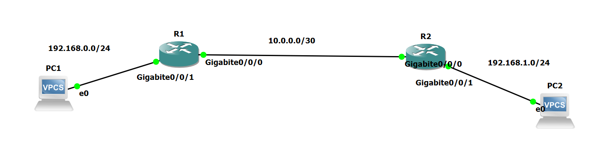 
R1
```
! Configure IP address
int g0/0/1
ip address 192.168.0.254 24
quit

int g0/0/0
ip address 10.0.0.1 30
quit

! Configure route
ip route-static 192.168.1.0 24 g0/0/0 10.0.0.2
```
R2
```
! Configure IP address
int g0/0/1
ip address 192.168.1.254 24
quit

int g0/0/0
ip address 10.0.0.2 30
quit

! Configure route
ip route-static 192.168.0.0 24 g0/0/0 10.0.0.1
```
PC1
```
ip 192.168.0.1 255.255.255.0 192.168.0.254
```
PC2
```
ip 192.168.1.1 255.255.255.0 192.168.1.254
```
Verify by pinging
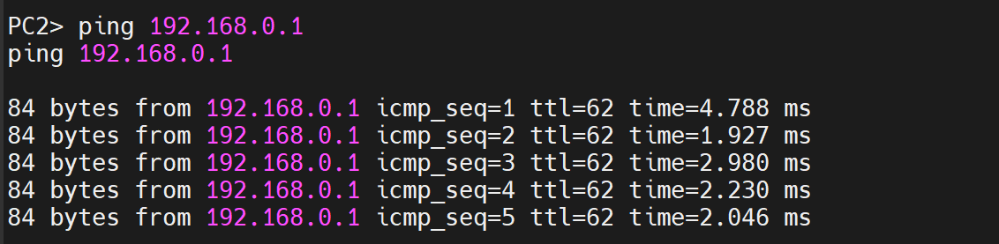
## OSPF Basics
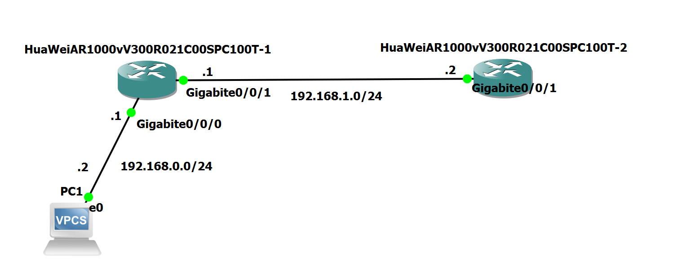
R1
```
! R1 is the DR
! This interface will face R2
int g0/0/1
ip address 192.168.1.1 24
undo shutdown
quit

! Configure OSPF
ospf 1 router-id 1.1.1.1
area 0
network 192.168.0.0 0.0.0.255
network 192.168.1.0 0.0.0.255
quit

! Set OSPF priority (Necessary in this case)
int g0/0/1
ospf dr-priority 10
quit
```
R2
```
! R2 is the BDR
! This interface will face R2
int g0/0/1
undo ip address
ip address 192.168.1.2 24
undo shutdown
quit

! Configure OSPF
ospf 1 router-id 2.2.2.2
area 0
network 192.168.1.0 0.0.0.255
quit
```
Output:
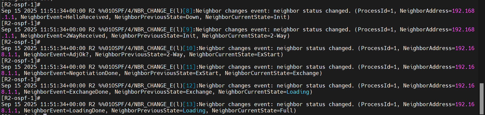
Verify by pinging 192.168.0.2 from R2.
## Inter-VLAN Communication
### Layer 3 Switch
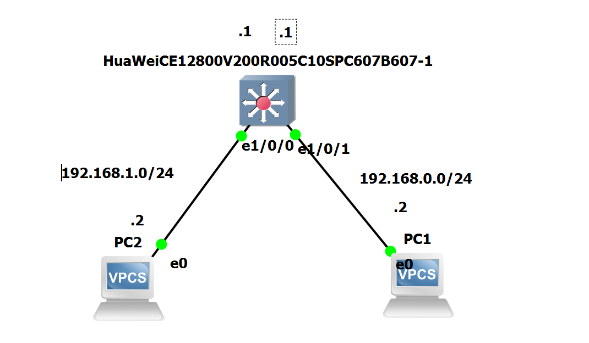
S1
```
! Add VLAN
vlan batch 10 20

! Configure access ports
int g1/0/1
port link-type access
port default vlan 10
quit

int g1/0/0
port link-type access
port default vlan 20
quit

! Configure VLAN interface
interface vlanif 10
ip address 192.168.0.1 24
quit
interface vlanif 20
ip address 192.168.1.1 24
quit
```
To verify, ping from PC2 to PC1
### ROAS
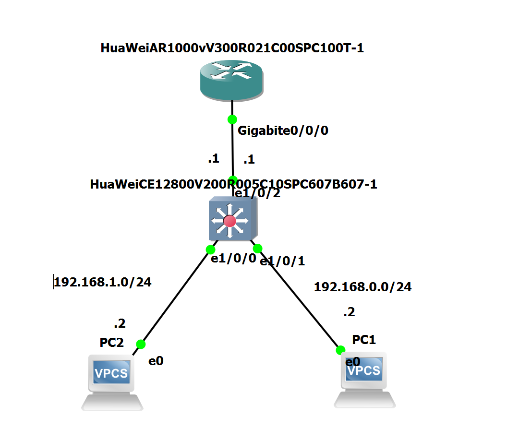
S1
```
! declare vlans
vlan batch 10 20 99

! Configure access ports
int g1/0/0
port link-type access
port default vlan 20
quit
int g1/0/1
port link-type access
port default vlan 10
quit

! Configure trunk port
int g1/0/2
port link-type trunk
port trunk allow-pass vlan 10 20
port trunk pvid vlan 99
quit
```
R1
```
int g0/0/0
undo ip address
quit

! Configure subinterface
int g0/0/0.10
ip address 192.168.0.1 24
dot1q termination vid 10
arp broadcast enable
quit

int g0/0/0.20
ip address 192.168.1.1 24
dot1q termination vid 20
arp broadcast enable
quit
```
To verify
```
PC1> ping 192.168.1.2
ping 192.168.1.2

84 bytes from 192.168.1.2 icmp_seq=1 ttl=63 time=4.934 ms
84 bytes from 192.168.1.2 icmp_seq=2 ttl=63 time=1.734 ms
84 bytes from 192.168.1.2 icmp_seq=3 ttl=63 time=2.006 ms
84 bytes from 192.168.1.2 icmp_seq=4 ttl=63 time=1.820 ms
84 bytes from 192.168.1.2 icmp_seq=5 ttl=63 time=1.477 ms
```
### ROAS (Hybrid)

S1
```
! declare vlans
vlan batch 10 20 99

! Configure access ports
int g1/0/0
port link-type hybrid
port hybrid pvid vlan 20
port hybrid untagged vlan 20
quit
int g1/0/1
port link-type hybrid
port hybrid pvid vlan 10
port hybrid untagged vlan 10
quit

! Configure trunk port
int g1/0/2
port link-type hybrid
port hybrid pvid vlan 99
port hybrid tagged vlan 10 20
quit
```
R1
```
int g0/0/0
undo ip address
quit

! Configure subinterface
int g0/0/0.10
ip address 192.168.0.1 24
dot1q termination vid 10
arp broadcast enable
quit

int g0/0/0.20
ip address 192.168.1.1 24
dot1q termination vid 20
arp broadcast enable
quit
```
To verify
```
PC1> ping 192.168.1.2
ping 192.168.1.2

84 bytes from 192.168.1.2 icmp_seq=1 ttl=63 time=4.934 ms
84 bytes from 192.168.1.2 icmp_seq=2 ttl=63 time=1.734 ms
84 bytes from 192.168.1.2 icmp_seq=3 ttl=63 time=2.006 ms
84 bytes from 192.168.1.2 icmp_seq=4 ttl=63 time=1.820 ms
84 bytes from 192.168.1.2 icmp_seq=5 ttl=63 time=1.477 ms
```
## Eth-Trunk
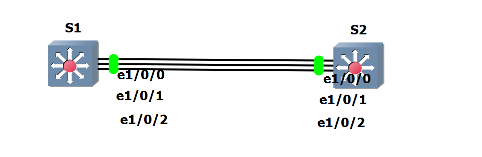
S1
```
! Enter eth-trunk interface config
interface Eth-Trunk 1
! Configure eth-trunk mode
mode lacp-static
! Configure member interfaces
! My version of switch does not allow ranges
trunkport g1/0/0
trunkport g1/0/1
trunkport g1/0/2
! Configure switchport info for all int
port link-type trunk
port trunk pvid vlan 1
least active-linknumber 3
quit

! Configure LACP Actor
lacp priority 65535

int g1/0/0
distribute-weight 3
int g1/0/1
distribute-weight 3
int g1/0/2
distribute-weight 3

int vlanif 1
ip address 192.168.0.1 24
quit
```
S2
```
! Enter eth-trunk interface config
interface Eth-Trunk 1
! Configure eth-trunk mode
mode lacp-static
! Configure member interfaces
! My version of switch does not allow ranges
trunkport g1/0/0
trunkport g1/0/1
trunkport g1/0/2
! Configure switchport info for all int
port link-type trunk
port trunk pvid vlan 1
least active-linknumber 3
quit

int vlanif 1
ip address 192.168.0.2 24
quit
```
To verify,
```
[S1]display lacp statistics eth-trunk 1
```
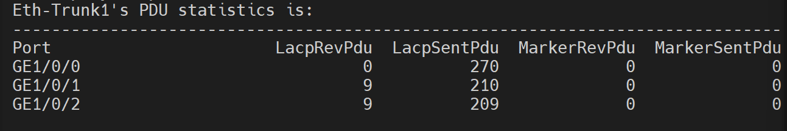
- You can also try pinging from S1 to S2.
## Access Control List
Allow ping only
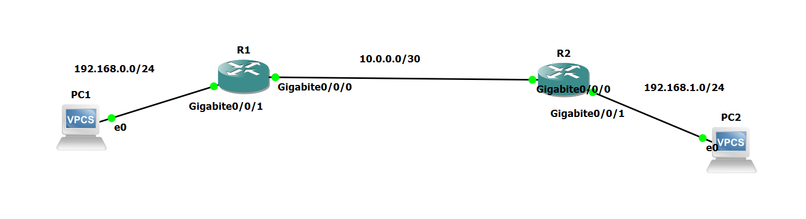
R1
```
acl 3000
! Allow ping from 192.168.1.0/24 to 192.168.0.0/24 only
rule permit icmp source 192.168.1.0 0.0.0.255 destination 192.168.0.0 0.0.0.255 
! Deny all packets to 192.168.0.0/24
rule deny ip source any destination 192.168.0.0 0.0.0.255
quit

! Apply on interface
int g0/0/0
traffic-filter inbound acl 3000
quit
```
## AAA
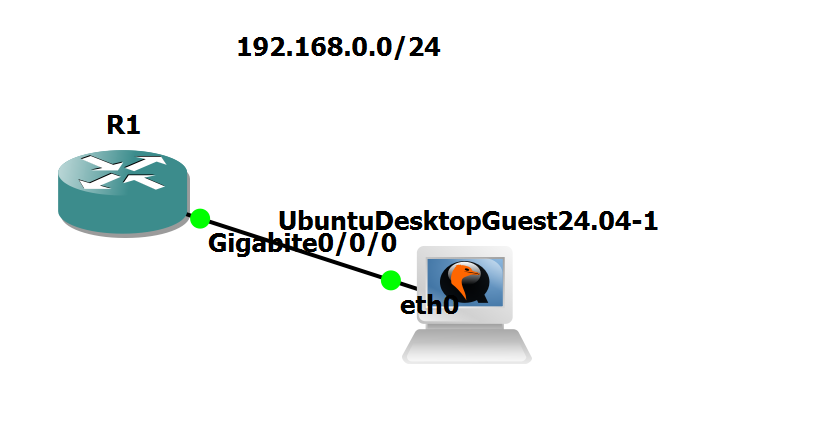
```
int g0/0/0
ip address 192.168.0.2 24
quit

aaa
! Create a local user
local-user superman password cipher huawei123
! This user can access via telnet
local-user superman service-type telnet
! This user can also ping and whatnot
local-user superman privilege level0
quit

! Start SSH server
stelnet server enable

!apply AAA on the VTY
user-interface vty 0 4
authentication-mode aaa
```
To verify, SSH into the server and see what commands are allowed.
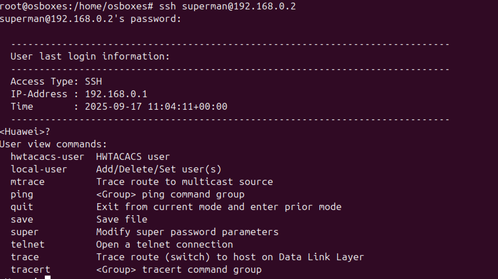
## Network Address Translation
### Static NAT
```
! Configure interfaces IP
int g0/0/0
ip address 12.0.0.1 24
quit
int g0/0/1
ip address 192.168.0.1 24
quit

! Configure NAT Pool
nat 
```
To verify, on the ubuntu server, run `sudo tcpdump -i ens3 icmp -n`, then ping from PC1.
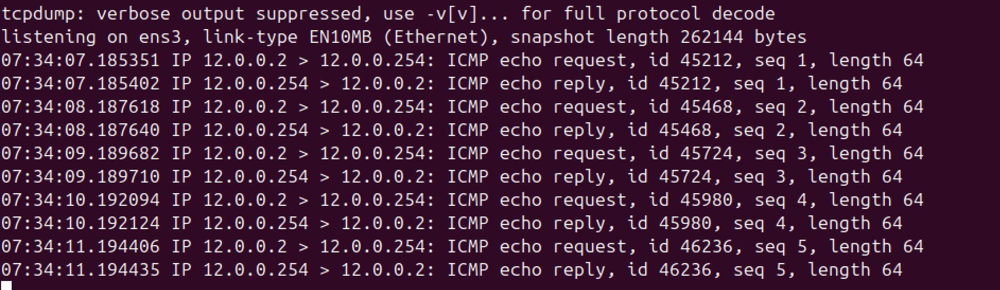
As you can see, Ubuntu thinks that it received packets from 12.0.0.2.
### Dynamic NAT
```
! Configure interfaces IP
int g0/0/0
ip address 12.0.0.1 24
quit
int g0/0/1
ip address 192.168.0.1 24
quit

! Configure NAT Pool
nat address-group 1 12.0.0.3 12.0.0.10

! Configure ACL
acl 2000
rule permit source 192.168.0.0 0.0.0.255
quit

! Configure exit interface
int g0/0/0
nat outbound 2000 address-group 1 no-pat
quit
```
To confirm,
```
[Huawei]display nat outbound interface g0/0/0
NAT Outbound Information:
--------------------------------------------------------------------------
Interface                     Acl     Address-group/IP/Interface      Type
--------------------------------------------------------------------------
GigabitEthernet0/0/0         2000                              1    no-pat
--------------------------------------------------------------------------
Total : 1
```
To verify, on the ubuntu server, run `sudo tcpdump -i ens3 icmp -n`, then ping from PC1.
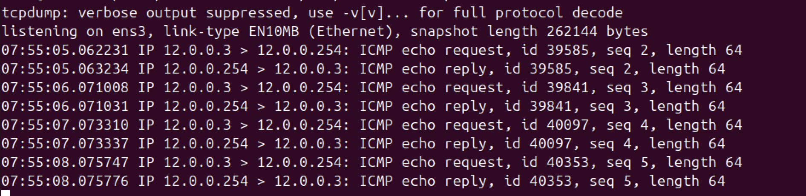
As you can see, Ubuntu thinks that it received packets from 12.0.0.3.
### NAPT
1. To configure NAPT,
```
! Configure interfaces IP
int g0/0/0
ip address 12.0.0.1 24
quit
int g0/0/1
ip address 192.168.0.1 24
quit

! Configure NAT Pool
nat address-group 2 12.0.0.11 12.0.0.12

! Configure ACL
acl 2000
rule permit source 192.168.0.0 0.0.0.255
quit

! Configure exit interface
int g0/0/0
nat outbound 2000 address-group 2
quit
```
To verify the finding,  on the ubuntu server, run `sudo tcpdump -i ens3 icmp -n`, then ping from PC1. Change the IP of the PC1 thrice.
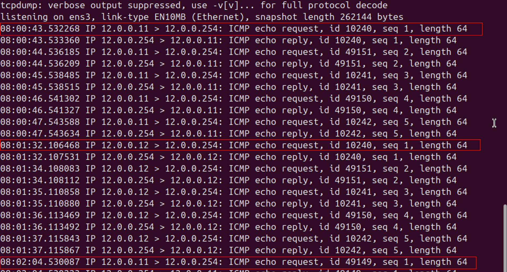
### Easy IP

```
! Configure interfaces IP
int g0/0/0
ip address 12.0.0.1 24
quit
int g0/0/1
ip address 192.168.0.1 24
quit

! Configure ACL
acl 2000
rule permit source 192.168.0.0 0.0.0.255
quit

! Configure exit interface
int g0/0/0
nat outbound 2000 
quit

int g0/0/0
undo nat outbound 2000 address-group 2
quit
```
To verify, on the ubuntu server, run `sudo tcpdump -i ens3 icmp -n`, then ping from PC1.
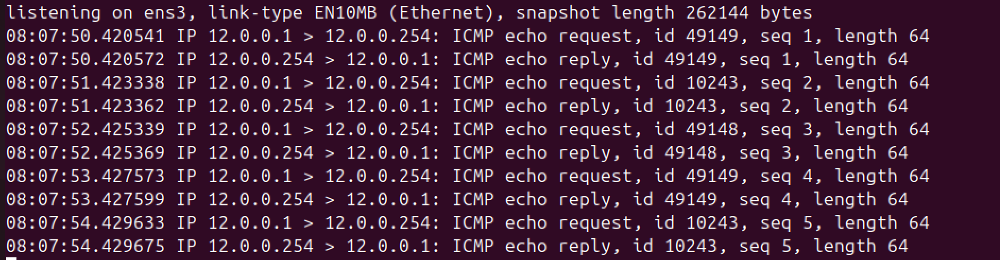
- The server receives ICMP packets whose source IP address is that of the interface.
## Network Services
### FTP
```
int g0/0/0
ip address 12.0.0.1 24
quit
int Loopback 1
ip address 1.1.1.1 32
quit

! Solves "Error: Before enabling the service, configure the function of logging in to the device through a specified interface."
ftp server permit interface all
ftp server-source -i Loopback 1
 ftp server-source -a 1.1.1.1
ftp server enable

aaa
local-user john password irreversible-cipher john1234
local-user john service-type ftp
local-user john privilege level 3
local-user john ftp-directory flash:/superman
quit
```
Output:

### Telnet
```
! Configure interface
int g0/0/0
ip address 12.0.0.1 24
quit
int Loopback 1
ip address 1.1.1.1 32
quit

! Configure telnet Server
telnet server permit interface all
telnet server-source -a 1.1.1.1
telnet server-source -i Loopback 1
telnet server enable

! telnet server
aaa
local-user jack password irreversible-cipher jack1234
local-user jack service-type telnet
local-user jack privilege level 3
quit
```
Output:
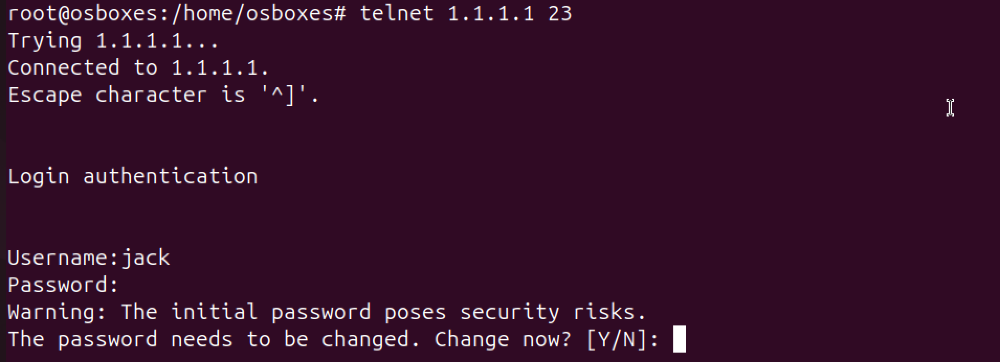
### DHCP
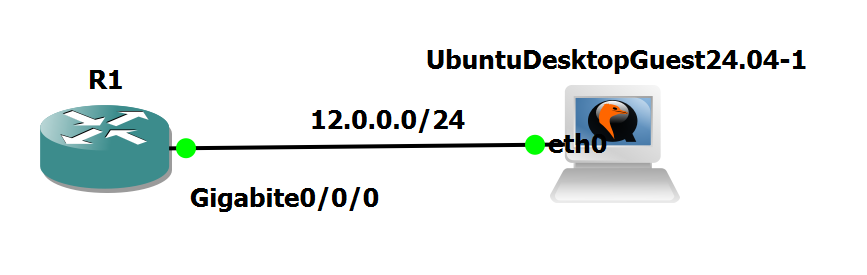
```
! Enable DHCP
dhcp enable

! Configure DHCP
ip pool supercool
network 12.0.0.0 mask 255.255.255.0
gateway-list 12.0.0.1
dns-list 8.8.8.8
quit

! Enable interface for DHCP
int g0/0/0
dhcp select global
quit
```
Output:
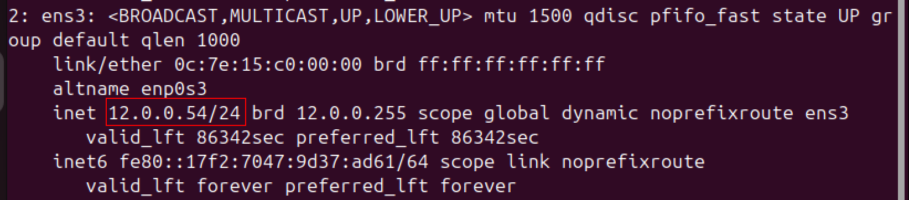
## PPPOE
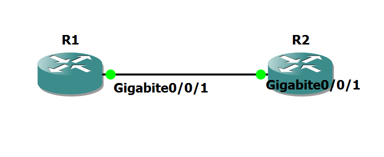
R1 (Server)
```
aaa
local-user superman password cipher huawei123
local-user superman service-type ppp
quit

ip pool POOL1
network 192.168.0.0 mask 24
quit

int virtual-template 1
ip address 192.168.0.254 24
remote address pool POOL1
ppp authentication-mode chap
quit

int g0/0/1
pppoe-server bind virtual-template 1
quit
```
R2 (Client)
```
dialer-rule
dialer-rule 1 ip permit
quit

int dialer 1
dialer user superman
dialer-group 1
dialer bundle 1
ppp chap user superman
ppp chap password cipher huawei123
ip address ppp-negotiate
quit

int g0/0/1
pppoe-client dial-bundle-number 1
quit

```
Verify 
```
[R2]display pppoe-client session summary
PPPoE Client Session:
ID   Bundle  Dialer  Intf             Client-MAC    Server-MAC    State
1    1       1       GE0/0/1          0ce6d0910001  0c27735f0001  UP
```
## Network Management and Operations and Maintenance
### SNMPv2c
```
int Loopback 1
ip address 1.1.1.1 32
quit

snmp-agent   //Start the SNMP agent service.
snmp-agent sys-info version v2c   //Set the SNMP version to v2c.
snmp-agent mib-view included View_ALL iso   //Create a MIB view View_ALL.
snmp-agent community read cipher Public123 mib-view View_ALL   //Configure a read community name and set the rights of the MIB view.
snmp-agent protocol source-interface Loopback 1  //This step must be performed in V200R020 and later versions
```
On the host,
```
snmpwalk -v 2c -c Public123 1.1.1.1
```
Output:
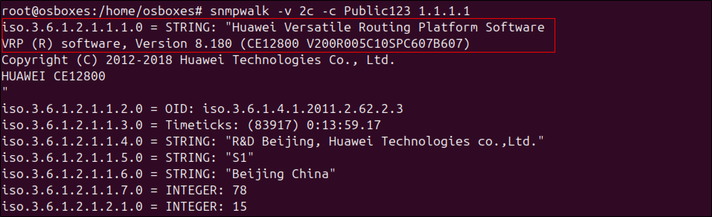
### SNMPv3
```
int Loopback 1
ip address 1.1.1.1 32
quit

int g0/0/0
ip address 192.168.0.254 24
quit

! Enable SNMP version 3
snmp-agent sys-info version v3
! Configure MIB view
snmp-agent mib-view isoview include iso
! Configure the user group
snmp-agent group v3 company_admin privacy read-view isoview write-view isoview notify-view isoview
! Configure user
snmp-agent usm-user v3 superman group company_admin
! Configure authentication password (and hash)
snmp-agent usm-user v3 superman authentication-mode sha
! (superman123)
! Configure sync encryption
snmp-agent usm-user v3 superman privacy-mode aes128
! superman1234
! Configure admin contact info
snmp-agent sys-info contact I just call to say I love you
```
On the host,
```
snmpwalk -u superman -a sha -A superman123 1.1.1.1
```
Output:
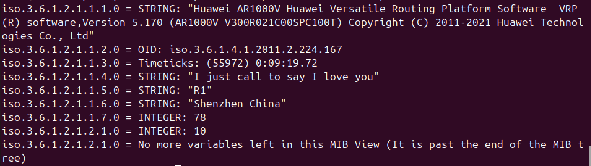
To verify,
```
<R1>display snmp-agent sys-info
```
Output:
```
   The contact person for this managed node:
           I just call to say I love you

   The physical location of this node:
           Shenzhen China

   SNMP version running in the system:
           SNMPv3
```
and
```
<R1>display snmp-agent usm-user
```
Output:
```
   User name: superman
   Engine ID: 800007DB03000000000000
   Group name: company_admin
   Authentication mode: sha, Privacy mode: aes128
   Storage type: nonVolatile
   User status: active

   Total number is 1
```
## IPv6
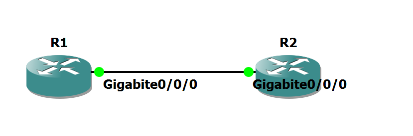
R1
```
ipv6

int g0/0/0
ipv6 enable
ipv6 address auto link-local
ipv6 address 2001::1 64
quit
```
R2
```
ipv6 

int g0/0/0
ipv6 enable
ipv6 address auto link-local
ipv6 address 2001::2 64
quit
```
To verify
```
[R1]ping ipv6 2001::2
  PING 2001::2 : 56  data bytes, press CTRL_C to break
    Reply from 2001::2
    bytes=56 Sequence=1 hop limit=64  time = 8 ms
    Reply from 2001::2
    bytes=56 Sequence=2 hop limit=64  time = 2 ms
    Reply from 2001::2
    bytes=56 Sequence=3 hop limit=64  time = 1 ms
    Reply from 2001::2
    bytes=56 Sequence=4 hop limit=64  time = 3 ms
    Reply from 2001::2
    bytes=56 Sequence=5 hop limit=64  time = 2 ms

  --- 2001::2 ping statistics ---
    5 packet(s) transmitted
    5 packet(s) received
    0.00% packet loss
    round-trip min/avg/max = 1/3/8 ms
```
