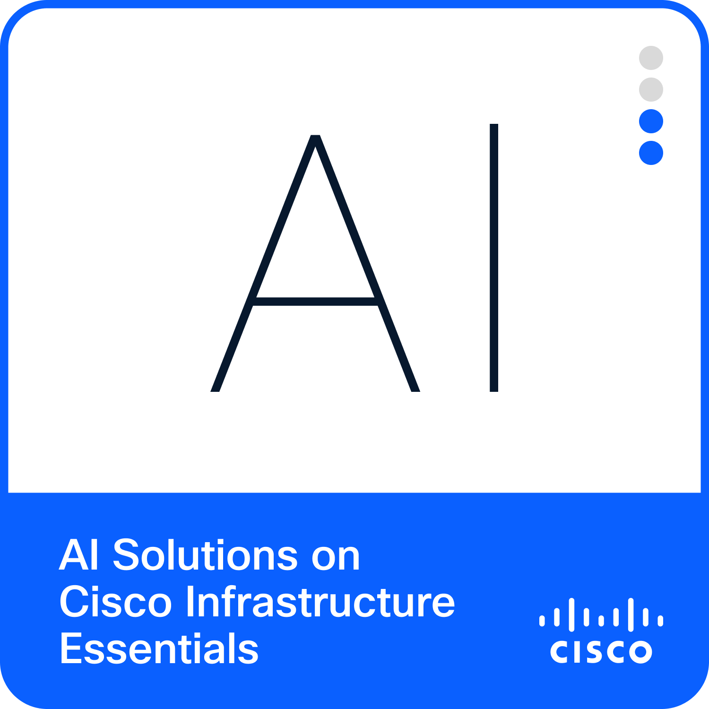
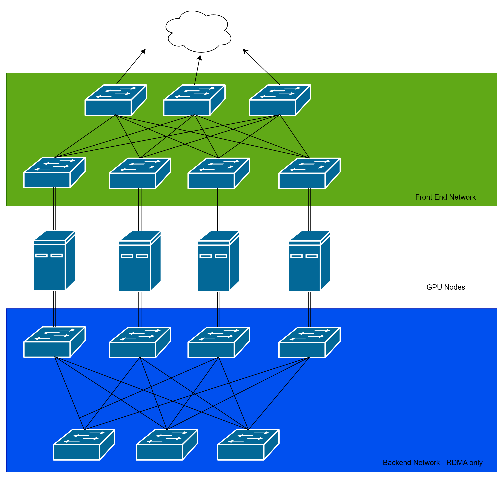
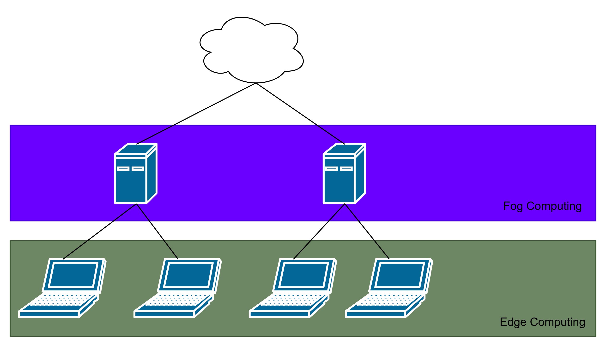

I recently completed the [AI Solutions on Cisco Infrastructure Essentials (DCAIE)](https://www.credly.com/badges/5e8e6c09-a2ab-400f-b095-ef1055b45078/public_url) course on Cisco U. It took me about 1 month to go through all of it and got 32 CE credits for it (Yay), but I ain't going to bore you with the details. I just thought it would be cool to blog about my main takeaway from this course - AI Network Architecture in Data Centres.

## Background
1. There are two main types of AI workloads: training and inferencing (Cisco is going to say there's more but this is my perspective anyways).
2. In the training phase, we will do parameter tuning, hypermeter tuning, backpropagation learning yada yada yada. This is the phase that needs big muscle like GPUs, TPUs or even FPGAs (Basically a programmable hardware, sorta like how you would burn a DVD?).
3. Thus, the network requirements of this phase are
	1. High bandwidth: To allow nodes to communicate with multiple nodes efficiently. This is required due to GPU limitations.
	2. Non-blocking lossless fabric: Packet loss allowed is 0 because any packet loss will make us retrain the AI model.
	3. Congestion management: Avoid dropping any packets during congestion
4. In the inferencing phase, the weights of the model has been set and the goal is to "use" the AI model. As such, this phase uses way less processing power and functions more like a web service. The network requirements of this phase include your classic web service stuff like:
	1. Low latency: For better user experience
	2. Low jitter
## Training Phase Network Requirements
### Example Training Phase Network Architecture

* Each node is dual-homed for redundancy and efficiency.
### High Bandwidth
1. An AI training network requires a high bandwidth network to support Remote Direct Memory Access (RDMA) between the GPU memory of its nodes.
	1. Quick tangent: It is impossible to train billion parameters model on a single GPU because it simply does not have enough memory! You don't hear vendors selling GPUs with terabytes of memory either, right? Hyperscalers achieve this scale by connecting multiple GPUs together in a distributed computing model.
	2. To support distributed computing with GPU, a technology called RDMA was created. In a microprocessor (thanks Mr Emran), Direct Memory Access allows peripherals to communicate directly with memory bypassing the CPU. RDMA allows a remote GPU to communicate with the memory of another remote GPU bypassing the CPU!
2. To support this,
	1. We use a spine-and-leaf/clos architecture to connect the nodes together. This ensures all nodes are always 3 hops away and have a dedicated link to each other.
	2. The spine-and-leaf architecture also allows us to load balance traffic between multiple lines. The idea is instead of maintaining data connection on one line (like in STP), we send data to all lines simultaneously. Of course, the receiving switch would have to know how to reorder the data correctly.
	3. In addition, we create two clos networks! The frontend network is for classic node-to-node communication while the backend network is reserved for RDMA traffic.
	4. We can also use special cables like Infiniband for more bandwidth. However, due to costs, people also use RDMA over Converged Ethernet (RoCE) to take advantage of Ethernet.
### Non-blocking lossless fabric
1. "Non-blocking" means the switch in the fabric must be able to support full capacity traffic in and out of all ports at the same time. To illustrate, let's say I have a switch with 24 10GBps ports. It means that the switch must be able to support 240 GBps traffic in and out at the same time! Not all switches are able to do this, hence, the term "network buffer" in most switches.
2. "Lossless" means that the fabric must not allow any packet drop. Nil.
3. The reason we need this kind of fabric is because any dropped packets may lead to us to retrain the AI model.
4. To achieve this,
	1. Buy non-blocking switches. I heard that the switching capacity must be two times the total bandwidth, as in, a switch with 48 10Gbps ports must support 48x10x2=960Gbps to be non-blocking.
	2. We can also achieve lossless with congestion avoidance techniques.
### Congestion Management
1. Network congestion is unavoidable, just ask anyone using UM wifi. So the question is how do we reduce and handle congestion?
2. In Ethernet, there are two ways to handle congestion: Explicit Congestion Notification (ECN) and Priority Flow Control (PFC)
3. Explicit Congestion Notification (ECN)
	1. We can set 2 thresholds on the network buffer in the switch. When the lower threshold is reached, the switch will send Congestion Encountered packets back to the low priority senders. However, when the high threshold is reached, the switch will send Congestion Encountered packets to all senders.
	2. ECN advises the sender to slow down the rate of sending packets.
	3. Note: It does not drop packets!
4. Priority Flow Control (PFC):
	1. We can set 2 thresholds on the network buffer in the switch, XON (higher threshold) and XOFF (lower threshold). When XON is reached, the switch will send PFC to the sending switch. Only when the buffer go below XOFF threshold, the switch will stop sending PFC packets.
	2. This has the side effect of filling up the buffer on the sending switch.
	3. If the buffer of sender switch also exceeds the XON threshold, it will send PFC to the previous sending switch and so on, creating a cascading effect.
	4. Note: It does not drop packets!
## Inference Phase Network Requirements
1. In this phase, we are mainly trying to reduce latency.
2. Best way to do it? Edge/Fog computing. 
	
	1. Some models are small and light enough to be run on edge devices.
	2. This decreases latency and network hops required 
3. I guess it is what Google Chrome is doing. Cough cough.

## Conclusion
This is just scratching the surface of the world of data centers. Did you know storage can be virtualized and made into a network too? The solution is left as practice for the reader. Hehe. Thanks for reading.