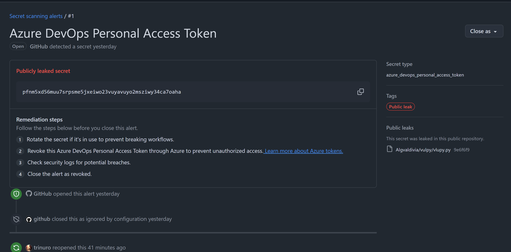
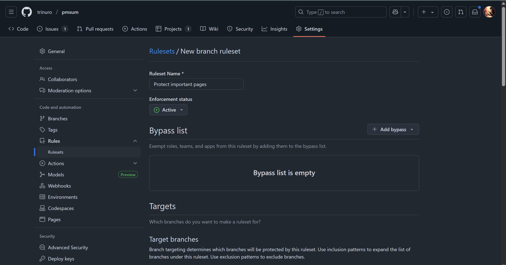
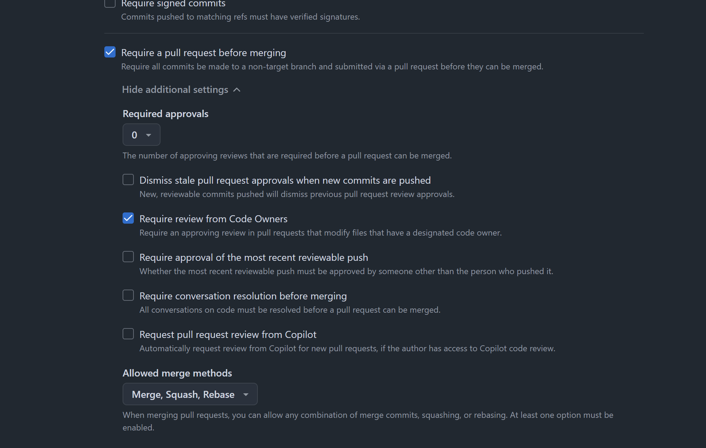
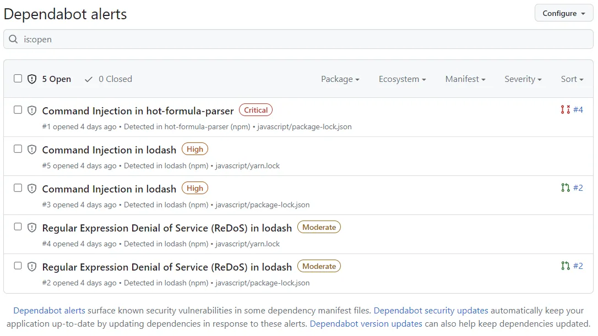
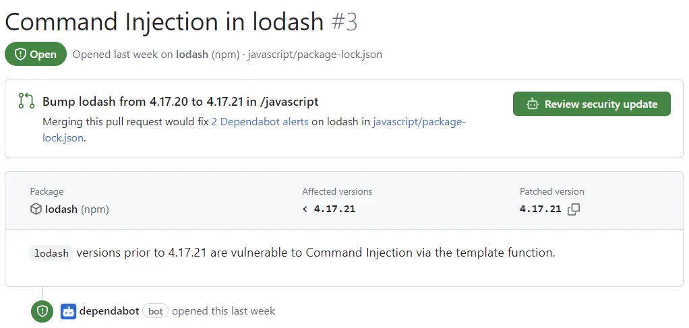

## Introduction
1. GitHub is a well known remote Git repository solution and naturally there are many security tools in it.
2. I felt to compelled to write this as I know I haven't wrote anything for my GitHub Advanced Security certification (shameless plug lol).
## Secrets
### Secrets Protection
1. One of the most common mistakes made by developers is committing secrets in Git history. Notice how I said Git history? This is because even if you deleted the secret and committed the delete, attackers can use tools such as [TruffleHog](https://github.com/trufflesecurity/trufflehog) to retrieve the secret!
2. Thus, GitHub comes with two options for protecting secrets, [push protection](https://docs.github.com/en/code-security/concepts/secret-security/push-protection) and [secrets scanning](https://docs.github.com/en/code-security/concepts/secret-security/secret-scanning).
	1. Push protection prevents secrets from being pushed while secrets scanning will scan the entire git tree, issues, titles and any things GitHub have access to for secrets.
3. Push protection can be enabled on the repository or user level. 
	1. If enabled at the repository, it will prevent any commits containing secrets from being pushed into the repo. If enabled at the user level, it will prevent the user from pushing secrets to any public repo.
4. Secrets scanning is automatic scan for secrets in the repo, issues, PR comments etc. If any secret is found, just assume compromise and invalidate those secrets immediately.

### Secrets Management
1. GitHub offers a vault to place secrets, so that we can use it in other places, especially GitHub Actions
## Code Scanning
1. Static code scanning is a good first line of defense to detect any security vulnerabilities in the application code. It should be integrated in the CI/CD pipeline or at least serve as a gatekeeper before a branch can be merged into the main branch.
2. GitHub offers CodeQL. Here is a simple tutorial on how to use it.
Navigate to the code repo on your localhost. It will create a special graph representation of your code.
```
cd myDumbApp
codeql database create myDumbApp-db --language=python # OR ANY OTHER LANGUAGE
```
Output:
```
<SNIP>
Successfully created database at /home/kali/Work/SecurityScan/myDumbApp-db.
```
Then, scan the database. Here I chose `python-code-scanning.qls` to scan.
```
codeql database analyze HivisionIDPhotos-db --format=csv --output=myDumbApp-output.csv python-code-scanning.qls
```
Output:
```
"Information exposure through an exception","Leaking information about an exception, such as messages and stack traces, to an external user can expose implementation details that are useful to an attacker for developing a subsequent exploit.","error","[[""Stack trace information""|""relative:///deploy_api.py:272:25:272:25""]] flows to this location and may be exposed to an external user.","/deploy_api.py","278","12","278","25"
```
3. You can integrate GitHub Actions to automatically trigger a CodeQL scan when a pull request is created. The results of SAST scan is useful for senior developers to verify whether the code is safe before approving the PR.
4. One of the artifacts that CodeQL can create is a Static Analysis Results Interchange Format ([SARIF](https://docs.github.com/en/code-security/concepts/code-scanning/sarif-files)) file. I highly recommend getting familiar with this format as it makes triaging code vulnerabilities easier.
## Security of Branches
1. Branches in a code repository are a way of multiple users to make changes (even contradictory changes) to the code base. Think of them as parallel timelines. These conflicts are resolved through merge conflict resolutions in the future.
2. At the minimum, production branches should reject all direct commits to it. It should only permit merges from another branch, for example, a testing branch before being pushed to production. We can configure this protection under rulesets.

Configure the branch to only accept pull request and reject any direct commits.

3. To take this one step further, we can require any pull requests to only be merged after it has been reviewed by one or more senior developers or testers. Refer to the above diagram
4. To take this another step further, a [`CODEOWNERS`](https://docs.github.com/en/repositories/managing-your-repositorys-settings-and-features/customizing-your-repository/about-code-owners) file can be defined to specify the user that must approve the pull request for the particular section of the code repo. This ensures that the subject matter expert has approved the matter.
```SH
# CODEOWNERS defines which user is required to approve certain PR
# Syntax: path @username
# Syntax: path @repo/team-name

# Require developer1 approval for main page
/components/main_page @developer1

# Require developer2 approval for activities page
/components/activities @developer2

# Require developer3 approval for team page
/components/team @developer3
```
- Place this file in `.github/CODEOWNERS.md`
## Dependencies Security
1. There are supply chain attacks in the news almost every day. To protect against it, we should stick with more trustworthy dependencies and audit them regularly as those dependencies may have become compromised or stale (not updated anymore).
2. GitHub tracks your dependencies using the [Dependency Graph](https://docs.github.com/en/code-security/concepts/supply-chain-security/dependency-graph)
3. GitHub offers [Dependabot](https://docs.github.com/en/code-security/tutorials/secure-your-dependencies/dependabot-quickstart#about-dependabot) to secure dependencies. There are three services offered by Dependabot:
	1. Dependabot alerts: An alert if GitHub notices that one of your dependencies is vulnerable
	
	2. [Dependabot security update](https://docs.github.com/en/code-security/concepts/supply-chain-security/dependabot-security-updates): Dependabot will automatically create a pull request if one of your dependencies is vulnerable
	
	3. [Dependabot version update](https://docs.github.com/en/code-security/concepts/supply-chain-security/dependabot-version-updates): Dependabot will automatically create a pull request if one of your dependencies is out-of-date, for best practice. This must be explicitly configured.
4. A good thing to note is that Dependabot relies on Dependency graph in GitHub. Thus, it is a good idea to check how GitHub identifies dependencies [here](http://docs.github.com/en/code-security/concepts/supply-chain-security/dependency-graph-data).
5. Finally, a good dependency audit is not complete with a Software Bill of Materials (SBOM) artifact. Back when I was taking GHAS certification, this required a GitHub Actions workflow, but I believe that this can be [done in GitHub](https://docs.github.com/en/code-security/how-tos/secure-your-supply-chain/establish-provenance-and-integrity/export-dependencies-as-sbom) now.
## Roles
1. In a repository owned by an enterprise account, we can assign roles to developers based on least privilege principle.
2. The roles available are as [follows](https://docs.github.com/en/organizations/managing-user-access-to-your-organizations-repositories/managing-repository-roles/repository-roles-for-an-organization):
	1. Read: Recommended for non-code contributors who want to view or discuss your project
	2. Triage: Recommended for contributors who need to proactively manage issues, discussions, and pull requests without write access
	3. Write: Recommended for contributors who actively push to your project
	4. Maintain: Recommended for project managers who need to manage the repository without access to sensitive or destructive actions
	5. Admin: Recommended for people who need full access to the project, including sensitive and destructive actions like managing security or deleting a repository
## Conclusion
To conclude, there are many security tools that GitHub offer. Use them!